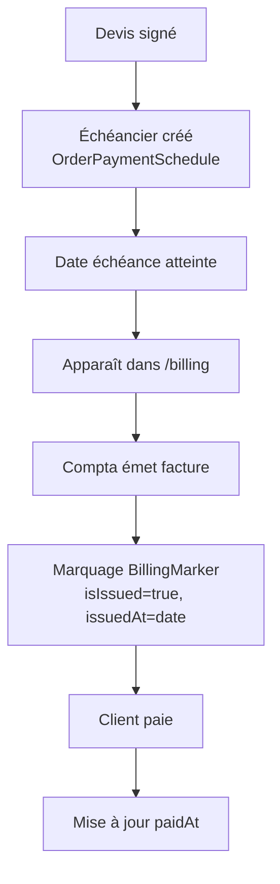
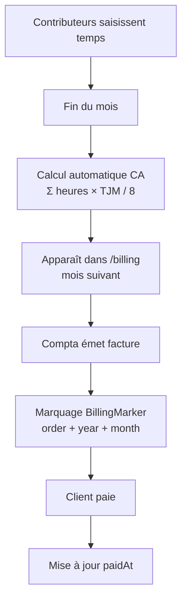

# Système de Facturation

Le système de facturation de HotOnes permet de gérer deux modes de facturation distincts : **forfait** et **régie**.

## Table des matières

- [Vue d'ensemble](#vue-densemble)
- [Types de facturation](#types-de-facturation)
- [Entités](#entités)
- [Service BillingService](#service-billingservice)
- [Interface utilisateur](#interface-utilisateur)
- [Workflow de facturation](#workflow-de-facturation)
- [Cas d'usage](#cas-dusage)

---

## Vue d'ensemble

Le système de facturation HotOnes distingue deux modes de facturation selon le type de contrat :

| Type de contrat | Mode de facturation | Base de calcul |
|----------------|---------------------|----------------|
| **Forfait** | Échéancier prédéfini | Devis total × % échéance |
| **Régie** | Facturation mensuelle | Temps passé × TJM contributeur |

Le système utilise des **BillingMarkers** (marqueurs de facturation) pour éviter les doublons et suivre l'état des facturations (émise, payée).

---

## Types de facturation

### Facturation au Forfait

Pour les projets au forfait, la facturation se base sur un **échéancier de paiement** défini dans le devis.

**Caractéristiques:**
- Montants et dates définis à l'avance dans `OrderPaymentSchedule`
- Indépendant du temps réellement passé
- Facturation selon le calendrier contractuel
- Chaque échéance = une ligne de facturation potentielle

**Exemple:**
```
Devis total: 50 000 €
Échéancier:
  - Acompte 30% à la signature      → 15 000 € le 01/01/2024
  - Paiement intermédiaire 40%      → 20 000 € le 15/02/2024
  - Solde 30% à la livraison        → 15 000 € le 30/03/2024
```

### Facturation en Régie

Pour les projets en régie, la facturation se calcule **mensuellement** selon le temps réellement passé.

**Caractéristiques:**
- Calcul automatique basé sur les timesheets
- Formule: `CA mensuel = Σ(heures_saisies × TJM_contributeur / 8)`
- Utilise le TJM (Taux Journalier Moyen) configuré pour chaque contributeur
- Génération automatique des lignes de facturation pour chaque mois où du temps a été saisi

**Exemple:**
```
Projet en régie - Mars 2024:
  - Contributeur A: 40h × 600€ TJM / 8 = 3 000 €
  - Contributeur B: 32h × 500€ TJM / 8 = 2 000 €
  → Facturation régie mars 2024 = 5 000 €
```

---

## Entités

### BillingMarker

L'entité `BillingMarker` marque les facturations émises pour éviter les doublons et suivre leur statut.

**Fichier:** `src/Entity/BillingMarker.php`

**Structure:**
```php
class BillingMarker
{
    private ?int $id;

    // Option 1: Forfait - lien vers une échéance
    private ?OrderPaymentSchedule $schedule;

    // Option 2: Régie - lien vers devis + période
    private ?Order $order;
    private ?int $year;   // YYYY
    private ?int $month;  // 1..12

    // Statut de facturation
    private bool $isIssued = false;           // Facture émise?
    private ?DateTimeInterface $issuedAt;     // Date d'émission
    private ?DateTimeInterface $paidAt;       // Date de paiement
    private ?string $comment;                 // Commentaire libre
}
```

**Contraintes d'unicité:**
- `uniq_marker_schedule`: Un seul marqueur par échéance (forfait)
- `uniq_marker_regie_period`: Un seul marqueur par (devis, année, mois) pour la régie

**Champs:**
- `schedule`: Référence à `OrderPaymentSchedule` pour les facturations au forfait (nullable)
- `order`: Référence à `Order` pour les facturations en régie (nullable)
- `year` / `month`: Période concernée pour la facturation en régie
- `isIssued`: Boolean indiquant si la facture a été émise
- `issuedAt`: Date d'émission de la facture
- `paidAt`: Date de paiement effectif
- `comment`: Commentaire libre (numéro de facture, remarques, etc.)

**Usage:**
- Pour forfait: `schedule` est renseigné, `order/year/month` sont NULL
- Pour régie: `order/year/month` sont renseignés, `schedule` est NULL

---

## Service BillingService

Le service `BillingService` construit le récapitulatif de facturation d'un projet.

**Fichier:** `src/Service/BillingService.php`

### Méthode `buildProjectBillingRecap(Project)`

Construit le récapitulatif de facturation complet d'un projet en combinant forfait et régie.

**Signature:**
```php
public function buildProjectBillingRecap(Project $project): array
```

**Retour:**
Tableau d'entrées de facturation triées par date:
```php
[
    [
        'date'   => DateTimeInterface,  // Date de facturation
        'label'  => string,              // Libellé (ex: "Échéance", "Régie 03/2024")
        'amount' => float,               // Montant en €
        'type'   => 'forfait'|'regie',  // Type de facturation
        'order'  => Order                // Devis associé
    ],
    // ...
]
```

**Algorithme:**
1. Parcourt tous les devis (`Order`) du projet
2. Pour chaque devis:
   - Si `contractType === 'forfait'` → appelle `buildForfaitEntries()`
   - Si `contractType === 'regie'` → appelle `buildRegieEntries()`
3. Fusionne toutes les entrées
4. Trie par date croissante

### Méthode `buildForfaitEntries(Order)` (privée)

Génère les entrées de facturation pour un contrat au forfait.

**Algorithme:**
1. Calcule le total du devis: `$total = $order->calculateTotalFromSections()`
2. Pour chaque échéance (`OrderPaymentSchedule`):
   - Date de facturation: `$schedule->getBillingDate()`
   - Montant: `$schedule->computeAmount($total)` (pourcentage × total)
   - Type: `'forfait'`

### Méthode `buildRegieEntries(Order)` (privée)

Génère les entrées de facturation pour un contrat en régie.

**Algorithme:**
1. Récupère le CA mensuel via `TimesheetRepository::getMonthlyRevenueForProjectUsingContributorTjm()`
2. Pour chaque mois ayant du temps saisi:
   - Date: 1er du mois
   - Label: `"Régie MM/YYYY"`
   - Montant: Revenu calculé (Σ heures × TJM / 8)
   - Type: `'regie'`

**Requête sous-jacente:**
```sql
SELECT
    YEAR(t.date) as year,
    MONTH(t.date) as month,
    SUM(t.hours * c.billing_rate / 8) as revenue
FROM timesheet t
JOIN contributor c ON t.contributor_id = c.id
WHERE t.project_task_id IN (SELECT id FROM project_task WHERE project_id = ?)
GROUP BY YEAR(t.date), MONTH(t.date)
ORDER BY year, month
```

---

## Interface utilisateur

### Route principale: `/billing`

**Contrôleur:** `BillingController::index()`
**Accès:** `ROLE_COMPTA` uniquement
**Méthode:** GET

**Paramètres de requête:**
- `month` (optionnel): Mois à afficher au format `YYYY-MM` (défaut: mois courant)

**Exemple:**
```
/billing?month=2024-03
```

**Fonctionnalités:**
- Affiche toutes les facturations du mois sélectionné
- Navigation mois précédent / mois suivant
- Distinction visuelle forfait vs régie
- Marquage des facturations (émise, payée)

**Données affichées:**
- **Forfait:** Échéances tombant dans le mois (via `OrderPaymentSchedule.billingDate`)
- **Régie:** CA calculé pour tous les projets en régie ayant du temps saisi ce mois-là

### Marquage des facturations

#### Marquer une échéance forfait

**Route:** `POST /billing/mark/schedule/{id}`
**Accès:** `ROLE_COMPTA`
**Paramètres POST:**
- `is_issued` (boolean): Facture émise?
- `issued_at` (date, nullable): Date d'émission (format `Y-m-d`)
- `paid_at` (date, nullable): Date de paiement
- `comment` (string, nullable): Commentaire

**Exemple:**
```javascript
fetch('/billing/mark/schedule/42', {
    method: 'POST',
    headers: {'Content-Type': 'application/x-www-form-urlencoded'},
    body: new URLSearchParams({
        is_issued: '1',
        issued_at: '2024-03-15',
        paid_at: '2024-04-10',
        comment: 'Facture #FAC-2024-0042'
    })
});
```

#### Marquer une facturation régie

**Route:** `POST /billing/mark/regie/{orderId}`
**Accès:** `ROLE_COMPTA`
**Paramètres POST:**
- `year` (int): Année (ex: 2024)
- `month` (int): Mois (1-12)
- `is_issued` (boolean): Facture émise?
- `issued_at` (date, nullable): Date d'émission
- `paid_at` (date, nullable): Date de paiement
- `comment` (string, nullable): Commentaire

**Exemple:**
```javascript
fetch('/billing/mark/regie/15', {
    method: 'POST',
    headers: {'Content-Type': 'application/x-www-form-urlencoded'},
    body: new URLSearchParams({
        year: '2024',
        month: '3',
        is_issued: '1',
        issued_at: '2024-04-05',
        comment: 'Facture régie mars 2024 - #FAC-2024-0043'
    })
});
```

---

## Workflow de facturation

### Workflow Forfait



**Étapes détaillées:**

1. **Création de l'échéancier**
   - Lors de la création/modification d'un devis au forfait
   - Définition des échéances dans `OrderPaymentSchedule`
   - Champs: `billingDate`, `percentage`, `label`

2. **Détection de l'échéance**
   - Le tableau de facturation `/billing` affiche toutes les échéances du mois
   - Filtrage par `billingDate BETWEEN début_mois AND fin_mois`

3. **Émission de la facture**
   - La comptabilité génère la facture dans le système comptable externe
   - Marquage via `POST /billing/mark/schedule/{id}`
   - `isIssued = true`, `issuedAt = date_émission`

4. **Suivi du paiement**
   - Mise à jour de `paidAt` quand le client règle
   - Commentaire pour référencer la facture

### Workflow Régie



**Étapes détaillées:**

1. **Saisie des temps**
   - Les contributeurs saisissent leurs temps sur les tâches projet
   - Chaque timesheet a: `contributor`, `hours`, `date`, `projectTask`

2. **Calcul du CA mensuel**
   - Calcul automatique via `TimesheetRepository::getMonthlyRevenueForProjectUsingContributorTjm()`
   - Formule: `Σ (heures × contributor.billing_rate / 8)` pour chaque contributeur
   - Regroupement par année/mois

3. **Affichage dans le tableau de facturation**
   - Pour chaque devis en régie (`contractType = 'regie'`) au statut `['gagne', 'signe', 'termine']`
   - Requête du CA pour le mois sélectionné
   - Génération d'une ligne "Régie MM/YYYY" avec le montant calculé

4. **Émission de la facture**
   - Marquage via `POST /billing/mark/regie/{orderId}`
   - Paramètres: `orderId`, `year`, `month`
   - Création du `BillingMarker` avec ces 3 références

5. **Suivi du paiement**
   - Mise à jour du marqueur avec `paidAt`

---

## Cas d'usage

### Cas 1: Projet 100% Forfait

**Contexte:**
- Projet "Refonte site e-commerce"
- Devis 50 000 € au forfait
- Échéancier: 30% / 40% / 30%

**Timeline:**
```
01/01/2024 - Signature du devis
    → Échéance #1: 15 000 € (30%) le 01/01/2024

15/02/2024 - Livraison phase 1
    → Échéance #2: 20 000 € (40%) le 15/02/2024

30/03/2024 - Livraison finale
    → Échéance #3: 15 000 € (30%) le 30/03/2024
```

**Dans `/billing`:**
- Janvier 2024: Affiche l'échéance #1 (15 000 €)
- Février 2024: Affiche l'échéance #2 (20 000 €)
- Mars 2024: Affiche l'échéance #3 (15 000 €)

**Aucune dépendance au temps passé réellement.**

### Cas 2: Projet 100% Régie

**Contexte:**
- Projet "TMA E-commerce"
- Contrat régie, TJM négocié par contributeur
- 2 contributeurs assignés

**Temps saisi en mars 2024:**
```
Contributeur Alice (TJM 600 €):
  - 02/03: 8h
  - 03/03: 7h
  - ...
  Total: 40h

Contributeur Bob (TJM 500 €):
  - 02/03: 8h
  - 04/03: 6h
  - ...
  Total: 32h
```

**Calcul:**
```
CA Mars 2024 = (40h × 600€ / 8) + (32h × 500€ / 8)
             = 3 000€ + 2 000€
             = 5 000€
```

**Dans `/billing?month=2024-03`:**
- Ligne "Régie 03/2024" - 5 000 €

### Cas 3: Projet Mixte (Forfait + Régie)

**Contexte:**
- Projet avec un devis forfait initial + TMA en régie
- 2 devis liés au même projet

**Configuration:**
```
Order #1 (Forfait):
  - Total: 30 000 €
  - Échéancier: 50% / 50%

Order #2 (Régie):
  - Démarrage après livraison du forfait
  - Facturation mensuelle selon temps passé
```

**Dans `/billing`:**
- Mois M1: Échéance forfait #1 (15 000 €)
- Mois M2: Échéance forfait #2 (15 000 €)
- Mois M3: Régie M3 (2 500 €)
- Mois M4: Régie M4 (3 200 €)
- etc.

**Le système gère automatiquement les deux modes pour le même projet.**

---

## Configuration

### TJM Contributeur

Le TJM (Taux Journalier Moyen) est configuré dans l'entité `Contributor`:

```php
// src/Entity/Contributor.php
class Contributor
{
    private ?string $billingRate = null;  // TJM en €, stocké en string (bcmath)
}
```

**Important:** Le TJM doit être configuré pour chaque contributeur afin que le calcul en régie fonctionne.

### Statuts de devis compatibles

Pour apparaître dans le tableau de facturation en régie, un devis doit avoir l'un des statuts suivants:
- `gagne`
- `signe`
- `termine`

Les devis au statut `en_attente`, `perdu`, etc. ne sont pas inclus.

---

## BillingMarkerRepository

**Fichier:** `src/Repository/BillingMarkerRepository.php`

### Méthodes principales

#### `getOrCreateForSchedule(OrderPaymentSchedule)`

Récupère ou crée un marqueur pour une échéance forfait.

```php
public function getOrCreateForSchedule(OrderPaymentSchedule $schedule): BillingMarker
```

**Comportement:**
- Recherche par contrainte unique `schedule_id`
- Crée si n'existe pas
- Retourne toujours une instance (jamais NULL)

#### `getOrCreateForRegiePeriod(Order, int $year, int $month)`

Récupère ou crée un marqueur pour une période régie.

```php
public function getOrCreateForRegiePeriod(Order $order, int $year, int $month): BillingMarker
```

**Comportement:**
- Recherche par contrainte unique `(order_id, year, month)`
- Crée si n'existe pas
- Retourne toujours une instance

#### `getMonthMarkers(DateTime $start, DateTime $end)`

Récupère tous les marqueurs d'un mois (forfait + régie).

```php
public function getMonthMarkers(DateTime $start, DateTime $end): array
```

**Usage:**
Utilisé pour afficher l'état des facturations dans le tableau `/billing`.

---

## Bonnes pratiques

### 1. Ne pas facturer deux fois

Les contraintes d'unicité sur `BillingMarker` empêchent la création de doublons:
- Un marqueur forfait = une échéance unique
- Un marqueur régie = une combinaison (devis, année, mois) unique

**Toujours utiliser `getOrCreateFor...()` au lieu de créer manuellement.**

### 2. Vérifier le TJM

Avant de facturer en régie, s'assurer que tous les contributeurs ont un `billingRate` configuré:

```php
$contributors = $project->getContributors();
foreach ($contributors as $c) {
    if (!$c->getBillingRate()) {
        throw new \RuntimeException("Contributeur {$c->getFullName()} n'a pas de TJM configuré");
    }
}
```

### 3. Cohérence devis vs facturation

Pour les forfaits, le total des échéances doit correspondre au total du devis:

```php
$total = $order->calculateTotalFromSections();
$schedulesTotal = array_sum(
    array_map(fn($s) => $s->computeAmount($total), $order->getPaymentSchedules()->toArray())
);

assert($schedulesTotal == $total);  // Doit être égal (ou très proche si arrondis)
```

### 4. Isolation des calculs

Le service `BillingService` est découplé du contrôleur:
- Réutilisable pour rapports, exports, etc.
- Testable unitairement
- Logique métier centralisée

---

## Évolutions futures

### Possibilités d'amélioration

1. **Export comptable**
   - Génération de fichiers d'import pour logiciels comptables
   - Formats: CSV, FEC, etc.

2. **Facturation automatique**
   - Commande cron qui détecte les échéances et génère les factures
   - Intégration avec API de facturation externe

3. **Rapprochement bancaire**
   - Import des relevés bancaires
   - Matching automatique avec `BillingMarker.paidAt`

4. **Alertes**
   - Notifications pour échéances à venir
   - Alertes pour factures impayées

5. **Statistiques**
   - Dashboard de suivi du CA facturé vs payé
   - Analyse des délais de paiement
   - Prévisionnel de trésorerie

---

## Voir aussi

- [Entités](entities.md) - Description détaillée de `Order`, `OrderPaymentSchedule`, `BillingMarker`
- [Time Planning](time-planning.md) - Saisie des temps (base de la facturation régie)
- [Profitability](profitability.md) - Analyse de rentabilité utilisant les mêmes données
- [Rôles](roles.md) - Permissions du rôle `ROLE_COMPTA`
