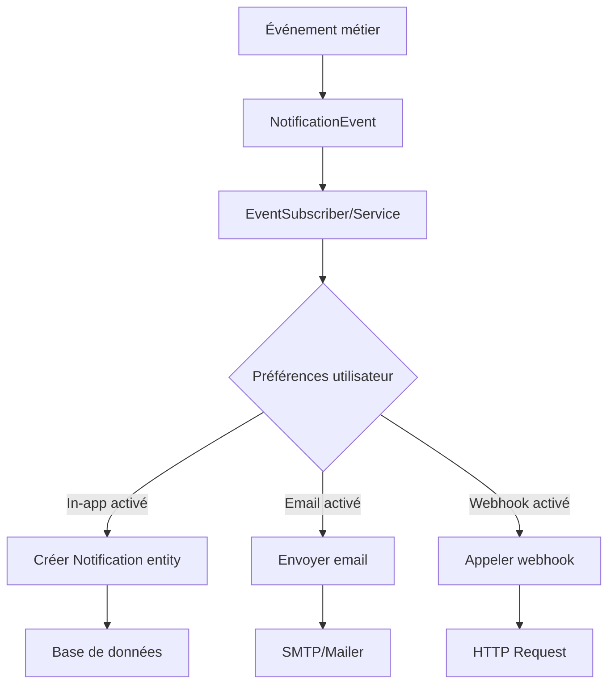

# Système de Notifications

Le système de notifications de HotOnes permet d'informer les utilisateurs des événements importants via plusieurs canaux (in-app, email, webhook).

## Table des matières

- [Vue d'ensemble](#vue-densemble)
- [Architecture](#architecture)
- [Entités](#entités)
- [Types de notifications](#types-de-notifications)
- [Service NotificationService](#service-notificationservice)
- [Contrôleur et routes](#contrôleur-et-routes)
- [Préférences utilisateur](#préférences-utilisateur)
- [Notifications implémentées](#notifications-implémentées)
- [Interface utilisateur](#interface-utilisateur)
- [Créer une nouvelle notification](#créer-une-nouvelle-notification)
- [Nettoyage automatique](#nettoyage-automatique)

---

## Vue d'ensemble

Le système de notifications supporte **3 canaux de diffusion**:

| Canal | Description | Statut |
|-------|-------------|--------|
| **In-app** | Notifications dans l'interface utilisateur | ✅ Implémenté |
| **Email** | Envoi d'email | ✅ Implémenté |
| **Webhook** | Envoi vers URL externe | ⚠️ Prévu (non implémenté) |

**Fonctionnalités clés:**
- Notifications personnalisées par utilisateur
- Préférences configurables par type d'événement
- Marquage lu/non lu
- API JSON pour dropdown temps réel
- Pagination et filtres
- Nettoyage automatique des anciennes notifications

---

## Architecture

### Flux de création de notification



**Exemple concret:**
1. Un contributeur ne saisit pas assez de temps dans la semaine
2. La commande `app:notify:timesheets-weekly` s'exécute (cron vendredi 12h)
3. Pour chaque contributeur concerné:
   - Création d'une `Notification` entity (in-app)
   - Envoi d'un email si activé dans les préférences
4. L'utilisateur voit la notification dans le header et reçoit un email

---

## Entités

### Notification

**Fichier:** `src/Entity/Notification.php`

Représente une notification individuelle pour un utilisateur.

**Champs:**

| Champ | Type | Description |
|-------|------|-------------|
| `id` | integer | Identifiant unique |
| `type` | NotificationType (enum) | Type de notification |
| `title` | string(255) | Titre court |
| `message` | text | Message complet |
| `data` | JSON | Données additionnelles (contexte, paramètres) |
| `recipient` | User (ManyToOne) | Destinataire de la notification |
| `entityType` | string(100) | Type d'entité liée (ex: "Order", "Project") |
| `entityId` | integer | ID de l'entité liée |
| `readAt` | DateTimeImmutable | Date de lecture (NULL si non lu) |
| `createdAt` | DateTimeImmutable | Date de création |

**Relations:**
- **ManyToOne** avec `User` (cascade DELETE)

**Méthodes utiles:**
```php
public function isRead(): bool                    // Notification déjà lue?
public function markAsRead(): self                // Marquer comme lue
public function getEntityUrl(): ?string           // URL de l'entité liée
```

**Exemple:**
```php
$notification = new Notification();
$notification->setRecipient($user)
    ->setType(NotificationType::PROJECT_BUDGET_ALERT)
    ->setTitle('Budget projet proche')
    ->setMessage('Le projet "Refonte e-commerce" a dépassé 90% de son budget.')
    ->setData(['project_id' => 42, 'percentage' => 92])
    ->setEntityType('Project')
    ->setEntityId(42);
```

---

### NotificationPreference

**Fichier:** `src/Entity/NotificationPreference.php`

Préférences de notification par utilisateur et par type d'événement.

**Champs:**

| Champ | Type | Description |
|-------|------|-------------|
| `id` | integer | Identifiant unique |
| `user` | User (ManyToOne) | Utilisateur |
| `eventType` | NotificationType (enum) | Type d'événement |
| `inApp` | boolean | Recevoir notification in-app? (défaut: true) |
| `email` | boolean | Recevoir email? (défaut: true) |
| `webhook` | boolean | Appeler webhook? (défaut: false) |

**Contrainte d'unicité:** `(user_id, event_type)` - Une seule préférence par utilisateur par type

**Comportement par défaut:**
- Si aucune préférence n'existe: in-app et email activés, webhook désactivé
- L'utilisateur peut désactiver certains canaux pour certains types d'événements

**Exemple:**
```php
// Désactiver les emails pour les rappels de saisie de temps
$pref = new NotificationPreference();
$pref->setUser($user)
    ->setEventType(NotificationType::TIMESHEET_MISSING_WEEKLY)
    ->setInApp(true)   // Garder in-app
    ->setEmail(false)  // Désactiver email
    ->setWebhook(false);
```

---

### NotificationSetting

**Fichier:** `src/Entity/NotificationSetting.php`

Configuration globale du système de notifications (clé/valeur).

**Champs:**

| Champ | Type | Description |
|-------|------|-------------|
| `id` | integer | Identifiant unique |
| `settingKey` | string(100) | Clé de configuration (unique) |
| `settingValue` | JSON | Valeur (array) |

**Settings actuels:**
```php
// Tolérance pour le rappel hebdomadaire de temps
KEY_TIMESHEET_WEEKLY_TOLERANCE = 'timesheet_weekly_tolerance'
// Valeur: 0.15 (15% de tolérance)
```

**Exemple d'utilisation:**
```php
// Dans NotificationSettingRepository
public function getValue(string $key, mixed $default = null): mixed
{
    $setting = $this->findOneBy(['settingKey' => $key]);
    return $setting ? $setting->getSettingValue() : $default;
}

// Usage
$tolerance = $settingsRepo->getValue('timesheet_weekly_tolerance', 0.15);
```

---

## Types de notifications

**Enum:** `src/Enum/NotificationType.php`

Liste des types de notifications disponibles:

| Type (valeur) | Label | Icône | Couleur | Usage |
|---------------|-------|-------|---------|-------|
| `quote_to_sign` | Nouveau devis à signer | fa-file-signature | info | Devis prêt pour signature |
| `quote_won` | Devis gagné | fa-check-circle | success | Devis signé/gagné |
| `quote_lost` | Devis perdu | fa-times-circle | danger | Devis refusé/perdu |
| `project_budget_alert` | Budget projet proche | fa-exclamation-triangle | warning | Dépassement de budget |
| `timesheet_pending_validation` | Temps en attente de validation | fa-clock | primary | Timesheets à valider |
| `payment_due_alert` | Échéance de paiement proche | fa-calendar-alt | warning | Paiement à venir |
| `kpi_threshold_exceeded` | Seuil KPI dépassé | fa-chart-line | danger | Alerte KPI |
| `timesheet_missing_weekly` | Rappel saisie temps hebdo | fa-hourglass-half | primary | Temps manquants |

**Méthodes de l'enum:**
```php
NotificationType::QUOTE_WON->getLabel();  // "Devis gagné"
NotificationType::QUOTE_WON->getIcon();   // "fa-check-circle"
NotificationType::QUOTE_WON->getColor();  // "success"
```

**Usage dans les templates:**
```twig
<i class="fas {{ notification.type.icon }}"></i>
<span class="badge bg-{{ notification.type.color }}">
    {{ notification.type.label }}
</span>
```

---

## Service NotificationService

**Fichier:** `src/Service/NotificationService.php`

Service centralisé pour gérer les notifications.

### Méthode `createNotification()`

Crée une notification pour un utilisateur.

**Signature:**
```php
public function createNotification(
    User $recipient,
    NotificationType $type,
    string $title,
    string $message,
    ?array $data = null,
    ?string $entityType = null,
    ?int $entityId = null
): Notification
```

**Exemple:**
```php
$notificationService->createNotification(
    recipient: $user,
    type: NotificationType::PROJECT_BUDGET_ALERT,
    title: 'Budget projet proche',
    message: 'Le projet "Refonte e-commerce" a dépassé 90% de son budget.',
    data: ['project_id' => 42, 'budget_percentage' => 92],
    entityType: 'Project',
    entityId: 42
);
```

---

### Méthode `createFromEvent()`

Crée des notifications à partir d'un événement pour plusieurs destinataires.

**Signature:**
```php
public function createFromEvent(NotificationEvent $event): array
```

**Usage:**
```php
$event = new NotificationEvent(
    recipients: [$manager, $director],
    type: NotificationType::QUOTE_WON,
    title: 'Nouveau devis signé',
    message: 'Le devis #12345 a été signé par le client.',
    data: ['order_id' => 12345],
    entityType: 'Order',
    entityId: 12345
);

$notifications = $notificationService->createFromEvent($event);
```

**Comportement:**
- Vérifie les préférences de chaque utilisateur
- Ne crée que les notifications in-app si activées
- Retourne un tableau de `Notification` créées

---

### Méthodes de marquage

```php
// Marquer une notification comme lue
$notificationService->markAsRead($notification);

// Marquer toutes les notifications d'un user comme lues
$count = $notificationService->markAllAsRead($user);
```

---

### Méthodes de récupération

```php
// Récupérer les 10 dernières notifications non lues
$unread = $notificationService->getUnreadNotifications($user, 10);

// Compter les notifications non lues
$count = $notificationService->countUnreadNotifications($user);
```

---

### Vérification des préférences

```php
// Vérifier si l'utilisateur veut recevoir in-app
$shouldSendInApp = $notificationService->shouldSendInApp($user, $type);

// Vérifier si l'utilisateur veut recevoir par email
$shouldSendEmail = $notificationService->shouldSendEmail($user, $type);

// Vérifier si l'utilisateur veut recevoir par webhook
$shouldSendWebhook = $notificationService->shouldSendWebhook($user, $type);
```

**Défauts:**
- In-app et Email: activés par défaut si aucune préférence
- Webhook: désactivé par défaut

---

### Nettoyage

```php
// Supprimer les notifications lues de plus de 30 jours
$deleted = $notificationService->cleanupOldNotifications(30);
```

---

## Contrôleur et routes

**Contrôleur:** `NotificationController`
**Préfixe:** `/notifications`
**Permission:** `ROLE_USER` (tous les utilisateurs authentifiés)

### Routes principales

| Route | Méthode | Nom | Action |
|-------|---------|-----|--------|
| `/notifications` | GET | `notification_index` | Liste paginée |
| `/notifications/api/unread` | GET | `notification_api_unread` | API notifications non lues |
| `/notifications/{id}/read` | POST | `notification_mark_read` | Marquer comme lu |
| `/notifications/mark-all-read` | POST | `notification_mark_all_read` | Tout marquer comme lu |
| `/notifications/{id}/delete` | POST | `notification_delete` | Supprimer |

---

### Page de liste (`GET /notifications`)

**Fonctionnalités:**
- Pagination (20 par page)
- Filtres par type
- Filtres par statut (lu/non lu)

**Paramètres de requête:**
- `page`: Numéro de page (défaut: 1)
- `type`: Filtrer par type (ex: `quote_won`)
- `status`: Filtrer par statut (`read` ou `unread`)

**Exemples:**
```
/notifications?page=2
/notifications?type=quote_won
/notifications?status=unread
/notifications?type=project_budget_alert&status=unread
```

---

### API notifications non lues (`GET /notifications/api/unread`)

**Usage:** Dropdown de notifications dans le header.

**Réponse JSON:**
```json
{
  "notifications": [
    {
      "id": 42,
      "type": "quote_won",
      "title": "Devis gagné",
      "message": "Le devis #12345 a été signé.",
      "icon": "fa-check-circle",
      "color": "success",
      "url": "/orders/12345",
      "created_at": "2024-03-15T14:30:00+00:00",
      "created_at_human": "Il y a 2 heures"
    }
  ],
  "count": 5
}
```

**Caractéristiques:**
- Retourne les 10 dernières notifications non lues
- Formatage de la date en relatif ("Il y a X minutes/heures/jours")
- URL de l'entité liée si disponible

---

### Marquer comme lu (`POST /notifications/{id}/read`)

**Réponse:**
```json
{
  "success": true
}
```

**Sécurité:** Vérifie que la notification appartient bien à l'utilisateur connecté.

---

### Tout marquer comme lu (`POST /notifications/mark-all-read`)

**Réponse:**
```json
{
  "success": true,
  "count": 12
}
```

---

### Supprimer (`POST /notifications/{id}/delete`)

**Protection CSRF:** Requiert un token CSRF valide.

**Redirection:** Vers `/notifications` après suppression.

---

## Préférences utilisateur

### Gestion des préférences

Actuellement, la gestion des préférences n'est pas exposée dans l'interface utilisateur, mais la structure est en place.

**À implémenter:**
- Page `/profile/notifications` avec liste des types de notifications
- Toggle pour chaque canal (in-app, email, webhook)
- Sauvegarde des préférences

**Structure attendue:**
```php
// Formulaire de préférences
foreach (NotificationType::cases() as $type) {
    echo $type->getLabel();
    // Checkboxes: In-app, Email, Webhook
}
```

**Sauvegarde:**
```php
$pref = $preferenceRepo->findByUserAndEventType($user, $type)
     ?? new NotificationPreference();
$pref->setUser($user)
    ->setEventType($type)
    ->setInApp($inAppEnabled)
    ->setEmail($emailEnabled)
    ->setWebhook($webhookEnabled);
$em->persist($pref);
```

---

## Notifications implémentées

### 1. Rappel hebdomadaire de saisie de temps

**Type:** `TIMESHEET_MISSING_WEEKLY`

**Déclencheur:** Commande cron `app:notify:timesheets-weekly` (vendredi 12h)

**Fichier:** `src/Command/NotifyWeeklyTimesheetsCommand.php`

**Logique:**
1. Pour chaque contributeur actif:
   - Récupère la période d'emploi active (EmploymentPeriod)
   - Calcule les heures attendues pour la semaine (du lundi au vendredi midi)
   - Somme les heures saisies
   - Si heures < (heures attendues × (1 - tolérance)):
     - Crée une notification in-app
     - Envoie un email si activé

**Tolérance:** Configurable via `NotificationSetting::KEY_TIMESHEET_WEEKLY_TOLERANCE` (défaut: 15%)

**Exemple de notification:**
```
Titre: Rappel de saisie des temps
Message: Vous avez saisi 28.5 h sur 35.0 h attendues cette semaine (tolérance 15%).
         Merci de compléter vos temps.
```

**Voir aussi:** [Documentation Commands - app:notify:timesheets-weekly](commands.md#appnotifytimesheets-weekly)

---

### 2. Autres notifications (à implémenter)

Les types suivants sont définis mais non implémentés:

**Devis:**
- `QUOTE_TO_SIGN`: Lorsqu'un devis est prêt pour signature
- `QUOTE_WON`: Lorsqu'un devis est signé/gagné
- `QUOTE_LOST`: Lorsqu'un devis est perdu

**Projets:**
- `PROJECT_BUDGET_ALERT`: Lorsque le budget dépasse un seuil (ex: 90%)

**Temps:**
- `TIMESHEET_PENDING_VALIDATION`: Lorsque des temps doivent être validés

**Facturation:**
- `PAYMENT_DUE_ALERT`: Lorsqu'une échéance de paiement approche

**Analytics:**
- `KPI_THRESHOLD_EXCEEDED`: Lorsqu'un KPI dépasse un seuil critique

---

## Interface utilisateur

### Dropdown header (temps réel)

**Fonctionnalité:**
- Badge avec nombre de notifications non lues
- Dropdown affichant les 10 dernières
- Click pour marquer comme lu
- Lien vers la page complète

**Implémentation (Stimulus/JavaScript):**
```javascript
// Polling toutes les 30 secondes
setInterval(async () => {
    const response = await fetch('/notifications/api/unread');
    const data = await response.json();
    updateBadge(data.count);
    updateDropdown(data.notifications);
}, 30000);
```

---

### Page de liste

**Template:** `templates/notification/index.html.twig`

**Sections:**
- Filtres (type, statut)
- Liste des notifications (titre, message, date, icône, lu/non lu)
- Pagination
- Action "Tout marquer comme lu"
- Action "Supprimer" par notification

---

## Créer une nouvelle notification

### Cas d'usage: Notification "Devis gagné"

**1. Identifier l'événement déclencheur**

Lorsqu'un devis passe au statut "gagné", notifier le commercial et le chef de projet.

**2. Créer un EventSubscriber**

```php
// src/EventSubscriber/OrderEventSubscriber.php
namespace App\EventSubscriber;

use App\Entity\Order;
use App\Enum\NotificationType;
use App\Service\NotificationService;
use Doctrine\Bundle\DoctrineBundle\Attribute\AsEntityListener;
use Doctrine\ORM\Event\PreUpdateEventArgs;
use Doctrine\ORM\Events;

#[AsEntityListener(event: Events::preUpdate, entity: Order::class)]
class OrderEventSubscriber
{
    public function __construct(
        private readonly NotificationService $notificationService
    ) {
    }

    public function preUpdate(Order $order, PreUpdateEventArgs $args): void
    {
        // Vérifier si le statut est passé à "gagne"
        if ($args->hasChangedField('status') && $order->getStatus() === 'gagne') {
            $this->notifyQuoteWon($order);
        }
    }

    private function notifyQuoteWon(Order $order): void
    {
        $recipients = [];

        // Notifier le commercial
        if ($salesperson = $order->getSalesperson()) {
            $recipients[] = $salesperson;
        }

        // Notifier le chef de projet
        if ($pm = $order->getProject()?->getProjectManager()) {
            $recipients[] = $pm;
        }

        foreach ($recipients as $user) {
            $this->notificationService->createNotification(
                recipient: $user,
                type: NotificationType::QUOTE_WON,
                title: 'Devis gagné',
                message: sprintf(
                    'Le devis #%d pour le projet "%s" a été gagné (montant: %s €).',
                    $order->getId(),
                    $order->getProject()->getName(),
                    number_format($order->calculateTotalFromSections(), 2)
                ),
                data: [
                    'order_id' => $order->getId(),
                    'project_id' => $order->getProject()->getId(),
                    'amount' => $order->calculateTotalFromSections(),
                ],
                entityType: 'Order',
                entityId: $order->getId()
            );
        }
    }
}
```

**3. Optionnel: Envoyer aussi un email**

Dans la même méthode:
```php
use Symfony\Component\Mailer\MailerInterface;
use Symfony\Component\Mime\Email;

// ...

private function notifyQuoteWon(Order $order): void
{
    // ... création notification in-app

    // Envoi email si activé
    foreach ($recipients as $user) {
        if ($this->notificationService->shouldSendEmail($user, NotificationType::QUOTE_WON)) {
            $email = (new Email())
                ->to($user->getEmail())
                ->subject('Devis gagné')
                ->text(sprintf(
                    "Bonjour %s,\n\nLe devis #%d pour le projet \"%s\" a été gagné !\n\nMontant: %s €\n\nConsultez le devis: %s",
                    $user->getFirstName(),
                    $order->getId(),
                    $order->getProject()->getName(),
                    number_format($order->calculateTotalFromSections(), 2),
                    'https://hotones.example.com/orders/' . $order->getId()
                ));

            $this->mailer->send($email);
        }
    }
}
```

---

## Nettoyage automatique

### Commande de nettoyage

**À créer:** `src/Command/CleanupOldNotificationsCommand.php`

```php
#[AsCommand(
    name: 'app:notifications:cleanup',
    description: 'Nettoie les anciennes notifications lues'
)]
class CleanupOldNotificationsCommand extends Command
{
    public function __construct(
        private readonly NotificationService $notificationService
    ) {
        parent::__construct();
    }

    protected function execute(InputInterface $input, OutputInterface $output): int
    {
        $deleted = $this->notificationService->cleanupOldNotifications(30);

        $output->writeln("Notifications nettoyées: $deleted");

        return Command::SUCCESS;
    }
}
```

**Cron:**
```cron
# Nettoyage des notifications tous les jours à 3h
0 3 * * * cd /var/www/hotones && php bin/console app:notifications:cleanup --env=prod
```

---

## Évolutions futures

### Fonctionnalités à ajouter

1. **Interface de gestion des préférences**
   - Page `/profile/notifications`
   - Toggle par type et par canal
   - Prévisualisation des notifications

2. **Webhooks**
   - Implémentation de l'envoi vers URL externe
   - Configuration d'URL webhook par utilisateur
   - Retry en cas d'échec

3. **Notifications push (navigateur)**
   - Service Worker
   - Push API
   - Notifications desktop

4. **Groupement de notifications**
   - Grouper les notifications similaires
   - Ex: "3 nouveaux devis à signer" au lieu de 3 notifications séparées

5. **Digests**
   - Résumé quotidien ou hebdomadaire par email
   - Configurable par utilisateur

6. **Templates d'emails**
   - Templates Twig pour les emails
   - Design HTML responsive
   - Variables dynamiques

7. **Statistiques**
   - Taux d'ouverture des notifications
   - Temps moyen avant lecture
   - Types les plus fréquents

---

## Voir aussi

- [Commands](commands.md) - Commande `app:notify:timesheets-weekly`
- [Entities](entities.md) - Entités Notification, NotificationPreference, NotificationSetting
- [Time Planning](time-planning.md) - Saisie des temps (lié au rappel hebdomadaire)
- [Roles](roles.md) - Permissions (`ROLE_USER` minimum)
