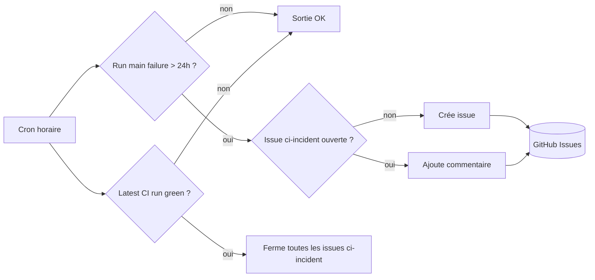

# CI Monitoring (OPS-004)

> Origine : sprint-003 OPS-004, retro sprint-002 action 1, 5 Pourquoi cause racine "personne ne voyait que `main` était rouge avant d'ouvrir un PR sprint".

## Vue d'ensemble

Le workflow `.github/workflows/ci-health-check.yml` ouvre une issue automatique quand au moins un workflow critique (`CI`, `Quality`, `SonarQube Analysis`) est en `failure` sur `main` depuis plus de 24 heures. La même issue se ferme automatiquement dès qu'un run `CI` sur `main` redevient vert.

Cron : toutes les heures (`7 * * * *`). Déclenchable aussi à la main via `workflow_dispatch`.

## Comportement



## Workflows critiques surveillés

Le filtre dans le workflow utilise un nom de workflow exact. Il faut maintenir cette liste si les noms changent :

- `CI` (`.github/workflows/ci.yml`)
- `Quality` (`.github/workflows/quality.yml`)
- `SonarQube Analysis` (`.github/workflows/sonarqube.yml`)

Pour ajouter un workflow : éditer le filtre `jq` dans le job `check-main-status`.

## Pré-requis dans le repo

- Un label `ci-incident` doit exister (couleur suggérée : rouge `#d73a4a`).

```bash
gh label create ci-incident --color d73a4a --description "Auto-opened when main CI is red >24h (OPS-004)"
```

- Permissions du `GITHUB_TOKEN` : `issues: write`, `actions: read` (déclarées dans le workflow lui-même).

## Test

Procédure manuelle :

```bash
# 1. Déclencher le workflow à la main
gh workflow run "CI Health Check (main)"

# 2. Suivre le run
gh run watch

# 3. Vérifier qu'aucune issue ci-incident n'est créée si main est vert
gh issue list --label ci-incident

# 4. Pour tester l'ouverture : push un commit cassant sur main, attendre que le run échoue,
#    puis attendre 24h (ou modifier temporairement le delta dans le workflow à 1h).
```

## Failure modes connus

| Cas | Effet | Action |
|---|---|---|
| `gh run list` rate-limited | Le job échoue, prochaine exécution dans 1h | Pas d'action — auto-resilient |
| Plusieurs runs failed > 24h | Une seule issue créée, les suivantes commentent dessus | Voulu (pas d'inondation) |
| Issue manuellement fermée | Si CI toujours rouge >24h, le job rouvre une nouvelle issue | Ne pas fermer manuellement, fixer le CI |
| `ci-incident` label absent | `gh issue create` échoue | Créer le label (cf. plus haut) |

## Dette future

- Notifier Slack en plus de l'issue (webhook `SLACK_CI_WEBHOOK`) — sprint suivant si demande.
- Étendre aux PRs anciennes restant rouges sur `feat/*` (signal de PRs abandonnées).
