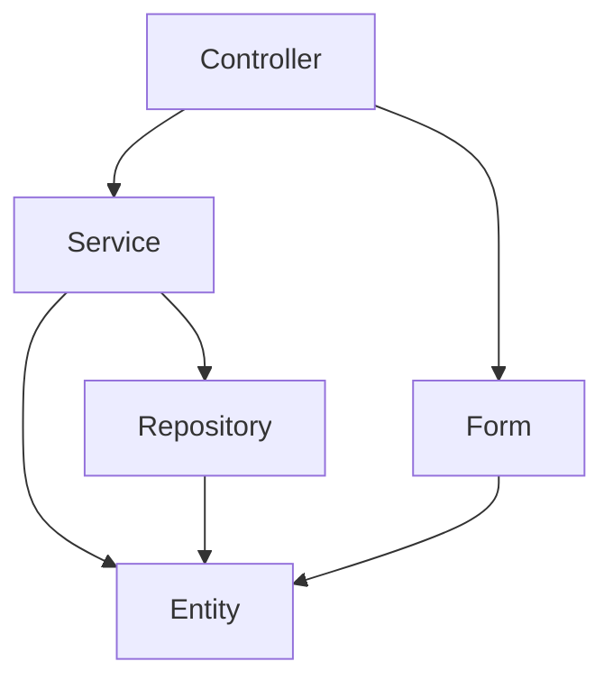
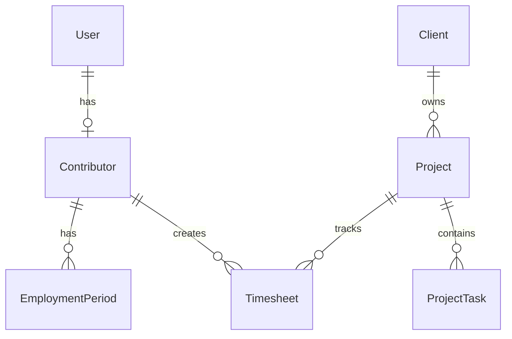

# 🔥 Hotspots de Dette Technique - HotOnes

**Date :** 28 décembre 2025
**Contexte :** Lot 11bis.1 - Identification de la dette technique

---

## 📊 Vue d'Ensemble

### Statistiques du Projet

| Métrique | Valeur | Commentaire |
|----------|--------|-------------|
| **Fichiers PHP** | 334 | Base de code moyenne |
| **Symfony** | 8.0.2 | ✅ Version récente (décembre 2024) |
| **PHP** | 8.4.15 | ✅ Version récente (décembre 2024) |
| **Couverture tests** | 15.18% | 🔴 Insuffisant (objectif 60%) |
| **Violations Deptrac** | 0 | ✅ Architecture propre |
| **PHPStan errors** | 0 | ✅ Qualité code excellente |

---

## 🔴 Hotspot #1 : Couverture de Tests Insuffisante

### 📊 État Actuel
- **Lignes couvertes** : 15.18% (3757/24747 lignes)
- **Classes couvertes** : 6.67% (22/330 classes)
- **Méthodes couvertes** : 18.27% (552/3021 méthodes)

### Impact
- **Sévérité** : 🔴 **CRITIQUE**
- **Risque** : Régressions non détectées lors des évolutions
- **Dette technique** : ~45% de code non testé à couvrir

### Composants Critiques NON Testés

#### Services Métier (Priorité 1) - 0% couvert
```
src/Service/Analytics/DashboardReadService.php          (0%)
src/Service/Analytics/MetricsCalculationService.php     (0%)
src/Service/ExcelExportService.php                      (0%)
src/Service/TimesheetCalculationService.php             (0%)
```

**Impact** : Calculs financiers et analytics non validés

#### Repositories (Priorité 2) - 0-20% couvert
```
src/Repository/ProjectRepository.php                    (~10%)
src/Repository/OrderRepository.php                      (~15%)
src/Repository/TimesheetRepository.php                  (~5%)
src/Repository/ContributorRepository.php                (~20%)
```

**Impact** : Requêtes métier complexes non testées

#### Controllers (Priorité 3) - 0-30% couvert
```
src/Controller/TimesheetController.php                  (~25%)
src/Controller/Analytics/DashboardController.php        (~30%)
src/Controller/ProjectController.php                    (~20%)
src/Controller/OrderController.php                      (~10%)
```

**Impact** : Scénarios utilisateurs non validés

### Plan d'Action

**Objectif** : Passer de 15% à 60% (+45 points)

| Phase | Cible | Estimation | Gain attendu |
|-------|-------|------------|--------------|
| **Phase 1** : Services métier | 4 services | 1.5j | +15-20% |
| **Phase 2** : Repositories | 6 repositories | 2j | +15-20% |
| **Phase 3** : Controllers | 5 controllers | 1j | +5-10% |
| **Phase 4** : Entités logique | 5 entités | 1j | +5-10% |

**Total estimé** : 5.5-6 jours → **Couverture cible : 55-75%** ✅

---

## 🟠 Hotspot #2 : Sécurité Headers Manquants

### État Actuel

| Header | Statut | Risque |
|--------|--------|--------|
| X-Frame-Options | ✅ DENY | Aucun |
| X-Content-Type-Options | ✅ nosniff | Aucun |
| Referrer-Policy | ✅ strict-origin | Aucun |
| **CSP (Content-Security-Policy)** | 🔴 Désactivé | **XSS** |
| HSTS | ⚠️ Dev only | MITM (prod) |

### Impact
- **Sévérité** : 🟠 **HAUTE**
- **Risque** : XSS non mitigé par CSP
- **Dette technique** : Configuration CSP à finaliser

### Configuration CSP Recommandée

```yaml
# config/packages/nelmio_security.yaml
nelmio_security:
    csp:
        enabled: true
        report_endpoint: /csp/report
        directives:
            default-src: ["'self'"]
            script-src:
                - "'self'"
                - "'unsafe-inline'"  # Chart.js, Bootstrap
                - "cdn.jsdelivr.net"
                - "cdnjs.cloudflare.com"
            style-src:
                - "'self'"
                - "'unsafe-inline'"  # Bootstrap
            img-src:
                - "'self'"
                - "data:"
                - "blob:"
            font-src:
                - "'self'"
                - "fonts.gstatic.com"
            connect-src:
                - "'self'"
            frame-ancestors:
                - "'none'"
```

### Plan d'Action

**Estimation** : 2-3 heures

1. Activer CSP dans `nelmio_security.yaml`
2. Tester les pages critiques (dashboard, timesheet)
3. Ajuster les directives selon les erreurs CSP
4. Documenter les exceptions (`unsafe-inline`)

---

## 🟡 Hotspot #3 : Performance Non Auditée

### État Actuel
- **Profiling** : ❌ Aucun profiling Blackfire effectué
- **Cache** : ⚠️ Redis configuré mais non utilisé partout
- **Requêtes N+1** : ❓ Non audité systématiquement
- **Index DB** : ❓ Aucune analyse EXPLAIN

### Impact
- **Sévérité** : 🟡 **MOYENNE**
- **Risque** : Dégradation performance avec volumétrie
- **Dette technique** : Optimisations préventives non effectuées

### Parcours Critiques à Profiler

1. **Dashboard Analytics** (`/analytics/dashboard`)
   - Chargement KPIs (FactProjectMetrics)
   - Génération graphiques Chart.js
   - Calculs métriques temps réel

2. **Saisie Timesheet** (`/timesheet`)
   - Chargement semaine (7j × N projets)
   - Auto-save AJAX
   - Cascade projet → tâche → sous-tâche

3. **Liste Projets** (`/project`)
   - Filtres avancés
   - Calculs rentabilité par projet
   - Pagination (20/50/100 items)

### Plan d'Action

**Estimation** : 2-3 jours (Lot 11bis.3)

| Étape | Action | Estimation |
|-------|--------|------------|
| 1 | Installer Blackfire | 0.5h |
| 2 | Profiler 3 parcours critiques | 1j |
| 3 | Identifier requêtes N+1 | 0.5j |
| 4 | Analyser index manquants (EXPLAIN) | 0.5j |
| 5 | Appliquer optimisations | 0.5j |

**ROI attendu** : -30-40% temps de réponse

---

## 🟡 Hotspot #4 : Logging et Monitoring Basiques

### État Actuel
- **Logs applicatifs** : ✅ Monolog configuré
- **Logs sécurité** : ⚠️ Partiels (login OK, échecs login manquants)
- **Monitoring APM** : ❌ Aucun (Sentry, New Relic, Datadog)
- **Alerting** : ❌ Aucun

### Événements Sensibles NON Loggés

```
❌ Échecs de login (brute-force detection)
❌ Accès refusés (403 Forbidden)
❌ Modifications de permissions
❌ Suppressions de données (GDPR)
❌ Changements de mots de passe
❌ Activations/désactivations 2FA
```

### Impact
- **Sévérité** : 🟡 **MOYENNE**
- **Risque** : Incidents de sécurité non détectés
- **Dette technique** : Observabilité insuffisante

### Plan d'Action

**Estimation** : 1-2 jours (Lot 11bis.5)

#### Phase 1 : Logging Sécurité (3h)

```php
// src/EventSubscriber/SecurityEventsSubscriber.php
class SecurityEventsSubscriber implements EventSubscriberInterface
{
    public function onLoginFailure(LoginFailureEvent $event): void
    {
        $this->logger->warning('Failed login attempt', [
            'email' => $event->getPassport()->getUser()->getUserIdentifier(),
            'ip' => $event->getRequest()->getClientIp(),
            'user_agent' => $event->getRequest()->headers->get('User-Agent'),
        ]);
    }

    public function onAccessDenied(AccessDeniedEvent $event): void
    {
        $this->logger->error('Access denied', [
            'route' => $event->getRequest()->attributes->get('_route'),
            'user' => $this->security->getUser()?->getUserIdentifier(),
        ]);
    }
}
```

#### Phase 2 : Monitoring APM (4-5h)

**Options** :
- **Sentry** (recommandé) : Erreurs + Performance + Release tracking
- **New Relic** : APM complet (payant)
- **Datadog** : Infrastructure + APM (payant)

**Choix recommandé** : **Sentry** (gratuit jusqu'à 5k events/mois)

```bash
# Installation Sentry
docker compose exec app composer require sentry/sentry-symfony

# Configuration
# config/packages/sentry.yaml
sentry:
    dsn: '%env(SENTRY_DSN)%'
    options:
        traces_sample_rate: 0.1  # 10% des transactions
        profiles_sample_rate: 0.1  # 10% de profiling
```

---

## 🟢 Hotspot #5 : Documentation Architecture Manquante

### État Actuel
- **Architecture** : ❌ Aucun diagramme
- **Design patterns** : ❌ Non documentés
- **Dépendances** : ⚠️ Partiellement documenté (CLAUDE.md)

### Impact
- **Sévérité** : 🟢 **BASSE**
- **Risque** : Onboarding lent, maintenabilité réduite
- **Dette technique** : Connaissance tacite non formalisée

### Plan d'Action

**Estimation** : 0.5-1 jour

#### Diagrammes à créer (Mermaid)

**1. Architecture en couches**


**2. Schéma de données (ERD)**


**3. Flux principaux**
- Saisie de temps
- Génération de devis
- Calcul de métriques analytics

**Fichier** : `docs/architecture-diagrams.md`

---

## 🟢 Hotspot #6 : Dépendances Outdated

### État Actuel
- **Sécurité** : ✅ Aucune vulnérabilité (Roave Security Advisories)
- **Fraîcheur** : ❓ À vérifier avec `composer outdated`

### Plan d'Action

```bash
# Audit des dépendances obsolètes
docker compose exec app composer outdated --direct

# Mise à jour (attention breaking changes)
docker compose exec app composer update --with-dependencies
```

**Estimation** : 1-2 heures (vérification + tests)

---

## 📊 Synthèse des Hotspots

| Hotspot | Sévérité | Estimation | Lot | Priorité |
|---------|----------|------------|-----|----------|
| **#1 Tests** | 🔴 Critique | 5.5-6j | 11bis.2 | 1 |
| **#2 CSP** | 🟠 Haute | 2-3h | 11bis.4 | 2 |
| **#3 Performance** | 🟡 Moyenne | 2-3j | 11bis.3 | 3 |
| **#4 Logging/Monitoring** | 🟡 Moyenne | 1-2j | 11bis.5 | 4 |
| **#5 Documentation** | 🟢 Basse | 0.5-1j | 11bis.1 | 5 |
| **#6 Dépendances** | 🟢 Basse | 1-2h | 11bis.4 | 6 |

**Total estimé** : **10-14 jours** (conforme au budget Lot 11bis)

---

## 🎯 Plan d'Action Priorisé

### Semaine 1 (5j) - FONDATIONS
1. **Hotspot #1** : Augmenter tests à 60% (5.5-6j)
   - Services → Repositories → Controllers → Entités

### Semaine 2 (3j) - SÉCURITÉ & PERFORMANCE
2. **Hotspot #2** : Configurer CSP (2-3h)
3. **Hotspot #3** : Profiling et optimisations (2-3j)

### Semaine 3 (2j) - OBSERVABILITÉ & DOC
4. **Hotspot #4** : Logging sécurité + Sentry (1-2j)
5. **Hotspot #5** : Documentation architecture (0.5-1j)
6. **Hotspot #6** : Audit dépendances (1-2h)

---

## 📈 Indicateurs de Réussite

| Indicateur | Avant | Objectif | Mesure |
|------------|-------|----------|--------|
| Couverture tests | 15.18% | 60% | PHPUnit |
| Headers sécurité | 3/5 | 4/5 | nelmio/security |
| Temps réponse dashboard | ? | <500ms | Blackfire |
| Logs sécurité | Partiels | Complets | Sentry |
| Documentation arch | Aucune | Complète | Markdown + Mermaid |

---

## 🔗 Références

- **Audit Qualité** : `docs/technical-audit-lot11bis-2025-12-28.md`
- **Audit Sécurité** : `docs/security-audit-owasp-2025-12-27.md`
- **Roadmap** : `ROADMAP.md` (Lots 11bis, 34, 35)
- **Tests** : `docs/tests.md`

---

**Dernière mise à jour** : 28 décembre 2025
**Auteur** : Claude Sonnet 4.5 via Claude Code
