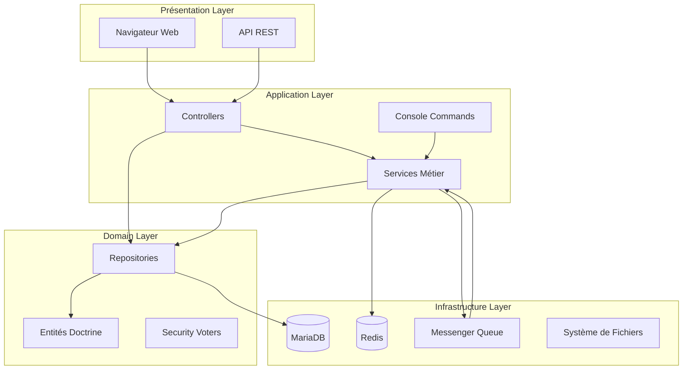
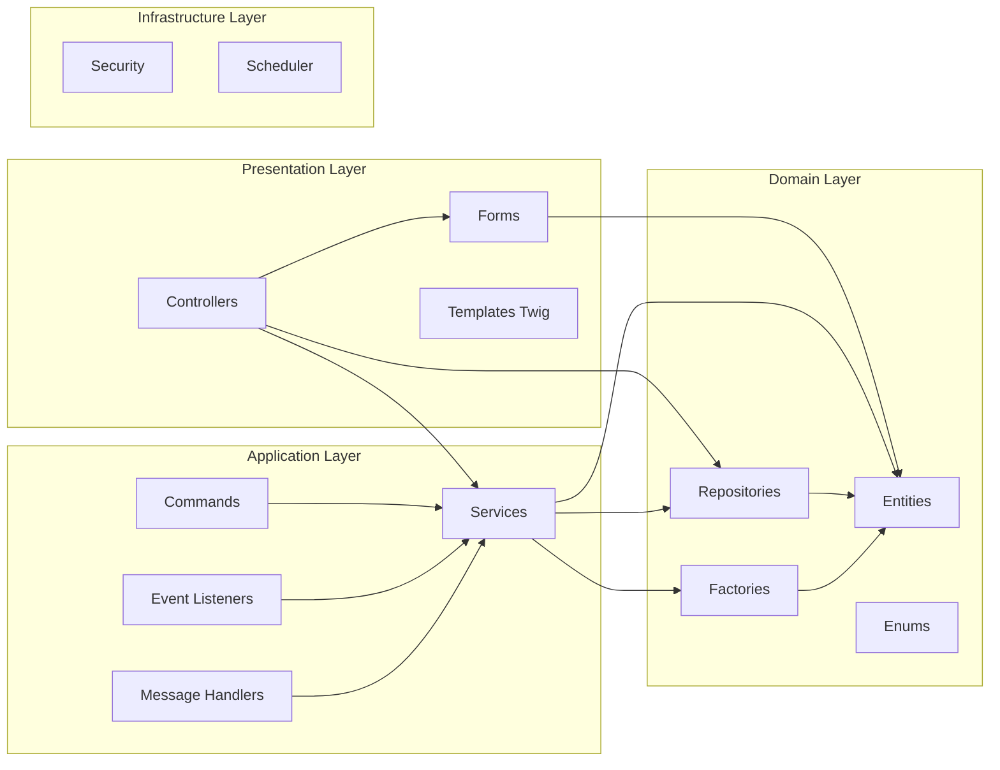
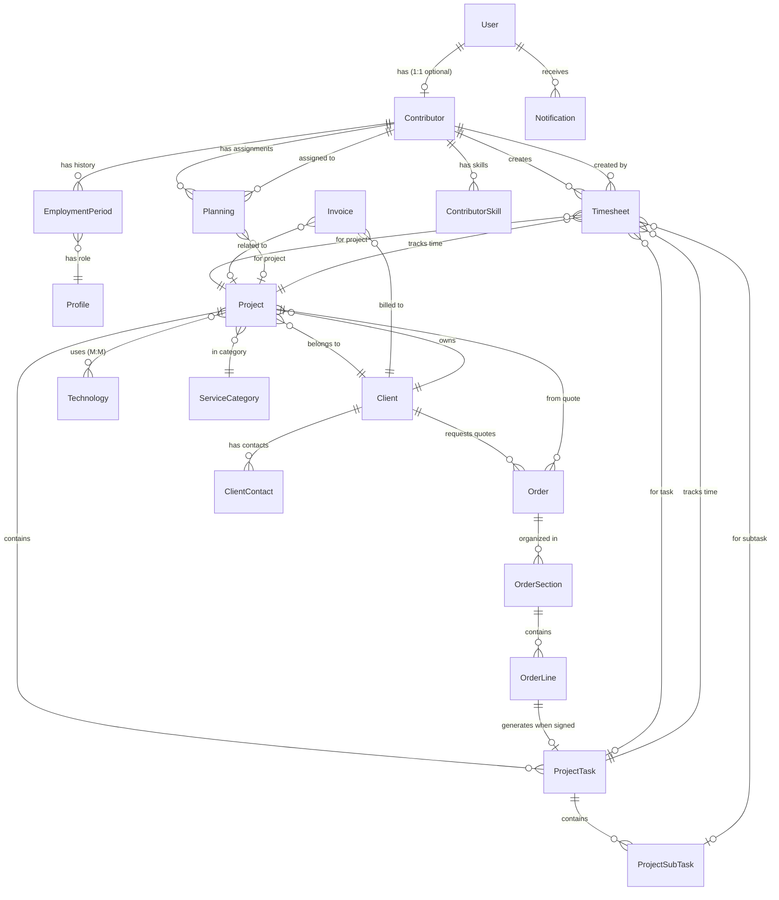
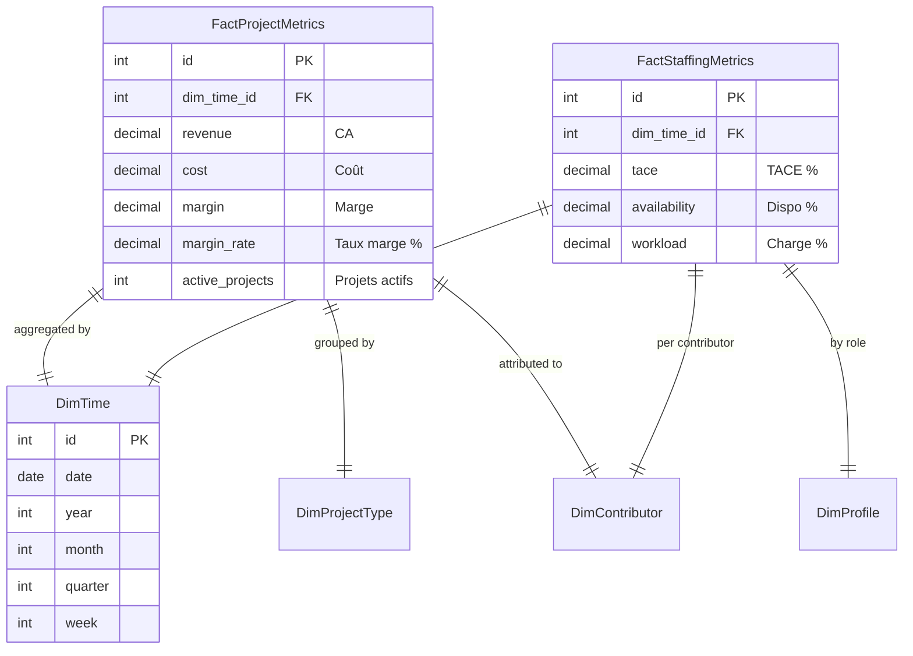
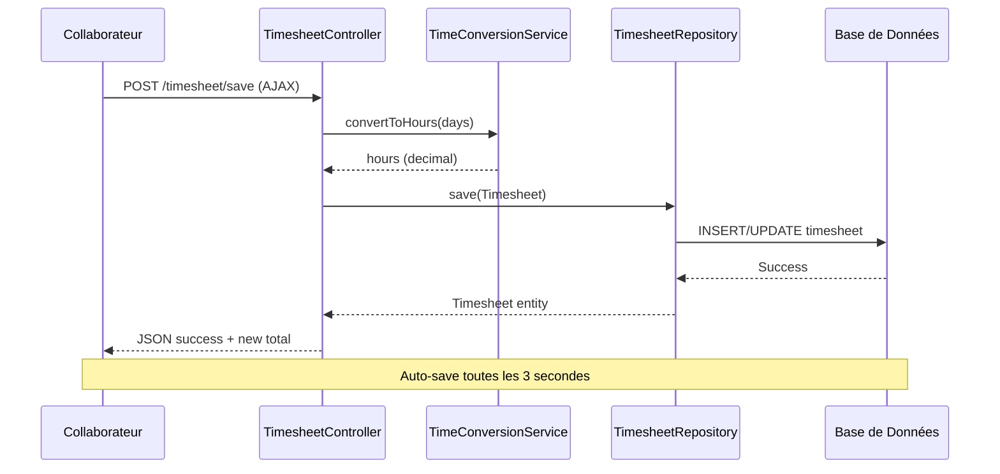
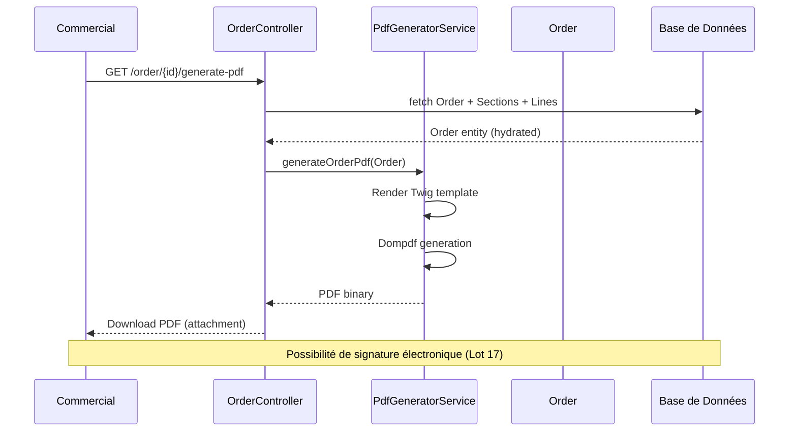
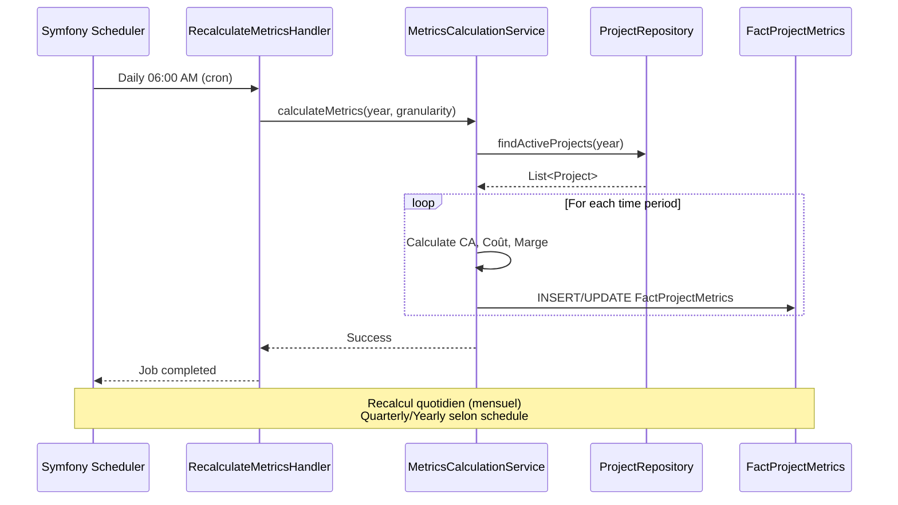
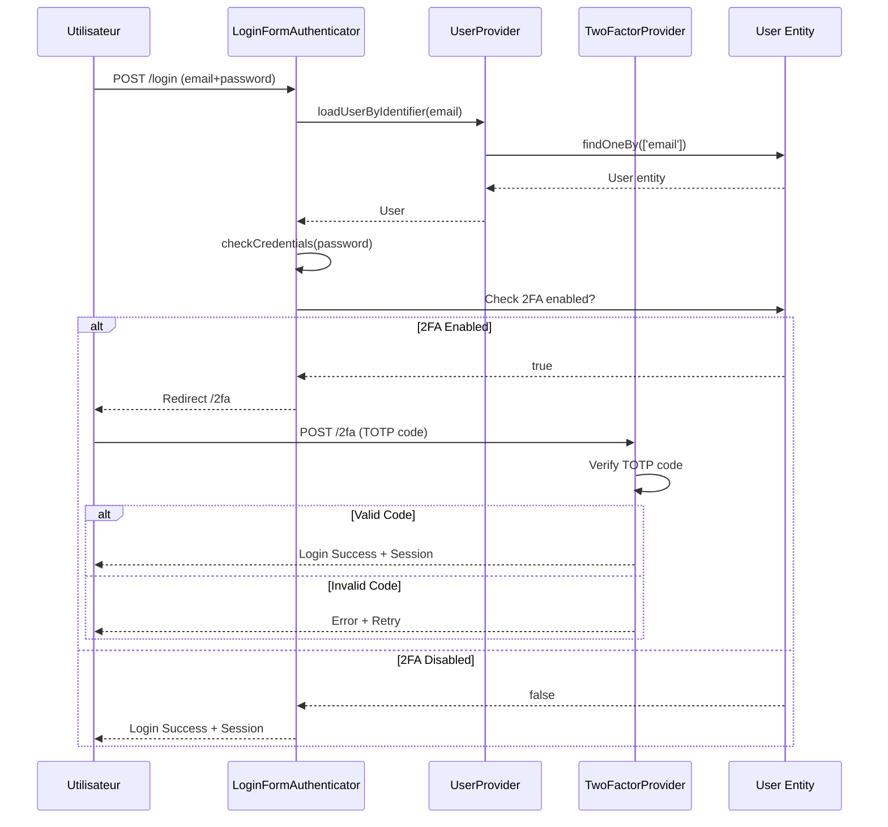

# 🏗️ Architecture HotOnes - Documentation Technique

**Date :** 28 décembre 2025
**Version :** 1.0
**Stack :** Symfony 8.0.2 + PHP 8.4.15 + MariaDB 11.4

---

## 📋 Table des Matières

1. [Vue d'Ensemble](#vue-densemble)
2. [Architecture en Couches](#architecture-en-couches)
3. [Schéma de Données (ERD)](#schéma-de-données-erd)
4. [Flux Principaux](#flux-principaux)
5. [Design Patterns](#design-patterns)
6. [Conventions de Nommage](#conventions-de-nommage)
7. [Composants Clés](#composants-clés)

---

## 🎯 Vue d'Ensemble

### Mission de l'Application

HotOnes est un **ERP métier pour agence web** permettant de gérer :
- 📊 Projets (forfait/régie) et rentabilité
- ⏱️ Saisie des temps et planning
- 💰 Devis, facturation et trésorerie
- 👥 Collaborateurs, compétences et RH
- 📈 Analytics et KPIs de performance

### Architecture Globale



### Stack Technique

| Composant | Technologie | Version |
|-----------|-------------|---------|
| **Framework** | Symfony | 8.0.2 |
| **Language** | PHP | 8.4.15 |
| **Base de données** | MariaDB | 11.4 |
| **Cache** | Redis + APCu | - |
| **Queue** | Symfony Messenger | - |
| **Frontend** | Twig + Bootstrap 5 | Skote theme |
| **Assets** | Webpack Encore | - |
| **Tests** | PHPUnit + Panther | - |

---

## 🏛️ Architecture en Couches

### Séparation des Responsabilités (Deptrac)



### Règles de Dépendances (Deptrac)

| Couche | Peut dépendre de |
|--------|------------------|
| **Controllers** | Service, Form, Entity, Repository, Security, Enum |
| **Services** | Entity, Repository, Factory, Enum, Message, Security |
| **Commands** | Service, Entity, Repository, Enum, Message |
| **Forms** | Entity, Enum, Repository |
| **Repositories** | Entity, Enum |
| **Entities** | Enum (uniquement) |
| **Enums** | Rien (feuilles) |

**Validation :** `composer deptrac` (0 violation ✅)

---

## 📊 Schéma de Données (ERD)

### Modèle Principal



### Modèle Analytics (Star Schema)



### Entités Principales (45+)

**Gestion Projets :**
- `Project`, `ProjectTask`, `ProjectSubTask`
- `Order`, `OrderSection`, `OrderLine`
- `Client`, `ClientContact`

**Temps & Planning :**
- `Timesheet`, `RunningTimer`
- `Planning`, `Vacation`

**RH & Collaborateurs :**
- `User`, `Contributor`, `EmploymentPeriod`
- `Profile`, `Skill`, `ContributorSkill`
- `PerformanceReview`, `OnboardingTask`

**Facturation & Finance :**
- `Invoice`, `ExpenseReport`
- `BillingMarker`

**Analytics :**
- `FactProjectMetrics`, `FactStaffingMetrics`
- `DimTime`, `DimProjectType`, `DimContributor`

**Gamification :**
- `Badge`, `Achievement`, `XpHistory`

---

## 🔄 Flux Principaux

### 1. Flux Saisie de Temps



**Composants clés :**
- `TimesheetController::save()` : Endpoint AJAX
- `TimeConversionService` : Conversion jours ↔ heures
- `TimesheetRepository` : Persistance
- JavaScript : `timesheet.js` (auto-save)

---

### 2. Flux Génération de Devis



**Composants clés :**
- `OrderController::generatePdf()` : Endpoint
- `PdfGeneratorService` : Génération PDF (Dompdf)
- Template : `order/pdf.html.twig`
- Entités : `Order`, `OrderSection`, `OrderLine`

---

### 3. Flux Calcul de Métriques Analytics



**Composants clés :**
- `AnalyticsScheduleProvider` : Configuration scheduling
- `RecalculateMetricsMessage` + `Handler` : Message bus
- `MetricsCalculationService` : Logique calcul
- `FactProjectMetrics` : Stockage pré-calculé
- `DashboardReadService` : Lecture KPIs

---

### 4. Flux Authentification 2FA



**Composants clés :**
- `LoginFormAuthenticator` : Guard Symfony
- `UserProvider` : Chargement User
- `scheb/2fa-bundle` : TOTP 2FA
- `User::getTotpSecret()` : Secret TOTP

---

## 🎨 Design Patterns

### 1. Repository Pattern

**Principe :** Abstraction de l'accès aux données

```php
// Interface implicite (Doctrine ServiceEntityRepository)
class ProjectRepository extends ServiceEntityRepository
{
    // Query methods métier
    public function findActiveProjectsBetweenDates(
        \DateTimeInterface $start,
        \DateTimeInterface $end
    ): array {
        return $this->createQueryBuilder('p')
            ->where('p.startedAt >= :start')
            ->andWhere('p.startedAt <= :end')
            ->andWhere('p.status = :status')
            ->setParameter('start', $start)
            ->setParameter('end', $end)
            ->setParameter('status', ProjectStatus::ACTIVE)
            ->getQuery()
            ->getResult();
    }
}
```

**Avantages :**
- ✅ Testabilité (mockable)
- ✅ Réutilisation des requêtes
- ✅ Séparation couches

---

### 2. Service Layer Pattern

**Principe :** Logique métier centralisée

```php
class ProfitabilityService
{
    public function __construct(
        private ProjectRepository $projectRepository,
        private TimesheetRepository $timesheetRepository,
        private CjmCalculatorService $cjmCalculator,
    ) {}

    public function calculateProjectProfitability(Project $project): array
    {
        // 1. Récupérer les données
        $timesheets = $this->timesheetRepository->findByProject($project);

        // 2. Calculs métier
        $revenue = $this->calculateRevenue($project);
        $cost = $this->calculateCost($timesheets);
        $margin = $revenue - $cost;
        $marginRate = ($margin / $revenue) * 100;

        return [
            'revenue' => $revenue,
            'cost' => $cost,
            'margin' => $margin,
            'margin_rate' => $marginRate,
        ];
    }
}
```

**Avantages :**
- ✅ Logique réutilisable
- ✅ Tests unitaires faciles
- ✅ Single Responsibility

---

### 3. Message Bus Pattern (Async)

**Principe :** Traitement asynchrone via queue

```php
// Message
class RecalculateMetricsMessage
{
    public function __construct(
        public readonly int $year,
        public readonly string $granularity = 'monthly',
    ) {}
}

// Handler
class RecalculateMetricsHandler implements MessageHandlerInterface
{
    public function __invoke(RecalculateMetricsMessage $message): void
    {
        $this->metricsService->calculateMetrics(
            $message->year,
            $message->granularity
        );
    }
}

// Dispatch
$this->messageBus->dispatch(
    new RecalculateMetricsMessage(2025, 'monthly')
);
```

**Avantages :**
- ✅ Non-bloquant
- ✅ Scalabilité
- ✅ Retry automatique

---

### 4. Factory Pattern

**Principe :** Création d'objets complexes

```php
class UserFactory extends Factory
{
    protected static function getDefaults(): array
    {
        return [
            'email' => self::faker()->email(),
            'password' => 'password',
            'firstName' => self::faker()->firstName(),
            'lastName' => self::faker()->lastName(),
            'roles' => ['ROLE_USER'],
            'isVerified' => true,
        ];
    }

    public function asAdmin(): self
    {
        return $this->with([
            'roles' => ['ROLE_ADMIN'],
        ]);
    }
}

// Usage en tests
$admin = UserFactory::new()->asAdmin()->create();
```

**Avantages :**
- ✅ Tests reproductibles
- ✅ Fixtures simplifiées
- ✅ Fluent API

---

### 5. Voter Pattern (Security)

**Principe :** Logique d'autorisation centralisée

```php
class ProjectVoter extends Voter
{
    protected function supports(string $attribute, mixed $subject): bool
    {
        return $subject instanceof Project
            && in_array($attribute, ['VIEW', 'EDIT', 'DELETE']);
    }

    protected function voteOnAttribute(
        string $attribute,
        mixed $subject,
        TokenInterface $token
    ): bool {
        $user = $token->getUser();

        return match($attribute) {
            'VIEW' => $this->canView($subject, $user),
            'EDIT' => $this->canEdit($subject, $user),
            'DELETE' => $this->canDelete($subject, $user),
            default => false,
        };
    }
}
```

**Avantages :**
- ✅ Permissions granulaires
- ✅ Testable unitairement
- ✅ Centralisé

---

### 6. Data Mapper Pattern (Doctrine ORM)

**Principe :** Séparation objet métier ↔ base de données

```php
#[ORM\Entity(repositoryClass: ProjectRepository::class)]
#[ORM\Table(name: 'projects')]
class Project
{
    #[ORM\Id]
    #[ORM\GeneratedValue]
    #[ORM\Column]
    private ?int $id = null;

    #[ORM\Column(length: 255)]
    private string $name;

    #[ORM\ManyToOne(targetEntity: Client::class, inversedBy: 'projects')]
    #[ORM\JoinColumn(nullable: false)]
    private Client $client;

    // Business logic (not DB-aware)
    public function isOverBudget(): bool
    {
        return $this->getSpentHours() > $this->getBudgetHours();
    }
}
```

**Avantages :**
- ✅ Entités riches (pas anémiques)
- ✅ ORM transparent
- ✅ Requêtes paramétrées (sécurité)

---

## 📝 Conventions de Nommage

### Entités

| Convention | Exemple | Règle |
|------------|---------|-------|
| **Nom** | `Project`, `OrderLine` | PascalCase, singulier |
| **Table** | `projects`, `order_lines` | snake_case, pluriel |
| **Propriété** | `startedAt`, `clientName` | camelCase |
| **Colonne** | `started_at`, `client_name` | snake_case |

### Controllers

| Convention | Exemple | Règle |
|------------|---------|-------|
| **Nom** | `ProjectController` | `{Entity}Controller` |
| **Action** | `show`, `edit`, `delete` | Verbe, camelCase |
| **Route** | `project_show` | `{entity}_{action}` |

### Repositories

| Convention | Exemple | Règle |
|------------|---------|-------|
| **Nom** | `ProjectRepository` | `{Entity}Repository` |
| **Méthode** | `findActiveProjects()` | `find*`, `count*`, `get*` |

### Services

| Convention | Exemple | Règle |
|------------|---------|-------|
| **Nom** | `ProfitabilityService` | `{Domain}Service` |
| **Méthode** | `calculateMargin()` | Verbe, camelCase |

### Templates

| Convention | Exemple | Règle |
|------------|---------|-------|
| **Fichier** | `project/show.html.twig` | `{entity}/{action}.html.twig` |
| **Variable** | `{{ project.name }}` | camelCase |

---

## 🧩 Composants Clés

### Controllers (53 controllers)

**Gestion Projets :**
- `ProjectController` : CRUD projets
- `ProjectTaskController` : Gestion tâches
- `ProjectDetailController` : Vue détaillée projet
- `OrderController` : Devis

**Temps & Planning :**
- `TimesheetController` : Saisie temps (AJAX)
- `PlanningController` : Planning collaborateurs
- `VacationRequestController` : Demandes congés

**Dashboards :**
- `HomeController` : Dashboard principal
- `SalesDashboardController` : Dashboard commercial
- `Analytics/DashboardController` : Analytics/KPIs
- `HrDashboardController` : Dashboard RH
- `TreasuryController` : Trésorerie

**RH & Collaborateurs :**
- `ContributorController` : CRUD collaborateurs
- `EmploymentPeriodController` : Périodes d'emploi
- `PerformanceReviewController` : Évaluations

**Facturation :**
- `InvoiceController` : Factures
- `BillingController` : Facturation

**Sécurité :**
- `SecurityController` : Login/logout
- `TwoFactorController` : 2FA TOTP

---

### Services (38 services)

**Analytics :**
- `DashboardReadService` : Lecture KPIs pré-calculés
- `MetricsCalculationService` : Calculs métriques
- `AnalyticsCacheService` : Cache analytics
- `ExcelExportService` : Export Excel

**Métier :**
- `ProfitabilityService` : Calculs rentabilité
- `CjmCalculatorService` : Calcul CJM (coût journalier moyen)
- `TimeConversionService` : Conversion jours ↔ heures

**Planning & Prédiction :**
- `WorkloadPredictionService` : Prédiction charge
- `ForecastingService` : Forecasting CA
- `ProjectRiskAnalyzer` : Analyse risques projets
- `Planning/PlanningOptimizer` : Optimisation planning

**RH :**
- `HrMetricsService` : Métriques RH
- `OnboardingService` : Onboarding nouveaux
- `PerformanceReviewService` : Évaluations

**Facturation :**
- `InvoiceGeneratorService` : Génération factures
- `BillingService` : Logique facturation
- `TreasuryService` : Trésorerie

**Infrastructure :**
- `PdfGeneratorService` : Génération PDF (Dompdf)
- `NotificationService` : Notifications
- `SecureFileUploadService` : Upload sécurisé
- `GlobalSearchService` : Recherche globale

**Gamification :**
- `GamificationService` : Badges, XP, achievements

---

### Repositories (50+ repositories)

**Core :**
- `ProjectRepository` : Requêtes projets
- `TimesheetRepository` : Requêtes temps
- `ContributorRepository` : Requêtes collaborateurs
- `OrderRepository` : Requêtes devis

**Analytics :**
- `FactProjectMetricsRepository` : Métriques projet
- `StaffingMetricsRepository` : Métriques staffing
- `DimTimeRepository` : Dimension temporelle

---

### Message Handlers

**Async Jobs :**
- `RecalculateMetricsHandler` : Recalcul métriques
- Autres handlers dans `src/MessageHandler/`

---

### Event Listeners

**Sécurité :**
- Logging des échecs de login (à implémenter - Lot 11bis.4)
- Logging des accès refusés (à implémenter - Lot 11bis.4)

**Business Logic :**
- Génération automatique de tâches à signature devis
- Mise à jour TACE sur modification planning

---

## 📊 Métriques Architecture

| Métrique | Valeur | Commentaire |
|----------|--------|-------------|
| **Controllers** | 53 | Nombre standard pour ERP métier |
| **Services** | 38 | Bonne séparation responsabilités |
| **Entities** | 50+ | Modèle riche et complet |
| **Repositories** | 50+ | 1 repository par entité |
| **Commands** | 15+ | Tâches maintenance/calculs |
| **Voters** | ~5 | Permissions granulaires |
| **Fichiers PHP** | 334 | Base de code moyenne |
| **Dépendances** | ~120 | Stack Symfony standard |

---

## 🔗 Références

### Documentation Projet
- `WARP.md` : Index documentation
- `CLAUDE.md` : Guide développement
- `docs/entities.md` : Modèle de données détaillé
- `docs/features.md` : Fonctionnalités implémentées
- `docs/profitability.md` : Formules calculs rentabilité
- `docs/analytics.md` : Système analytics/KPIs

### Code Quality
- `deptrac.yaml` : Règles architecture
- `.php-cs-fixer.dist.php` : Standards code
- `phpstan.neon` : Configuration analyse statique

### Infrastructure
- `docker-compose.yml` : Stack Docker
- `config/packages/` : Configuration Symfony

---

**Dernière mise à jour** : 28 décembre 2025
**Auteur** : Claude Sonnet 4.5 via Claude Code
**Validation** : Deptrac 0 violation ✅
