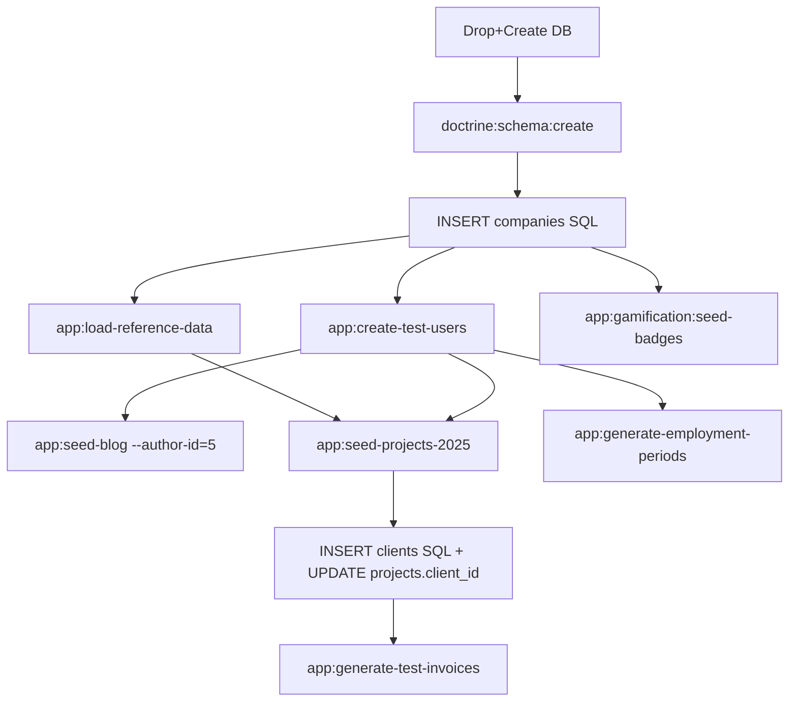

# Runbook — Bootstrap base de données HotOnes

> **Audience**: dev / ops / nouveau membre équipe
> **Objectif**: amener une instance HotOnes vierge à un état "demo ready" avec données représentatives.
> **Stack**: Symfony 8.0 / PHP 8.5 / MariaDB 11.4 / Redis 7 / Docker Compose
> **Dernière mise à jour**: 2026-05-05

---

## 1. Prérequis

```bash
# Docker daemon up
docker info

# Services projet up + healthy
docker compose ps
# Attendu: hotones_app, hotones_db, hotones_redis, hotones_web, hotones-mailer-1
```

Si services down: `docker compose up -d --build`.

---

## 2. Séquence de bootstrap (résumé exécutable)

```bash
# ⚠️ Étape 0 — Reset complet (DESTRUCTIF)
docker compose exec -T db mariadb -uroot -proot -e \
  "DROP DATABASE IF EXISTS hotones; CREATE DATABASE hotones CHARACTER SET utf8mb4 COLLATE utf8mb4_unicode_ci;"

# Étape 1 — Schéma depuis entités (bypass migrations buggées, voir §6)
docker compose exec -T app php bin/console doctrine:schema:create

# Étape 2 — Company seed (BUG: pas de commande, voir §6.1) — SQL direct
docker compose exec -T db mariadb -uroot -proot hotones -e \
  "INSERT INTO companies (name, slug, status, subscription_tier, billing_start_date, billing_day_of_month, currency, settings, enabled_features, structure_cost_coefficient, employer_charges_coefficient, annual_paid_leave_days, annual_rtt_days, created_at, updated_at)
   VALUES ('HotOnes Demo', 'hotones-demo', 'active', 'professional', '2026-01-01', 1, 'EUR', '[]', '[]', 1.2000, 1.4500, 25, 10, NOW(), NOW());"

# Étape 3 — Données de référence (technologies)
docker compose exec -T app php bin/console app:load-reference-data

# Étape 4 — Utilisateurs de test (6 rôles)
docker compose exec -T app php bin/console app:create-test-users

# Étape 5 — Badges gamification
docker compose exec -T app php bin/console app:gamification:seed-badges

# Étape 6 — Articles blog
docker compose exec -T app php bin/console app:seed-blog --company-id=1 --author-id=5

# Étape 7 — Projets de test (50 projets 2025 avec devis + temps)
docker compose exec -T app php bin/console app:seed-projects-2025 --count=50 --year=2025

# Étape 8 — Clients seed (BUG: app:create-test-data échoue, voir §6.2) — SQL direct
docker compose exec -T db mariadb -uroot -proot hotones -e \
  "INSERT INTO clients (name, company_id) VALUES
     ('Acme Corp', 1), ('Beta Industries', 1), ('Gamma Solutions', 1), ('Delta SAS', 1),
     ('Epsilon Tech', 1), ('Zeta Group', 1), ('Eta Consulting', 1), ('Theta Studios', 1);
   UPDATE projects SET client_id = 1 + (id % 8) WHERE client_id IS NULL;"

# Étape 9 — Factures de test (trésorerie dashboard)
docker compose exec -T app php bin/console app:generate-test-invoices

# Étape 10 — Périodes d'emploi pour les contributeurs
docker compose exec -T app php bin/console app:generate-employment-periods
```

---

## 3. Vérification

```bash
docker compose exec -T db mariadb -uroot -proot hotones -e "
  SELECT 'companies' AS tbl, COUNT(*) AS n FROM companies
  UNION SELECT 'users', COUNT(*) FROM users
  UNION SELECT 'contributors', COUNT(*) FROM contributors
  UNION SELECT 'employment_periods', COUNT(*) FROM employment_periods
  UNION SELECT 'technologies', COUNT(*) FROM technologies
  UNION SELECT 'badges', COUNT(*) FROM badges
  UNION SELECT 'blog_posts', COUNT(*) FROM blog_posts
  UNION SELECT 'clients', COUNT(*) FROM clients
  UNION SELECT 'projects', COUNT(*) FROM projects
  UNION SELECT 'orders', COUNT(*) FROM orders
  UNION SELECT 'project_tasks', COUNT(*) FROM project_tasks
  UNION SELECT 'timesheets', COUNT(*) FROM timesheets
  UNION SELECT 'invoices', COUNT(*) FROM invoices;"
```

État attendu après bootstrap complet:

| Table | Volume |
|-------|-------:|
| companies | 1 |
| users | 6 |
| contributors | 6 |
| employment_periods | 6 |
| technologies | 20 |
| badges | 15 |
| blog_posts | 5 |
| clients | 8 |
| projects | 50 |
| orders | 50 |
| project_tasks | ~230 |
| timesheets | ~745 |
| invoices | 20 |

Login dev: `http://localhost:8080`

| Email | Rôle | Mot de passe |
|-------|------|--------------|
| `intervenant@test.com` | ROLE_INTERVENANT | `password` |
| `chef-projet@test.com` | ROLE_CHEF_PROJET | `password` |
| `manager@test.com` | ROLE_MANAGER | `password` |
| `compta@test.com` | ROLE_COMPTA | `password` |
| `admin@test.com` | ROLE_ADMIN | `password` |
| `superadmin@test.com` | ROLE_SUPERADMIN | `password` |

---

## 4. Catalogue exhaustif des commandes de seeding

### 4.1 Données de référence

| Commande | Effet | Prérequis | Idempotent |
|----------|-------|-----------|-----------|
| `app:load-reference-data` | Charge 20 technologies (PHP, Symfony, React, etc.) depuis `config/reference_data.yaml` | Company existe | ✅ |
| `app:gamification:seed-badges` | Crée 15 badges gamification (Pionnier, Fidèle, etc.) | Aucun | ✅ |

### 4.2 Utilisateurs

| Commande | Effet | Options |
|----------|-------|---------|
| `app:create-test-users` | Crée 6 users de test (un par rôle) avec mot de passe `password`. Crée Contributor lié. | `--company-id=N` (par défaut première Company trouvée) |
| `app:user:create` | Crée un user interactif | (interactif) |
| `app:user:change-password` | Change mot de passe d'un user | (interactif) |

### 4.3 Données métier (test)

| Commande | Effet | Bug connu |
|----------|-------|-----------|
| `app:seed-projects-2025` | Génère 50 projets 2025 avec devis signés, temps passés et prévisionnels | Crée projets avec `client_id=NULL` (cf §6.3) |
| `app:create-test-data` | Crée contributeurs + optionnellement projets/devis/tâches | ❌ `--with-test-data` plante sur `company_id NULL` (cf §6.2) |
| `app:generate-test-data` | Génère données analytics + métriques | ❌ Plante sur `company_id NULL` |
| `app:create-test-subtasks` | Crée sous-tâches pour projets existants + temps | À tester |
| `app:generate-test-invoices` | 20 factures réparties Envoyée/Payée/Retard pour dashboard trésorerie | Requiert clients |
| `app:generate-forecast-test-data` | Données forecasting | ❌ Bug Doctrine `DateTime` vs `DateTimeImmutable` |
| `app:forecast:generate-mock` | Prévisions simulées | À tester |
| `app:seed-blog` | 5 articles de blog démo | Requiert `--company-id` + `--author-id` |

### 4.4 Données dérivées (calculs)

| Commande | Effet | Quand l'utiliser |
|----------|-------|------------------|
| `app:generate-employment-periods` | Crée période d'emploi active pour contributeurs sans | Après `create-test-users` |
| `app:calculate-metrics` | Calcule métriques analytics par période | Après seed projets+timesheets |
| `app:calculate-staffing-metrics` | Métriques staffing (taux + TACE) | Après seed plannings |
| `app:metrics:dispatch` | Dispatch jobs async metrics | Production (cron) |
| `app:project:analyze-risks` | Analyse santé + score risque tous projets | Après seed projets |
| `app:analyze-project-risks` | Analyse risques + rapport | Après seed projets |
| `app:forecast:calculate` | Génère prévisions CA mois prochains | Après seed orders |
| `app:assign-task-profiles` | Auto-assigne profils à task selon nom | Optionnel |
| `app:client:recalculate-service-level` | Recalcule niveau service clients (mode auto) | Cron production |

### 4.5 Imports externes

| Commande | Effet |
|----------|-------|
| `app:import-thetribe-staffing` | Importe collaborateurs depuis Excel theTribe |
| `app:import-thetribe-projects` | Importe projets/devis depuis Excel theTribe |
| `app:import-thetribe-planning` | Importe plannings depuis grille staffing Excel |
| `app:import-thetribe-notion` | Enrichit projets depuis CSV Notion |
| `app:sync-boond-manager` | Sync temps depuis BoondManager |

### 4.6 Opérations de production / cron

| Commande | Cadence suggérée |
|----------|------------------|
| `app:check-alerts` | toutes les heures |
| `app:notify:timesheets-weekly` | vendredi soir |
| `app:satisfaction:send-reminders` | mensuel |
| `app:nps:mark-expired` | quotidien |
| `app:invoice:generate-monthly-regie` | début de mois |
| `app:invoice:generate-from-schedules` | quotidien |
| `app:invoice:send-reminders` | quotidien |
| `app:send-nurturing-emails` | quotidien |
| `app:saas:renew-subscriptions` | quotidien |
| `app:process-account-deletions` | quotidien (RGPD) |

### 4.7 Doctrine Fixtures (bundle)

| Fixture | Status |
|---------|--------|
| `App\DataFixtures\AppFixtures` | ❌ Cassé — Foundry factories nécessitent DI; `doctrine:fixtures:load` échoue |
| `App\DataFixtures\TechnologyFixtures` | redondant avec `app:load-reference-data` |
| `App\DataFixtures\SkillFixtures` | non testé |
| `App\DataFixtures\OnboardingTemplateFixtures` | non testé |
| `App\DataFixtures\EmployeeLevelFixtures` | non testé |

> **Recommandation**: utiliser commandes `app:*` plutôt que Doctrine Fixtures pour le bootstrap.

### 4.8 Outils utilitaires

| Commande | Effet |
|----------|-------|
| `app:backup:dump` | Dump BDD (multi-driver) |
| `app:backup:restore` | Restaure depuis dump |
| `app:test-s3-connection` | Test S3/R2 + config |
| `app:check-php-limits` | Affiche limites PHP upload |
| `app:migrations:sync` | Aligne `doctrine_migration_versions` avec état réel BDD |
| `app:debug:planning-optimization` | Debug recommandations planning |
| `app:debug:planning-suggestions` | Debug suggestions par projet |
| `app:debug:task-assignment` | Affiche tâches assignées d'un contributeur |

---

## 5. Reset rapide (entre 2 demos)

```bash
# Drop + recreate vide
docker compose exec -T db mariadb -uroot -proot -e \
  "DROP DATABASE IF EXISTS hotones; CREATE DATABASE hotones CHARACTER SET utf8mb4 COLLATE utf8mb4_unicode_ci;"

# Recharge schema
docker compose exec -T app php bin/console doctrine:schema:create

# Re-exécuter §2 étapes 2 à 10
```

Ou utiliser un dump:

```bash
# Dump après 1er bootstrap réussi
docker compose exec -T app php bin/console app:backup:dump --output=/tmp/hotones-bootstrap.sql

# Restore plus tard
docker compose exec -T app php bin/console app:backup:restore --input=/tmp/hotones-bootstrap.sql
```

---

## 6. Bugs connus & workarounds

### 6.1 Pas de commande pour créer la première Company

**Symptôme**: toutes les commandes seed échouent avec `[ERROR] Aucune Company trouvée. Créez d'abord une Company.`

**Cause**: aucun script ne bootstrap une Company; toutes les commandes assument `findOneBy([])`.

**Workaround**: insertion SQL direct (cf §2 étape 2) ou via `app:user:create` interactif (qui peut créer une Company implicitement — à confirmer).

**Fix proposé** (US à créer): `app:tenant:create --name=X --slug=Y` ou paramètre `--bootstrap-company` sur `app:create-test-users`.

### 6.2 `app:create-test-data --with-test-data` plante sur `company_id NULL`

**Symptôme**:
```
[ERROR] Erreur lors de la création des données : An exception occurred while
        executing a query: SQLSTATE[23000]: Integrity constraint violation:
        1048 Column 'company_id' cannot be null
```

**Cause**: une entité créée par cette commande omet `setCompany($company)` lors de la persistance.

**Workaround**: ne pas utiliser `--with-test-data`. Préférer `app:seed-projects-2025` + insert SQL clients.

**Fix proposé**: audit `CreateTestDataCommand` pour identifier l'entité fautive (probablement `Planning` ou `OrderTask`).

### 6.3 `app:seed-projects-2025` crée projets sans `client_id`

**Symptôme**: `SELECT id, name, client_id FROM projects;` → tous `client_id IS NULL`.

**Cause**: la commande crée projets standalone sans rattacher de Client.

**Workaround**: insérer clients en SQL puis `UPDATE projects SET client_id = 1 + (id % N)`.

**Fix proposé**: paramètre `--with-clients=N` ou auto-create N clients aléatoires.

### 6.4 `app:generate-forecast-test-data` plante sur `DateTime` vs `DateTimeImmutable`

**Symptôme**:
```
Could not convert PHP value of type DateTime to type Doctrine\DBAL\Types\DateTimeImmutableType.
Expected one of the following types: null, DateTimeImmutable.
```

**Cause**: la commande passe `\DateTime` à un setter qui attend `\DateTimeImmutable` (cohérent avec Symfony 8).

**Fix proposé**: remplacer `new DateTime(...)` par `new DateTimeImmutable(...)`.

### 6.5 Migrations cassées — ordre de création

**Symptôme**: `doctrine:migrations:migrate -n` échoue avec `Table 'planning_skills' already exists` (déjà existante) ou `Table doesn't exist` (pas encore créée selon ordre).

**Cause**: migrations historiques non-idempotentes; certaines référencent des tables créées par migrations ultérieures.

**Workaround**: bootstrap via `doctrine:schema:create` (depuis entities) plutôt que migrations. Acceptable en dev/demo, **non en production**.

**Fix proposé**: nettoyer migrations + `app:migrations:sync` puis re-générer un baseline propre.

### 6.6 `app:load-reference-data` ne charge pas `skills` ni `profiles`

**Symptôme**: après commande, tables `skills` et `contributor_profiles` à 0.

**Cause**: la commande charge uniquement `technologies` (via `config/reference_data.yaml`). Le code source mentionne "profils et technologies" mais l'implémentation ne couvre que les technos.

**Workaround**: insertion SQL ou enrichir `config/reference_data.yaml` + commande.

**Fix proposé**: ajouter sections `profiles` et `skills` dans la config + parsing dans `LoadReferenceDataCommand`.

---

## 7. URLs de vérification post-bootstrap

| URL | Attendu |
|-----|---------|
| `http://localhost:8080/` | page marketing publique |
| `http://localhost:8080/login` | formulaire login |
| `http://localhost:8080/blog` | 5 articles |
| `http://localhost:8080/projects` (auth) | 50 projets |
| `http://localhost:8080/clients` (auth) | 8 clients |
| `http://localhost:8080/treasury/dashboard` (compta+) | 20 factures triées par statut |
| `http://localhost:8080/risks/projects` (manager+) | analyse risques |
| `http://localhost:8080/staffing/prediction` (manager+) | prédiction charge |
| `http://localhost:8080/backoffice` (admin) | EasyAdmin |
| `http://localhost:8080/api/docs` | OpenAPI doc |

---

## 8. Ordre d'idempotence

Si tu relances le bootstrap sur DB existante:
- `app:load-reference-data` → idempotent (skip si déjà créés)
- `app:create-test-users` → idempotent (skip emails existants)
- `app:gamification:seed-badges` → idempotent
- `app:seed-blog` → ❓ à vérifier (probablement crée doublons)
- `app:seed-projects-2025` → ❌ NON idempotent (crée à chaque appel)
- `app:generate-test-invoices` → ❌ NON idempotent

> Pour résultats prévisibles: **toujours partir d'un schéma vierge**.

---

## 9. Dépendances entre seeds



---

## 10. Backlog de bugs à fixer

| # | Bug | Fichier | Sévérité |
|---|-----|---------|----------|
| 1 | Pas de commande Company init | n/a (à créer) | Major |
| 2 | `CreateTestDataCommand` company_id NULL | `src/Command/CreateTestDataCommand.php` | Major |
| 3 | `seed-projects-2025` projets sans client | `src/Command/SeedProjects2025Command.php` | Minor |
| 4 | `GenerateForecastTestDataCommand` DateTime | `src/Command/GenerateForecastTestDataCommand.php` | Minor |
| 5 | Migrations historiques non-idempotentes | `migrations/*.php` | Major |
| 6 | `app:load-reference-data` skills/profiles manquants | `src/Command/LoadReferenceDataCommand.php` + `config/reference_data.yaml` | Minor |
| 7 | `AppFixtures` Foundry incompatible | `src/DataFixtures/AppFixtures.php` | Minor |

À tracker dans le backlog (créer un EPIC `OPS-DB-Bootstrap` ?).

---

## Voir aussi

- [README.md §"Démarrage rapide (Docker)"](../../README.md)
- [docs/multi-tenant-company-context-migration.md](../multi-tenant-company-context-migration.md)
- `.claude/rules/14-multitenant.md` — règles de tenant filtering
- `project-management/analysis/gap-analysis.md` — gaps liés à seeding
