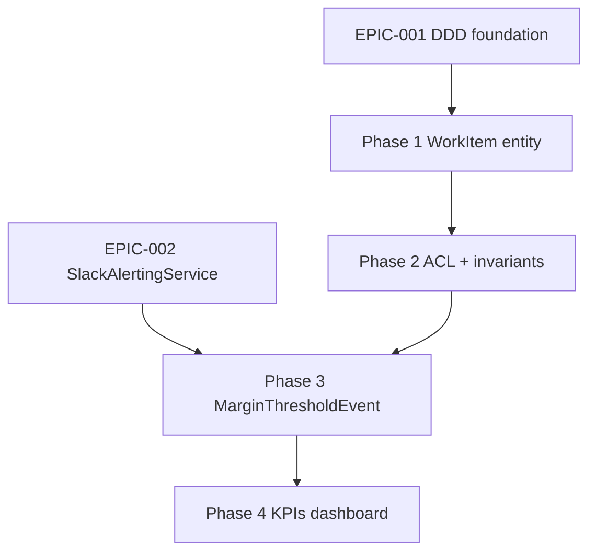

# EPIC-003 : WorkItem & Profitability

## Métadonnées

- **ID** : EPIC-003
- **Statut** : 🟡 In Progress (Phase 3 finition, sprint-023)
- **Priorité** : **High**
- **MMF** : « Toute saisie temps contributeur recalcule la marge projet temps réel ; tout dépassement seuil configuré déclenche alerte Slack `#alerts-prod` en < 5 min. »
- **Créé le** : 2026-05-08 (atelier PO sprint-019, ADR-0013)
- **Auteur** : Tech Lead + PO

---

## Contexte

EPIC-001 (DDD strangler fig) et EPIC-002 (observabilité) clôturés. EPIC-003
exploite la fondation DDD + l'instrumentation pour livrer le **cœur métier
agence** : calcul de marge projet temps réel piloté par les saisies temps
contributeurs (`WorkItem`).

**Déclencheurs PO** (atelier sprint-019 J1, ADR-0013) :

1. Pas de visibilité marge projet temps réel — décisions prises sur Excel
   manuel après-coup, dérives détectées trop tard.
2. EPIC-002 dashboard expose 5 KPIs business mais pas DSO ni temps de
   facturation ni adoption marge calculée.
3. Stack tech mature (Symfony Workflow component bundled) — pas besoin engine
   externe.

---

## Objectifs Business

- **Visibilité marge temps réel** : `Project::getMarge()` calculé à chaque
  saisie `WorkItem`, exposé dashboard PO.
- **Alerting proactif dépassement** : `MarginThresholdExceededEvent` → Slack
  webhook `#alerts-prod` (réutilise infra US-094 EPIC-002).
- **3 nouveaux KPIs dashboard** : DSO + temps facturation + % projets adoption
  marge temps réel.
- **Saisie temps fluide** : UI grille hebdomadaire contributeur avec
  invariants journaliers (max 8h/jour, doublons interdits).

---

## Critères de succès (MMF)

| Critère | Cible | Mesure |
|---|---|---|
| Marge projet temps réel | 100 % projets actifs | `Project::getMargePercent()` non null |
| Alerte dépassement seuil | < 5 min détection | Sentry breadcrumb + Slack message |
| Adoption saisie WorkItem | > 80 % contributeurs / mois | Dashboard `% projets avec marge` |
| DSO | mesuré et exposé | KPI dashboard `dso_days` |
| Temps de facturation | mesuré et exposé | KPI `lead_time_quote_to_invoice_days` |
| Coverage Domain projet + WorkItem | > 80 % | PHPUnit + Sonar |

---

## Bounded contexts impactés

- **WorkItem** (nouveau BC) — entity `WorkItem` + ValueObjects `WorkItemId`,
  `HourlyRate`, `WorkedHours`.
- **Project** (existant) — aggregate étendu avec `MarginCalculator` Domain
  Service.
- **Invoice** (existant) — exposition `paidAmount` pour calcul marge.
- **Notification** (existant) — `LowMarginAlertEvent` puis refactor vers
  Domain Events directs (sprint-022/023 strangler).

---

## User Stories livrées + planifiées

### Phase 1 — Foundation DDD (sprint-019, livrée)

| ID | Titre | Pts | Statut |
|---|---|---:|---|
| US-097 | DDD `WorkItem` entity + ValueObjects + interfaces | 3 | ✅ |
| AUDIT-WORKITEM-DATA | Audit qualité données existantes `WorkItem.cost` | 1 | ✅ |

### Phase 2 — ACL + invariants (sprint-020, livrée)

| ID | Titre | Pts | Statut |
|---|---|---:|---|
| US-098 | ACL legacy WorkItem → DDD aggregate | 5 | ✅ |
| US-099 | Invariant journalier `WorkedHours` max 8h + doublons interdits | 3 | ✅ |
| ADR-0015 | EPIC-003 Phase 2 décisions `task=NULL` + doublons + invariant journalier | — | ✅ |

### Phase 3 — UC + Workflow + UI (sprint-021..023, en cours)

| ID | Titre | Pts | Sprint | Statut |
|---|---|---:|---|---|
| US-100 | UC `RecordWorkItem` avec invariant journalier | 3 | sprint-021 | ✅ |
| US-101 | Symfony Workflow `WorkItem` state machine | 2 | sprint-021 | ✅ |
| US-102 | UI grille hebdomadaire saisie WorkItem | 3 | sprint-021 | ✅ |
| US-103 | UC `CalculateProjectMargin` Domain Service | 3 | sprint-022 | ✅ |
| US-104 | `MarginThresholdExceededEvent` + alerte Slack | 2 | sprint-022 | ✅ |
| US-105 | Refactor `NotificationSubscriber` strangler — étape 1 | 2 | sprint-022 | ✅ |
| US-106 | Refactor `NotificationSubscriber` Domain Events + suppression `LowMarginAlertEvent` legacy | 3 | sprint-023 | ✅ |
| US-107 | Persistence margin snapshot `Project` | 3 | sprint-023 | ✅ |
| US-108 | Configurabilité hiérarchique seuil marge (Q5.1 D) | 2 | sprint-023 | ✅ |
| US-109 | (réservé Phase 3 finition / Phase 4 kickoff) | — | sprint-023 | 🟡 |

### Phase 4 — KPIs dashboard + adoption (sprint-024+, planifiée)

| ID | Titre | Pts | Notes |
|---|---|---:|---|
| US-110 | KPI DSO calcul + exposition dashboard | 3 | EPIC-002 dashboard étendu |
| US-111 | KPI temps facturation lead time devis → facture | 3 | — |
| US-112 | KPI % projets adoption marge temps réel | 2 | — |
| US-113 | Migration historique `WorkItem.cost` legacy → DDD | 3 | Cf audit Phase 1 |

---

## Dépendances

| Item | Dépend de | Status |
|---|---|---|
| Phase 1 WorkItem entity | EPIC-001 Phase 4 (DDD foundation) | ✅ |
| Phase 3 alerte Slack | EPIC-002 US-094 (SlackAlertingService) | ✅ |
| Phase 4 KPIs dashboard | EPIC-002 dashboard métriques business | ✅ |
| Migration `WorkItem.cost` legacy | AUDIT-WORKITEM-DATA Phase 1 | ✅ |

---

## Risques

| Risque | Probabilité | Impact | Mitigation |
|---|---|---|---|
| Bug data integrity marge vs comptable > 5 % | Moyenne | Haut | Audit Phase 1 + tests acceptance comptable |
| Adoption saisie WorkItem < 50 % contributeurs | Moyenne | Haut | UI grille hebdo simplifiée Phase 3 + onboarding équipe |
| Recalcul marge temps réel surcoût perf p95 > 200ms | Faible | Moyen | Persistence snapshot `Project.margin` (US-107) + invalidation event-driven |
| Dépassement timeline 6 sprints sans MVP | Faible | Haut | Trigger abandon ADR-0013 cas 1 → réduire scope ou pivot EPIC-004 |

---

## Plan macro (6 sprints estimés, 4 livrés)

| Sprint | Phase | Stories | Livrables | Statut |
|---|---|---|---|---|
| sprint-019 | Phase 1 | US-097 + AUDIT | WorkItem entity + ValueObjects + audit data | ✅ |
| sprint-020 | Phase 2 | US-098 + US-099 | ACL + invariants journaliers + ADR-0015 | ✅ |
| sprint-021 | Phase 3.1 | US-100..US-102 | UC RecordWorkItem + Workflow + UI grille | ✅ |
| sprint-022 | Phase 3.2 | US-103..US-105 | MarginCalculator + alerte Slack + strangler étape 1 | ✅ |
| sprint-023 | Phase 3.3 | US-106..US-108 | Refactor Subscriber + persistence margin + configurabilité | 🟡 finition |
| sprint-024 | Phase 4 | US-110..US-113 | KPIs DSO + temps facturation + migration legacy | ⏳ planifié |

---

## ADR liés

- [ADR-0013](../../../docs/02-architecture/adr/0013-epic-003-workitem-profitability-scope.md) — Scope + stack + KPIs (sprint-019)
- ADR-0015 — Phase 2 décisions `task=NULL` + doublons + invariant journalier (sprint-020)
- ADR-0016 — Phase 3 décisions UC RecordWorkItem + Workflow + UI saisie (sprint-021)
- ADR-0017 — OPS Sub-epic B Out Backlog (sprint-022, 4ᵉ holdover signal arrêt)

---

## Triggers abandon (cf ADR-0013)

1. > 6 sprints sans MVP livré → réduire scope ou pivot EPIC-004
2. < 3 utilisations alerte dépassement / mois post prod → fonctionnalité gadget
3. Bug data integrity > 5 % vs comptable → bloquer scaling

**Statut actuel** : Phase 3 finition sprint-023 (5ᵉ sprint EPIC-003). MVP
calcul marge + alerte livré sprint-022. Trigger 1 non déclenché.

---

## Liens

- ADR-0013 (scope) / 0015 (Phase 2) / 0016 (Phase 3)
- Audit data : `docs/02-architecture/epic-003-audit-existing-data.md`
- Sprints sprint-019 → sprint-023 + sprint-024 (planifié Phase 4)
