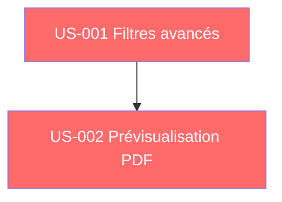

# Sprint 001 : Dépendances

> Dernière mise à jour : 2026-02-22

---

## Dépendances internes

### Détail

| US | Dépend de | Raison |
|----|-----------|--------|
| US-001 | Aucune | Fondation, peut commencer immédiatement |
| US-002 | US-001 (partielle) | Les filtres et la liste servent de contexte pour la prévisualisation, mais peut démarrer en parallèle |

---

## Dépendances externes

| Dépendance | Type | Statut | Impact |
|------------|------|--------|--------|
| Entités Projet/Devis existantes | Code | ✅ Disponible | Base pour les filtres et PDF |
| Template PDF Devis | Code | ✅ Existant | Réutilisé pour la prévisualisation |
| Thème Skote | UI | ✅ Disponible | Framework CSS de l'application |

---

## Risques

| Risque | Probabilité | Impact | Mitigation |
|--------|-------------|--------|------------|
| Complexité des filtres combinés | Faible | Moyen | Commencer par filtres simples, itérer |
| Performance PDF côté serveur | Moyen | Faible | Utiliser le cache si nécessaire |
