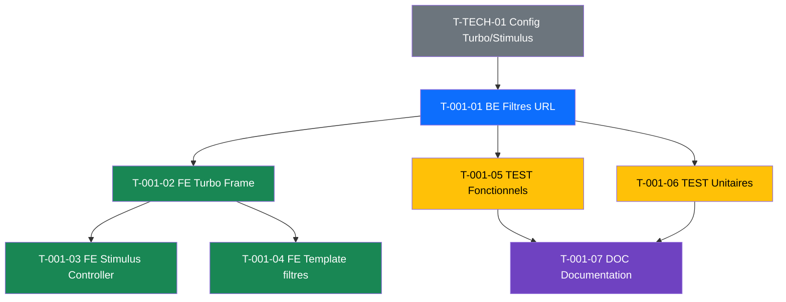

# US-001 : Filtres avances liste projets - Taches

> Derniere mise a jour : 2026-02-22

---

## Resume

| Attribut | Valeur |
|----------|--------|
| **User Story** | US-001 |
| **Points** | 5 |
| **Nombre de taches** | 7 |
| **Estimation totale** | 16h |

---

## Taches

### T-001-01 : [BE] Refactorer ProjectController pour filtres URL

| Attribut | Valeur |
|----------|--------|
| **ID** | T-001-01 |
| **Type** | [BE] |
| **Estimation** | 3h |
| **Statut** | :black_square_button: A faire |
| **Depend de** | T-TECH-01 |

**Description :**

Refactorer `ProjectController::index()` pour remplacer la persistance session par des query parameters URL.

**Sous-taches :**
- [ ] Remplacer `session->get/set` par `Request::query->get()` pour tous les filtres
- [ ] Ajouter les query parameters dans la reponse (`status`, `type`, `technology[]`, `category[]`, `search`, `per_page`, `page`)
- [ ] Supprimer la logique de persistance session des filtres
- [ ] S'assurer que les filtres se combinent en AND logique (deja le cas dans le QueryBuilder)
- [ ] Verifier la pagination KnpPaginator avec les query parameters

**Fichiers concernes :**
- `src/Controller/ProjectController.php`
- `src/Repository/ProjectRepository.php`

---

### T-001-02 : [FE-WEB] Ajouter Turbo Frame sur la liste projets

| Attribut | Valeur |
|----------|--------|
| **ID** | T-001-02 |
| **Type** | [FE-WEB] |
| **Estimation** | 2h |
| **Statut** | :black_square_button: A faire |
| **Depend de** | T-001-01 |

**Description :**

Encapsuler la liste projets dans un Turbo Frame pour permettre le rechargement partiel sans rechargement complet de la page.

**Sous-taches :**
- [ ] Ajouter `<turbo-frame id="project-list">` autour du tableau + pagination
- [ ] Configurer le formulaire de filtres avec `data-turbo-frame="project-list"`
- [ ] Verifier que la pagination fonctionne dans le Turbo Frame
- [ ] S'assurer que l'URL du navigateur se met a jour (`data-turbo-action="advance"`)

**Fichiers concernes :**
- `templates/project/index.html.twig`

---

### T-001-03 : [FE-WEB] Creer Stimulus controller filtres

| Attribut | Valeur |
|----------|--------|
| **ID** | T-001-03 |
| **Type** | [FE-WEB] |
| **Estimation** | 2h |
| **Statut** | :black_square_button: A faire |
| **Depend de** | T-001-02 |

**Description :**

Creer un Stimulus controller pour gerer les interactions des filtres cote client.

**Sous-taches :**
- [ ] Creer `assets/controllers/project-filter_controller.js`
- [ ] Soumettre automatiquement le formulaire au changement d'un filtre (debounce 300ms pour le champ recherche)
- [ ] Implementer la reinitialisation de tous les filtres (bouton "Reinitialiser")
- [ ] Mettre a jour visuellement les filtres actifs (badge/compteur)

**Fichiers concernes :**
- `assets/controllers/project-filter_controller.js` (nouveau)
- `templates/project/index.html.twig`

---

### T-001-04 : [FE-WEB] Ameliorer template filtres (selects multiples, reset, compteur)

| Attribut | Valeur |
|----------|--------|
| **ID** | T-001-04 |
| **Type** | [FE-WEB] |
| **Estimation** | 3h |
| **Statut** | :black_square_button: A faire |
| **Depend de** | T-001-02 |

**Description :**

Ameliorer le template des filtres pour les criteres d'acceptation : selects multiples, reinitialisation, compteur de resultats, message "aucun resultat".

**Sous-taches :**
- [ ] Transformer les selects technologie et categorie en selects multiples (`multiple`)
- [ ] Ajouter un bouton "Reinitialiser les filtres" visible quand des filtres sont actifs
- [ ] Ajouter un compteur de resultats ("X resultats")
- [ ] Afficher un message "Aucun projet ne correspond a vos criteres" avec lien de reinitialisation quand la liste est vide
- [ ] Styler les filtres actifs pour les distinguer visuellement

**Fichiers concernes :**
- `templates/project/index.html.twig`
- `templates/project/_filters.html.twig` (nouveau partial si necessaire)

---

### T-001-05 : [TEST] Tests fonctionnels filtres

| Attribut | Valeur |
|----------|--------|
| **ID** | T-001-05 |
| **Type** | [TEST] |
| **Estimation** | 3h |
| **Statut** | :black_square_button: A faire |
| **Depend de** | T-001-01 |

**Description :**

Ecrire les tests fonctionnels couvrant les 5 criteres d'acceptation de la US-001.

**Sous-taches :**
- [ ] Test CA-1 : Filtrer par statut "en cours" et verifier le nombre de resultats
- [ ] Test CA-2 : Combiner statut + type et verifier le filtrage AND
- [ ] Test CA-3 : Reinitialiser les filtres et verifier que tous les projets s'affichent
- [ ] Test CA-4 : Filtre sans resultat et verifier le message d'erreur
- [ ] Test CA-5 : Verifier que les query parameters sont presents dans l'URL

**Fichiers concernes :**
- `tests/Functional/Controller/ProjectControllerFilterTest.php` (nouveau)

---

### T-001-06 : [TEST] Tests unitaires repository filtres

| Attribut | Valeur |
|----------|--------|
| **ID** | T-001-06 |
| **Type** | [TEST] |
| **Estimation** | 2h |
| **Statut** | :black_square_button: A faire |
| **Depend de** | T-001-01 |

**Description :**

Ecrire les tests unitaires pour les methodes de filtrage du ProjectRepository.

**Sous-taches :**
- [ ] Test filtrage par statut unique
- [ ] Test filtrage par type (forfait/regie)
- [ ] Test filtrage par technologies multiples
- [ ] Test filtrage par categories multiples
- [ ] Test combinaison de filtres (AND logique)
- [ ] Test recherche textuelle partielle

**Fichiers concernes :**
- `tests/Unit/Repository/ProjectRepositoryTest.php` (nouveau)

---

### T-001-07 : [DOC] Documentation technique filtres

| Attribut | Valeur |
|----------|--------|
| **ID** | T-001-07 |
| **Type** | [DOC] |
| **Estimation** | 1h |
| **Statut** | :black_square_button: A faire |
| **Depend de** | T-001-05, T-001-06 |

**Description :**

Documenter les query parameters disponibles et le fonctionnement des filtres.

**Sous-taches :**
- [ ] Documenter les query parameters (nom, type, valeurs possibles)
- [ ] Documenter le Stimulus controller (events, targets, values)
- [ ] Mettre a jour le README si necessaire

---

## Dependances

