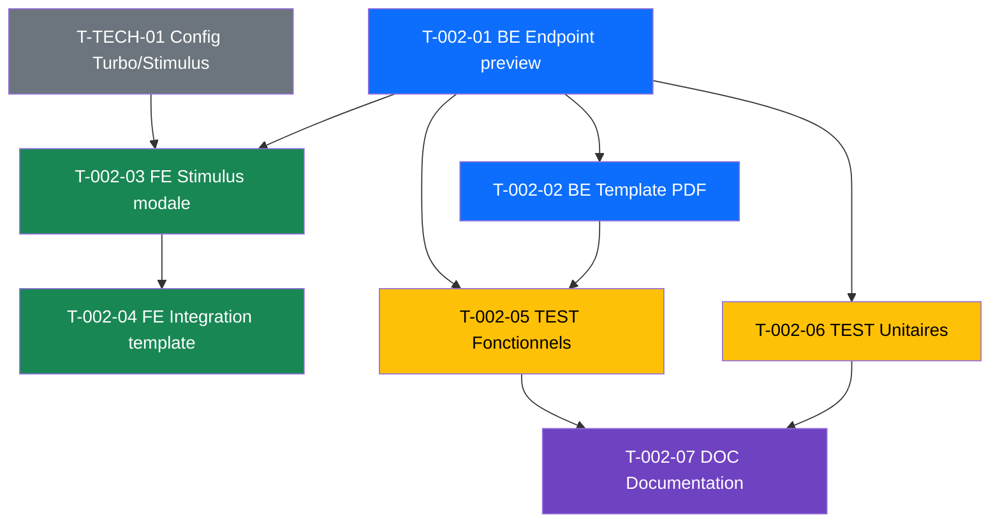

# US-002 : Previsualisation PDF devis - Taches

> Derniere mise a jour : 2026-02-22

---

## Resume

| Attribut | Valeur |
|----------|--------|
| **User Story** | US-002 |
| **Points** | 5 |
| **Nombre de taches** | 7 |
| **Estimation totale** | 15h |

---

## Taches

### T-002-01 : [BE] Ajouter action preview PDF dans OrderController

| Attribut | Valeur |
|----------|--------|
| **ID** | T-002-01 |
| **Type** | [BE] |
| **Estimation** | 2h |
| **Statut** | :black_square_button: A faire |
| **Depend de** | Aucune |

**Description :**

Ajouter un endpoint `/order/{id}/preview.pdf` qui genere le PDF du devis et le retourne inline dans le navigateur.

**Sous-taches :**
- [ ] Ajouter l'action `preview()` dans `OrderController`
- [ ] Utiliser `PdfGeneratorService::createPdfResponse()` avec `Content-Disposition: inline`
- [ ] Verifier que le devis contient au moins une ligne de prestation (sinon erreur 422)
- [ ] Gerer les erreurs de generation (try/catch, log, message utilisateur)
- [ ] Ajouter le voter/security pour verifier l'acces au devis

**Fichiers concernes :**
- `src/Controller/OrderController.php`
- `src/Service/PdfGeneratorService.php`

---

### T-002-02 : [BE] Completer template PDF devis (mentions legales)

| Attribut | Valeur |
|----------|--------|
| **ID** | T-002-02 |
| **Type** | [BE] |
| **Estimation** | 2h |
| **Statut** | :black_square_button: A faire |
| **Depend de** | T-002-01 |

**Description :**

Completer le template Twig PDF existant pour inclure toutes les mentions legales obligatoires.

**Sous-taches :**
- [ ] Verifier les mentions legales existantes dans `templates/order/pdf.html.twig`
- [ ] Ajouter la duree de validite du devis
- [ ] Ajouter les conditions de paiement
- [ ] Ajouter le numero SIRET et numero de TVA intracommunautaire
- [ ] Verifier le rendu PDF avec DomPDF (mise en page, sauts de page)

**Fichiers concernes :**
- `templates/order/pdf.html.twig`

---

### T-002-03 : [FE-WEB] Creer Stimulus controller modale PDF viewer

| Attribut | Valeur |
|----------|--------|
| **ID** | T-002-03 |
| **Type** | [FE-WEB] |
| **Estimation** | 3h |
| **Statut** | :black_square_button: A faire |
| **Depend de** | T-002-01, T-TECH-01 |

**Description :**

Creer un Stimulus controller pour gerer la modale de previsualisation PDF avec un viewer integre.

**Sous-taches :**
- [ ] Creer `assets/controllers/pdf-preview_controller.js`
- [ ] Implementer l'ouverture de la modale avec chargement du PDF dans un `<iframe>`
- [ ] Gerer la fermeture par bouton "Fermer" et touche Echap
- [ ] Afficher un spinner pendant le chargement du PDF
- [ ] Gerer les erreurs de chargement (timeout, erreur serveur) avec message utilisateur
- [ ] Ajouter un bouton "Telecharger" dans la modale

**Fichiers concernes :**
- `assets/controllers/pdf-preview_controller.js` (nouveau)

---

### T-002-04 : [FE-WEB] Integrer modale dans template show devis

| Attribut | Valeur |
|----------|--------|
| **ID** | T-002-04 |
| **Type** | [FE-WEB] |
| **Estimation** | 2h |
| **Statut** | :black_square_button: A faire |
| **Depend de** | T-002-03 |

**Description :**

Integrer le bouton "Previsualiser PDF" et la modale dans la page detail du devis.

**Sous-taches :**
- [ ] Ajouter le bouton "Previsualiser PDF" sur la page show du devis
- [ ] Integrer le markup HTML de la modale (plein ecran)
- [ ] Connecter le Stimulus controller `pdf-preview` au bouton et a la modale
- [ ] Styler la modale (plein ecran, overlay, responsive)
- [ ] Desactiver le bouton si le devis ne contient aucune ligne (avec message d'avertissement)

**Fichiers concernes :**
- `templates/order/show.html.twig`
- `templates/order/_pdf_preview_modal.html.twig` (nouveau partial)

---

### T-002-05 : [TEST] Tests fonctionnels previsualisation

| Attribut | Valeur |
|----------|--------|
| **ID** | T-002-05 |
| **Type** | [TEST] |
| **Estimation** | 3h |
| **Statut** | :black_square_button: A faire |
| **Depend de** | T-002-01, T-002-02 |

**Description :**

Ecrire les tests fonctionnels couvrant les 5 criteres d'acceptation de la US-002.

**Sous-taches :**
- [ ] Test CA-1 : Generer le PDF d'un devis avec lignes, verifier le Content-Type et le contenu
- [ ] Test CA-2 : Verifier la presence des mentions legales dans le PDF genere
- [ ] Test CA-3 : Verifier que la page detail du devis contient le bouton previsualiser
- [ ] Test CA-4 : Tenter de previsualiser un devis vide, verifier l'erreur 422
- [ ] Test CA-5 : Simuler une erreur du service PDF, verifier la gestion d'erreur

**Fichiers concernes :**
- `tests/Functional/Controller/OrderControllerPreviewTest.php` (nouveau)

---

### T-002-06 : [TEST] Tests unitaires PdfGeneratorService

| Attribut | Valeur |
|----------|--------|
| **ID** | T-002-06 |
| **Type** | [TEST] |
| **Estimation** | 2h |
| **Statut** | :black_square_button: A faire |
| **Depend de** | T-002-01 |

**Description :**

Ecrire les tests unitaires pour le service de generation PDF.

**Sous-taches :**
- [ ] Test generation PDF avec devis valide (lignes, totaux)
- [ ] Test rejet si devis sans lignes
- [ ] Test presence des mentions legales dans le HTML genere
- [ ] Test format de la reponse (Content-Type, Content-Disposition inline)

**Fichiers concernes :**
- `tests/Unit/Service/PdfGeneratorServiceTest.php` (nouveau)

---

### T-002-07 : [DOC] Documentation technique PDF

| Attribut | Valeur |
|----------|--------|
| **ID** | T-002-07 |
| **Type** | [DOC] |
| **Estimation** | 1h |
| **Statut** | :black_square_button: A faire |
| **Depend de** | T-002-05, T-002-06 |

**Description :**

Documenter le fonctionnement de la previsualisation PDF.

**Sous-taches :**
- [ ] Documenter l'endpoint preview (URL, methode, parametres, reponses)
- [ ] Documenter le Stimulus controller (events, targets, values)
- [ ] Documenter les mentions legales incluses dans le PDF

---

## Dependances

