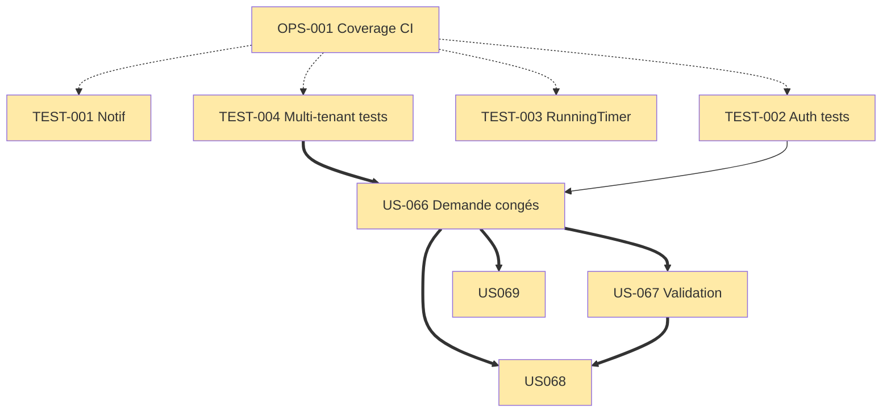

# Sprint 001 — Dépendances

## Graphe inter-US Sprint

**Légende :**
- `==>` : dépendance bloquante (obligatoire)
- `-->` : dépendance logique (pas bloquante)
- `-.->` : dépendance recommandée (meilleure mesure)

## Ordre d'exécution optimal

### Jour 1-2
1. OPS-001 (1 dev, 2-3h)
2. Démarrage parallèle TEST-001, TEST-003 (indépendants)

### Jour 3-5
3. TEST-002 Auth (peut paralléliser TEST-001/003)
4. TEST-004 Multi-tenant (pré-req Vacation)

### Jour 6-9
5. US-066 Demande congés (besoin TEST-002 + TEST-004 mergés)
6. US-067 Validation manager (besoin US-066 mergé)

### Jour 9-10
7. US-068 Rejet + US-069 Annulation (parallèles, dépendent US-066/067)

### Jour 10-11
8. Stabilisation, bug fixes, review

### Jour 12
9. Smoke test staging, Sprint Review, Rétro

## Dépendances externes

| Dépendance | Source | Impact si indispo |
|---|---|---|
| Redis | Docker compose | Messenger tests fail |
| MariaDB | Docker compose | Integration tests fail |
| SonarCloud | SaaS externe | OPS-001 blocked (alternative : local coverage) |
| GitHub Actions | CI | Pas de build auto |

## Risques dépendances

1. **US-066 dépend TEST-004** — si TEST-004 glisse J6, US-066 démarre J7 au lieu de J6
2. **US-067 bloqué par US-066** — chaîne critique 4 jours
3. **OPS-001 première** — si installation pcov galère, décaler tests (risque faible, fallback xdebug)
