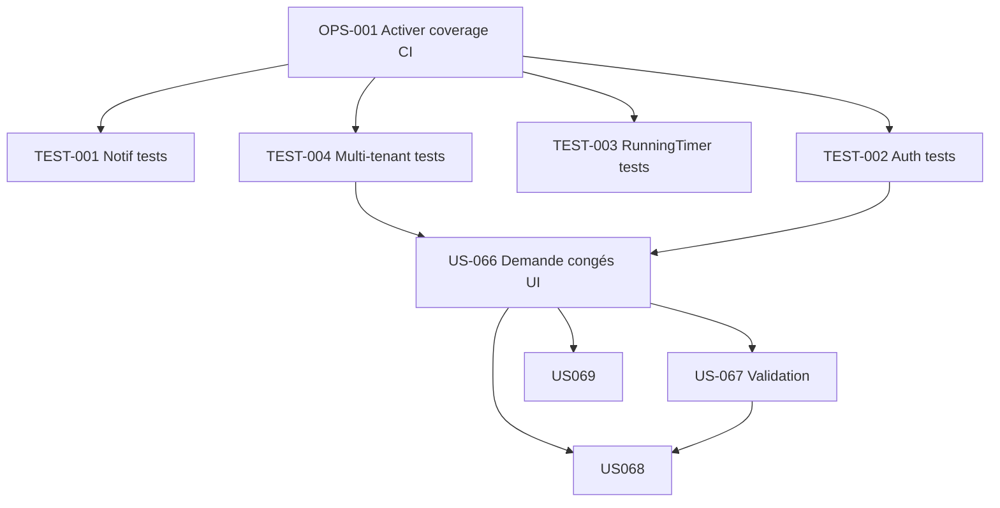
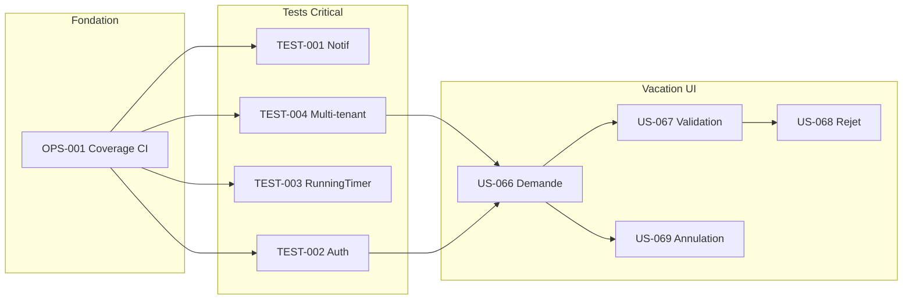

# Sprint 002 — Tests Consolidation (rattrapage dette critique)

**Dates:** 2026-04-24 → 2026-05-08 (2 semaines fixe — fériés FR 01/05 Fête travail, 08/05 Victoire 1945)
**Contexte:** Brownfield — HotOnes en production. Sprint 002 = **consolidation** post Walking Skeleton (US-001 filtres + US-002 PDF livrés sprint-001).
**Dépend de:** sprint-001-walking-skeleton clôturé + PR OPS-001 (#30) mergée.
**Origine:** Planification initialement dans sprint-001-tests_consolidation local (non pushée), migrée vers sprint-002 après finding que origin/main avait sprint-001-walking-skeleton divergent.

## Objectif du Sprint (Sprint Goal)

> **Finaliser bounded context Vacation (DDD) + combler les 4 trous tests Critical identifiés dans gap-analysis (Notifications, Auth/2FA, RunningTimer, Company voter) pour stabiliser le socle avant migration DDD étendue.**

## Rationale

gap-analysis.md identifie :
- 🔴 11 gaps Critical — prioriser 4 bloquants qualité
- 🟡 EPIC-009 Vacation UI supprimée → décider et agir
- Coverage baseline mesurée J1 sprint-002 : **9.4% elements** (2922/31077) · methods 11.2% · statements 9.2% — cible long-terme 80%

## Cérémonies

| Cérémonie | Durée | Participants |
|---|---|---|
| Sprint Planning Part 1 (QUOI) | 2h | PO + Tech Lead + Team |
| Sprint Planning Part 2 (COMMENT) | 2h | Tech Lead + Team |
| Daily Scrum | 15 min/jour | Team |
| Affinage Backlog (Sprint 2 prep) | 5-10% sprint | PO + Team |
| Sprint Review | 2h | PO + stakeholders + Team |
| Rétrospective | 1.5h | Team (pas PO) |

## User Stories sélectionnées

| ID | Titre | Points | MoSCoW | Dépend de | Statut |
|---|---|---:|---|---|---|
| US-066 | Demande congés | 5 | Must | US-067 | 🟡 → 🟢 |
| US-067 | Validation manager congés | 5 | Must | US-066 | 🟡 → 🟢 |
| US-068 | Rejet avec motif | 3 | Should | US-067 | 🟡 → 🟢 |
| US-069 | Annulation | 3 | Should | US-066 | 🟡 → 🟢 |
| TEST-001 | Tests Notifications (NotificationService + Subscriber) | 5 | Must | - | 🔴 → 🟢 |
| TEST-002 | Tests Auth/2FA (SecurityController + TwoFactor + LoginSecuritySubscriber) | 5 | Must | - | 🔴 → 🟢 |
| TEST-003 | Tests RunningTimer + Timer start/stop | 3 | Must | - | 🔴 → 🟢 |
| TEST-004 | Tests Multi-tenant (CompanyVoter + CompanyContext) | 3 | Must | - | 🔴 → 🟢 |
| OPS-001 | Activer coverage PHPUnit + CI Sonar | 2 | Must | - | 🔴 → 🟢 |

**Total :** 34 points (dans la vélocité 20-40)

## Ordre d'exécution

1. 🏁 **OPS-001** — Activer coverage PHPUnit + CI (fondation mesure)
2. **TEST-004** — Tests multi-tenant voter (pré-requis pour US Vacation re-UI)
3. **TEST-002** — Tests Auth/2FA (critique sécurité)
4. **TEST-001** — Tests Notifications (indépendant)
5. **TEST-003** — Tests RunningTimer (indépendant)
6. **US-066** — Demande congés UI (réexposer controller)
7. **US-067** — Validation manager UI
8. **US-068** — Rejet (feature complémentaire)
9. **US-069** — Annulation (feature complémentaire)

## Incrément livrable

À la fin du Sprint 002, l'utilisateur pourra :

**Côté produit**
- ✅ Soumettre une demande de congés via nouvelle UI (P-001 Intervenant)
- ✅ Manager valider/rejeter demandes (P-003 Manager)
- ✅ Annuler sa demande pending (P-001)
- ✅ Affichage lecture seule des congés approuvés dans le planning (US-056 déjà 🟢)

**Côté qualité**
- ✅ Coverage mesurée et affichée SonarCloud (baseline)
- ✅ Tests critiques ajoutés sur 4 modules (Notif, Auth, RunningTimer, Multi-tenant)
- ✅ MSI Infection CI activée

## Graphe dépendances Sprint

## Sprint Backlog (détaillé)

### TEST-001 — Tests Notifications (5 pts)

**Tâches :**
- T-001-01 [TEST] NotificationServiceTest unit (3h)
- T-001-02 [TEST] NotificationSubscriberTest integration (4h)
- T-001-03 [TEST] NotificationType enum test (1h)
- T-001-04 [TEST] Test chaîne event→subscriber→notification persisté (3h)
- T-001-05 [DOC] Documenter les 10 NotificationType (1h)

### TEST-002 — Tests Auth/2FA (5 pts)

- T-002-01 [TEST] SecurityControllerTest functional (4h)
- T-002-02 [TEST] TwoFactorControllerTest functional (3h)
- T-002-03 [TEST] LoginSecuritySubscriberTest (3h)
- T-002-04 [TEST] Test rate limiting login 5/15min (2h)
- T-002-05 [TEST] Test JWT login /api/login + Bearer (3h)

### TEST-003 — Tests RunningTimer (3 pts)

- T-003-01 [TEST] RunningTimerTest unit (2h)
- T-003-02 [TEST] Test constraint 1 timer/user (2h)
- T-003-03 [TEST] Test timer start/stop + conversion 0.125j (3h)
- T-003-04 [TEST] Test switch timer auto-impute (2h)

### TEST-004 — Tests Multi-tenant (3 pts)

- T-004-01 [TEST] CompanyVoterTest unit tous attrs (3h)
- T-004-02 [TEST] CompanyContextTest integration (3h)
- T-004-03 [TEST] Test cross-tenant access denied + log (2h)

### OPS-001 — Coverage CI (2 pts)

- T-005-01 [OPS] Activer coverage dans phpunit.xml.dist (1h)
- T-005-02 [OPS] Installer pcov dans Dockerfile (1h)
- T-005-03 [OPS] CI : upload coverage vers SonarCloud (1h)
- T-005-04 [DOC] README section "coverage" (0.5h)
- T-005-05 [OPS] Baseline report initiale (0.5h)

### US-066 — Demande congés (5 pts)

- T-066-01 [BE] Recréer `VacationRequestController` (3h)
- T-066-02 [BE] Wire RequestVacationCommand + MessageBus (2h)
- T-066-03 [FE-WEB] Template Twig + formulaire (3h)
- T-066-04 [FE-WEB] Stimulus calendar picker (2h)
- T-066-05 [TEST] Functional test controller (2h)
- T-066-06 [TEST] Integration test Command handler (2h)

### US-067 — Validation manager (5 pts)

- T-067-01 [BE] Recréer `VacationApprovalController` (3h)
- T-067-02 [BE] Wire ApproveVacationCommand + RejectVacationCommand (2h)
- T-067-03 [FE-WEB] Dashboard widget liste pending (3h)
- T-067-04 [FE-WEB] Modal rejet avec motif (2h)
- T-067-05 [TEST] Functional test controller (2h)
- T-067-06 [TEST] Test hors hiérarchie → 403 (1h)

### US-068 — Rejet (3 pts)

- T-068-01 [BE] Endpoint reject + validation motif NotBlank (1h)
- T-068-02 [FE-WEB] UI formulaire rejet (2h)
- T-068-03 [TEST] Test notification rejet envoyée (2h)

### US-069 — Annulation (3 pts)

- T-069-01 [BE] Endpoint cancel (1h)
- T-069-02 [FE-WEB] Bouton "Annuler ma demande" (1h)
- T-069-03 [TEST] Test cancel only by owner (2h)

**Total tâches estimées :** ~85h (2 semaines × 1-2 devs)

---

## Rétrospective — Directive Fondamentale

> « Peu importe ce que nous découvrons, nous comprenons et croyons sincèrement que tout le monde a fait le meilleur travail possible dans les circonstances données, avec les compétences et les capacités disponibles, les ressources disponibles, et la situation à portée de main. »

### Format : Étoile de Mer (Starfish)

- 🟢 **Continuer** — pratiques qui fonctionnent
- 🔴 **Arrêter** — pratiques contre-productives
- 🟡 **Commencer** — nouvelles pratiques à essayer
- ⬆️ **Plus de** — augmenter fréquence/intensité
- ⬇️ **Moins de** — diminuer fréquence/intensité

### Questions guide

1. Quelle a été la plus grosse friction cette sprint ?
2. Qu'est-ce qui nous a permis de livrer ?
3. Les tests ajoutés ont-ils attrapé des bugs réels ?
4. Le DoD a-t-il été respecté ?
5. La vélocité 34 pts était-elle réaliste ?

### Actions amélioration

- [ ] Action 1 (à remplir en rétro)
- [ ] Action 2
- [ ] Action 3

---

## Risques

| Risque | Impact | Mitigation |
|---|---|---|
| Sous-estimation refactor Vacation | Retard sprint | Découper US-066/067 si débordement J8 |
| Coverage CI casse builds | Blocage dev | Baseline tolérante initiale, serrer progressivement |
| Tests flaky (Redis state) | Instabilité CI | DAMA bundle rollback + isolation Redis per test |
| AI provider mock incomplet (TEST-001 indirect) | Tests fragiles | Pas d'appel live AI en tests |

## Definition of Done Sprint

Sprint considéré done si :
- [ ] Toutes US-066 à US-069 mergées + déployées staging
- [ ] 4 test suites Critical passées en CI
- [ ] Coverage initial mesuré (baseline)
- [ ] Pas de régression sur 63 tests existants
- [ ] Sprint Review effectué avec PO validation
- [ ] Rétrospective tenue + actions tracées
