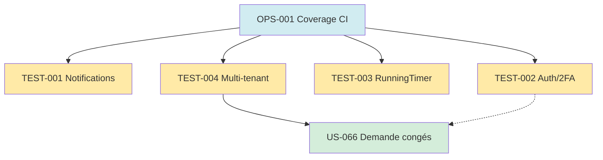

# Tâches — Cluster Tests Critical (TEST-001 à TEST-004)

## Contexte

gap-analysis §4.1 identifie 6 modules avec **0 tests**. Sprint 1 cible **4 modules critiques** pour débloquer la cible 80% coverage.

---

## TEST-001 : Tests Notifications

**Module :** EPIC-015 Notifications (actuel : 0 tests)
**Story Points :** 5
**Dépend de :** OPS-001

### Tâches (12h)

| ID | Type | Tâche | Est. |
|---|---|---|---:|
| T-TEST001-01 | [TEST] | `NotificationServiceTest` unit (create, mark read, unread count) | 3h |
| T-TEST001-02 | [TEST] | `NotificationSubscriberTest` integration (subscribe aux events) | 4h |
| T-TEST001-03 | [TEST] | `NotificationTypeEnumTest` (10 valeurs, mapping labels) | 1h |
| T-TEST001-04 | [TEST] | Chain e2e : QuoteStatusChangedEvent → Subscriber → Notification persistée | 3h |
| T-TEST001-05 | [DOC] | Documenter les 10 NotificationType dans catalog | 1h |

### Détails

#### T-TEST001-01 — NotificationServiceTest

- **Fichier :** `tests/Unit/Service/NotificationServiceTest.php`
- **Cibles :** méthodes create, markAsRead, getUnread, getForUser

**Cas :**
- [ ] Create Notification persistée avec payload
- [ ] Preference utilisateur respectée (filtre canal désactivé)
- [ ] Mark as read set `readAt` timestamp
- [ ] Unread count par user

#### T-TEST001-02 — NotificationSubscriberTest

- **Fichier :** `tests/Integration/EventSubscriber/NotificationSubscriberTest.php`
- **Use :** DAMA bundle (rollback), Foundry factories

**Cas :**
- [ ] Dispatch `QuoteStatusChangedEvent` → Notification créée
- [ ] Dispatch `ProjectBudgetAlertEvent` → Notification manager
- [ ] Dispatch `LowMarginAlertEvent` → Notification chef projet
- [ ] Dispatch `ContributorOverloadAlertEvent` → Notification manager
- [ ] Dispatch `TimesheetPendingValidationEvent` → Notification manager
- [ ] Dispatch `PaymentDueAlertEvent` → Notification compta
- [ ] Dispatch `KpiThresholdExceededEvent` → Notification admin
- [ ] Dispatch `Vacation*` events → Notification contributor + manager

#### T-TEST001-03 — NotificationTypeEnumTest

- **Fichier :** `tests/Unit/Enum/NotificationTypeTest.php`

**Cas :**
- [ ] 10 valeurs présentes (QUOTE_TO_SIGN, QUOTE_WON, QUOTE_LOST, PROJECT_BUDGET_ALERT, LOW_MARGIN_ALERT, CONTRIBUTOR_OVERLOAD_ALERT, TIMESHEET_PENDING_VALIDATION, PAYMENT_DUE_ALERT, KPI_THRESHOLD_EXCEEDED, TIMESHEET_MISSING_WEEKLY)
- [ ] Label FR mapping
- [ ] Channel defaults (IN_APP + EMAIL pour la plupart)

#### T-TEST001-04 — Chain e2e intégration

- **Fichier :** `tests/Integration/Notification/EventToNotificationChainTest.php`

**Cas :**
- [ ] Change Order status PENDING → WON → QuoteStatusChangedEvent auto → Notification persisted
- [ ] Test avec préférences utilisateur mixtes (IN_APP on, EMAIL off)

#### T-TEST001-05 — Documenter NotificationType

- **Fichier :** `docs/notifications-catalog.md`
- **Contenu :** 10 types + triggers + templates email + canaux défaut

---

## TEST-002 : Tests Auth/2FA

**Module :** EPIC-002 (actuel : 2 tests security only)
**Story Points :** 5
**Dépend de :** OPS-001

### Tâches (15h)

| ID | Type | Tâche | Est. |
|---|---|---|---:|
| T-TEST002-01 | [TEST] | `SecurityControllerTest` functional (login form + redirect) | 4h |
| T-TEST002-02 | [TEST] | `TwoFactorControllerTest` functional (enable + verify + login flow) | 3h |
| T-TEST002-03 | [TEST] | `LoginSecuritySubscriberTest` (5 failures / 15min blocage) | 3h |
| T-TEST002-04 | [TEST] | Test rate limiting login via `rate_limiter` sliding_window | 2h |
| T-TEST002-05 | [TEST] | Test JWT login `/api/login` + `Authorization: Bearer` + claim company_id | 3h |

### Détails

#### T-TEST002-01 — SecurityControllerTest

- **Fichier :** `tests/Functional/Controller/SecurityControllerTest.php`

**Cas :**
- [ ] GET /login → 200 + form affiché
- [ ] POST /login credentials valides → 302 dashboard
- [ ] POST /login invalides → 200 + erreur form
- [ ] Logout → 302 + session cleared
- [ ] Redirect post-login bloqué vers /_profiler (LoginRedirectSubscriber)

#### T-TEST002-02 — TwoFactorControllerTest

- **Fichier :** `tests/Functional/Controller/TwoFactorControllerTest.php`

**Cas :**
- [ ] GET /me/2fa/enable → QR code + secret affichés
- [ ] POST /me/2fa/enable avec code TOTP valide → 2FA activé
- [ ] Login utilisateur avec 2FA → redirect /2fa
- [ ] POST /2fa_check code valide → dashboard
- [ ] POST /2fa_check code invalide → erreur
- [ ] Issuer "hotones" dans secret URI

#### T-TEST002-03 — LoginSecuritySubscriber

- **Fichier :** `tests/Security/LoginSecuritySubscriberTest.php`

**Cas :**
- [ ] 5 échecs même user en 15min → 6e bloquée 429
- [ ] Attempt counter reset après succès
- [ ] LoginFailureEvent logged (Monolog)
- [ ] LoginSuccessEvent logged + counter reset

#### T-TEST002-04 — Rate limiting login

- **Fichier :** `tests/Security/LoginRateLimitTest.php`
- **Config :** `rate_limiter.yaml` `login` sliding_window 5/15min

**Cas :**
- [ ] 5 requests OK
- [ ] 6e retry-after header présent
- [ ] Sliding window : 14 min après 1ère, encore bloqué

#### T-TEST002-05 — JWT login API

- **Fichier :** `tests/Api/JwtLoginTest.php`

**Cas :**
- [ ] POST /api/login valide → 200 + token
- [ ] Token décodable → contient email + roles + company_id
- [ ] Token signé RS256 (asymétrique)
- [ ] GET /api/resource avec Bearer → 200
- [ ] Token expiré → 401
- [ ] Sans Bearer → 401
- [ ] Rate limit 100/min respecté

---

## TEST-003 : Tests RunningTimer

**Module :** EPIC-007 (actuel : 1 Repository test + 1 Controller)
**Story Points :** 3
**Dépend de :** OPS-001

### Tâches (9h)

| ID | Type | Tâche | Est. |
|---|---|---|---:|
| T-TEST003-01 | [TEST] | `RunningTimerTest` unit entity (start, stop, duration) | 2h |
| T-TEST003-02 | [TEST] | Test constraint unicité 1 timer / user (DB unique) | 2h |
| T-TEST003-03 | [TEST] | Integration test timer start/stop + TimeConversionService arrondi 0.125j | 3h |
| T-TEST003-04 | [TEST] | Test switch timer auto-impute timer précédent (chaîne) | 2h |

### Détails

#### T-TEST003-01 — RunningTimer unit

- **Fichier :** `tests/Unit/Entity/RunningTimerTest.php`

**Cas :**
- [ ] Construct RunningTimer (user, project, startedAt)
- [ ] getDuration() retourne secondes depuis startedAt
- [ ] Immutabilité startedAt

#### T-TEST003-02 — Constraint unicité

- **Fichier :** `tests/Integration/Entity/RunningTimerConstraintTest.php`

**Cas :**
- [ ] INSERT 1er timer user X → OK
- [ ] INSERT 2e timer user X → Doctrine UniqueConstraintViolationException
- [ ] INSERT timer user Y (différent) → OK

#### T-TEST003-03 — Start/stop + conversion

- **Fichier :** `tests/Integration/Timesheet/TimerStartStopTest.php`

**Cas :**
- [ ] Start puis stop après 30s → Timesheet 0.125j (minimum)
- [ ] Start puis stop après 2h → Timesheet 0.25j (arrondi ¼ journée)
- [ ] Start puis stop après 4h → Timesheet 0.5j (½ journée = 4h)
- [ ] TimeConversionService::toDays(4*3600) === 0.5

#### T-TEST003-04 — Switch timer

- **Fichier :** `tests/Integration/Timesheet/TimerSwitchTest.php`

**Cas :**
- [ ] User X démarre timer Projet A → 1h → switch Projet B
- [ ] Assertions : Timesheet projet A créé (0.125+), RunningTimer = projet B
- [ ] Double switch chain → 3 Timesheets créés, 1 RunningTimer actif
- [ ] Stop final → 3 Timesheets + 0 RunningTimer

---

## TEST-004 : Tests Multi-tenant voter

**Module :** EPIC-001 (actuel : 3 tests isolation basic)
**Story Points :** 3
**Dépend de :** OPS-001

### Tâches (8h)

| ID | Type | Tâche | Est. |
|---|---|---|---:|
| T-TEST004-01 | [TEST] | `CompanyVoterTest` unit (tous attributs COMPANY_VIEW/EDIT/DELETE) | 3h |
| T-TEST004-02 | [TEST] | `CompanyContextTest` integration (JWT → session → fallback) | 3h |
| T-TEST004-03 | [TEST] | Test cross-tenant access 403 + log audit | 2h |

### Détails

#### T-TEST004-01 — CompanyVoterTest

- **Fichier :** `tests/Security/CompanyVoterTest.php`

**Cas :**
- [ ] VIEW : user Company A, resource Company A → GRANT
- [ ] VIEW : user Company A, resource Company B → DENY
- [ ] EDIT : ROLE_CHEF_PROJET sur Project Company own → GRANT
- [ ] EDIT : ROLE_INTERVENANT sur Project → DENY
- [ ] DELETE : ROLE_ADMIN own Company → GRANT
- [ ] SUPERADMIN cross-tenant → GRANT + LOG
- [ ] Entity non CompanyOwnedInterface → vote ABSTAIN

#### T-TEST004-02 — CompanyContextTest

- **Fichier :** `tests/Integration/Security/CompanyContextTest.php`

**Cas :**
- [ ] JWT claim company_id présent → résout Company
- [ ] Pas de JWT, session `current_company_id` → résout
- [ ] Rien, fallback `User.company` → résout
- [ ] Company status = SUSPENDED → NoCurrentCompanyException
- [ ] Cache request-scoped : 2 appels consécutifs → 1 seule query DB

#### T-TEST004-03 — Cross-tenant access log

- **Fichier :** `tests/Security/CrossTenantAuditTest.php`

**Cas :**
- [ ] GET /projects/{id-company-B} avec session Company A → 403
- [ ] Log entry Monolog avec context (user, attempted_company, resource_id)
- [ ] SUPERADMIN switch Company B → 200 + log audit (non bloqué)

---

## Graphe dépendances Tests cluster

---

## DoD Tests cluster

- [ ] Tous tests verts localement ET en CI
- [ ] Coverage incrémentale +10pts minimum (14% → 24% cible baseline)
- [ ] Infection MSI ≥ 70 sur les 4 modules testés
- [ ] PHPStan level 4 pas de régression
- [ ] Tests rapides (< 100ms unit, < 2s integration)
- [ ] Pas de tests flaky (isolation via DAMA bundle)
- [ ] Fixtures via Foundry stories
