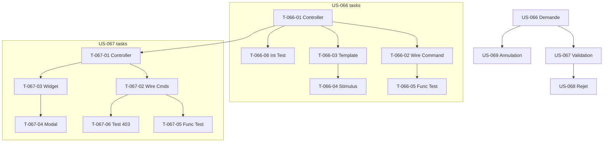

# Tâches — Cluster Vacation (US-066 à US-069)

## Contexte

**EPIC-009 Vacation** — refactoring DDD en cours.
Domain `src/Domain/Vacation/` + Application `src/Application/Vacation/` **complets**. Controllers `VacationRequestController` + `VacationApprovalController` **supprimés** (git status).

**Objectif Sprint 1 :** réexposer UI en réutilisant Domain + Application existants.

---

## US-066 : Demande de congés

**Persona :** P-001 Adrien (Intervenant)
**Story Points :** 5
**Dépend de :** TEST-002 Auth, TEST-004 Multi-tenant (recommandé)

### Tâches (14h)

| ID | Type | Tâche | Est. | Dépend |
|---|---|---|---:|---|
| T-066-01 | [BE] | Recréer `VacationRequestController` | 3h | - |
| T-066-02 | [BE] | Wire `RequestVacationCommand` via MessageBus | 2h | T-066-01 |
| T-066-03 | [FE-WEB] | Template Twig `vacation/request.html.twig` | 3h | T-066-01 |
| T-066-04 | [FE-WEB] | Stimulus `vacation_picker_controller.js` date range | 2h | T-066-03 |
| T-066-05 | [TEST] | Functional test controller (nominal + erreurs) | 2h | T-066-02 |
| T-066-06 | [TEST] | Integration test `RequestVacationHandler` | 2h | T-066-01 |

### Détails

#### T-066-01 — Recréer VacationRequestController

- **Type :** [BE] | **Est :** 3h
- **Fichier :** `src/Controller/VacationRequestController.php`
- **Route :** `GET|POST /vacation-request`
- **Auth :** `IsGranted('ROLE_INTERVENANT')`

**Critères :**
- [ ] Form Symfony bind à VacationRequestType
- [ ] Dispatch `RequestVacationCommand` via MessageBus
- [ ] Flash message success/error
- [ ] Redirect vers `/vacation-request/my` (liste mes demandes)

**Code skeleton :**
```php
#[Route('/vacation-request', name: 'vacation_request')]
#[IsGranted('ROLE_INTERVENANT')]
class VacationRequestController extends AbstractController {
    public function __invoke(Request $req, MessageBusInterface $bus): Response { ... }
}
```

#### T-066-02 — Wire RequestVacationCommand

- **Type :** [BE] | **Est :** 2h
- **Fichiers :** Form type + handler connection
- **Cmd existe déjà :** `src/Application/Vacation/Command/RequestVacationCommand.php`

**Critères :**
- [ ] Form data → Command DTO mapping
- [ ] Overlap validation handled in Application layer (pas dans controller)
- [ ] Exception mapping → flash error

#### T-066-03 — Template Twig

- **Type :** [FE-WEB] | **Est :** 3h
- **Fichier :** `templates/vacation/request.html.twig`

**Critères :**
- [ ] Formulaire : dateDebut, dateFin, type (congés/RTT/sans solde), halfDay (matin/après-midi)
- [ ] Calendrier inline via Stimulus
- [ ] Affiche solde congés restant (from `CountApprovedDaysQuery`)
- [ ] WCAG 2.1 AA (aria labels + contraste)

#### T-066-04 — Stimulus controller

- **Type :** [FE-WEB] | **Est :** 2h
- **Fichier :** `assets/controllers/vacation_picker_controller.js`

**Critères :**
- [ ] Bind flatpickr ou datepicker natif
- [ ] Range validation front (fin > début)
- [ ] Preview nb jours ouvrés

#### T-066-05 — Functional test

- **Type :** [TEST] | **Est :** 2h
- **Fichier :** `tests/Functional/Controller/VacationRequestControllerTest.php`

**Cas :**
- [ ] POST valide → 302 redirect
- [ ] POST invalide (dates inversées) → 200 avec erreur form
- [ ] Unauthorized → 302 login
- [ ] ROLE_ADMIN sans ROLE_INTERVENANT → accès OK (hérite)

#### T-066-06 — Integration test handler

- **Type :** [TEST] | **Est :** 2h
- **Fichier :** `tests/Integration/Vacation/RequestVacationHandlerTest.php`

**Cas :**
- [ ] Command valid → Vacation persist status=PENDING + event VacationRequested
- [ ] Overlap existing → VacationOverlapException
- [ ] Date future invalid → DomainException

---

## US-067 : Validation manager

**Persona :** P-003 Karim (Manager)
**Story Points :** 5
**Dépend de :** US-066

### Tâches (13h)

| ID | Type | Tâche | Est. | Dépend |
|---|---|---|---:|---|
| T-067-01 | [BE] | Recréer `VacationApprovalController` | 3h | T-066-01 |
| T-067-02 | [BE] | Wire `ApproveVacationCommand` + `RejectVacationCommand` | 2h | T-067-01 |
| T-067-03 | [FE-WEB] | Widget dashboard homepage liste pending | 3h | T-067-01 |
| T-067-04 | [FE-WEB] | Modal rejet avec motif (Stimulus) | 2h | T-067-03 |
| T-067-05 | [TEST] | Functional test (approve + reject) | 2h | T-067-02 |
| T-067-06 | [TEST] | Test hors hiérarchie → 403 | 1h | T-067-02 |

### Détails

#### T-067-01 — VacationApprovalController

- **Type :** [BE] | **Est :** 3h
- **Fichier :** `src/Controller/VacationApprovalController.php`
- **Routes :**
  - `GET /vacation-approval` — liste demandes pending (mon équipe)
  - `POST /vacation-approval/{id}/approve`
  - `POST /vacation-approval/{id}/reject`

**Auth :** `IsGranted('ROLE_MANAGER')`
**Query :** `GetPendingVacationsForManagerQuery`

#### T-067-02 — Wire commands

- **Type :** [BE] | **Est :** 2h
- **Commands existent :** `ApproveVacationCommand`, `RejectVacationCommand`

**Critères :**
- [ ] Token CSRF validé
- [ ] Vérif manager hiérarchique (contributor.manager === currentUser)
- [ ] Exceptions mappées

#### T-067-03 — Widget homepage

- **Type :** [FE-WEB] | **Est :** 3h
- **Fichier :** `templates/home/_vacation_pending_widget.html.twig`
- **Include dans :** `templates/home/dashboard.html.twig`

**Critères :**
- [ ] Compteur pending en badge
- [ ] Top 5 demandes affichées
- [ ] Lien vers `/vacation-approval` full

#### T-067-04 — Modal rejet

- **Type :** [FE-WEB] | **Est :** 2h
- **Fichier :** `assets/controllers/vacation_reject_modal_controller.js`

**Critères :**
- [ ] Ouvre modal Bootstrap
- [ ] Champ motif NotBlank
- [ ] Submit AJAX → Turbo Stream refresh liste

#### T-067-05 — Functional test

- **Type :** [TEST] | **Est :** 2h
- **Fichier :** `tests/Functional/Controller/VacationApprovalControllerTest.php`

**Cas :**
- [ ] Approve nominal → 302 + notification envoyée
- [ ] Reject avec motif → 302 + notification
- [ ] Reject sans motif → 422 validation
- [ ] Double approve → 409 Conflict

#### T-067-06 — Test hors hiérarchie

- **Type :** [TEST] | **Est :** 1h
**Cas :**
- [ ] Manager M1 tente approve demande contributeur rattaché M2 → 403

---

## US-068 : Rejet avec motif

**Persona :** P-003 Karim
**Story Points :** 3
**Dépend de :** US-067

### Tâches (5h)

| ID | Type | Tâche | Est. |
|---|---|---|---:|
| T-068-01 | [BE] | Endpoint reject + validation motif NotBlank | 1h |
| T-068-02 | [FE-WEB] | UI formulaire rejet finalisé | 2h |
| T-068-03 | [TEST] | Test notification rejet dispatchée | 2h |

### Critères
- [ ] Motif min 10 caractères (#[Assert\Length])
- [ ] Notification email + in-app envoyée (canaux NotificationPreference)
- [ ] VacationRejected event émis

---

## US-069 : Annulation demande

**Persona :** P-001 Adrien
**Story Points :** 3
**Dépend de :** US-066

### Tâches (4h)

| ID | Type | Tâche | Est. |
|---|---|---|---:|
| T-069-01 | [BE] | Endpoint `POST /vacation-request/{id}/cancel` | 1h |
| T-069-02 | [FE-WEB] | Bouton "Annuler ma demande" sur liste | 1h |
| T-069-03 | [TEST] | Test cancel only by owner + status=PENDING | 2h |

### Critères
- [ ] Owner only (contributeur auteur)
- [ ] Status PENDING obligatoire (pas cancel si APPROVED déjà effectif)
- [ ] Soft cancel = status CANCELLED
- [ ] VacationCancelled event émis

---

## Graphe dépendances Vacation cluster



---

## DoD Vacation cluster

Voir `definition-of-done.md`. Spécifiques à ce cluster :

- [ ] Domain `src/Domain/Vacation/` intact (zéro modif)
- [ ] Application `src/Application/Vacation/` intact
- [ ] Controllers + Templates **nouveaux** (pas resurrection git)
- [ ] Tests Functional + Integration passent
- [ ] Notifications Vacation* envoyées via NotificationSubscriber
- [ ] Affichage planning (US-056 🟢 existant) fonctionne avec nouvelles Vacations approuvées
- [ ] CompanyVoter enforce tenant
- [ ] PHPStan level 4 pas de régression
- [ ] Deptrac 0 violation
