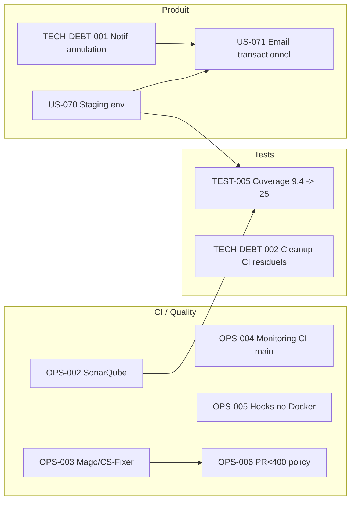

# Sprint 003 — Dépendances

## Dépendances inter-stories



## Dépendances externes (hors équipe dev)

| Dépendance | Bloque | Resp. | Echéance | Statut |
|---|---|---|---|---|
| `gh secret set SONAR_TOKEN` (regen côté SonarCloud) | OPS-002 | @ops | J1 sprint-003 (2026-05-11) | ⚠️ User action |
| Validation budget Render hosting (~30€/mois) | US-070 | @po | Avant J1 | ❓ À confirmer |
| Provider mailer transactionnel (Sendgrid free tier 100/j ou Mailtrap dev) | US-071 | @ops | Avant J5 | ❓ À confirmer |
| Réservation salle Sprint Planning P1+P2 | Démarrage | @scrum-master | 2026-05-11 09:00 + 14:00 | À faire |

## Dépendances héritées (PRs sprint-002 à merger)

| PR | Story | Bloque | Action |
|---|---|---|---|
| #43 | US-068 + US-069 | Test reproduction sur staging post US-070 | Reviewer humain externe |
| #44 | sprint-002 review + retro docs | Métrique vélocité historisée | Reviewer humain externe |

## Ordre recommandé J1-J5

```
J1 (lundi 11/05) :
  - Sprint Planning (matin/après-midi)
  - Action user : régénérer SONAR_TOKEN
  - Démarrer OPS-004 (monitoring CI main, fondation)
  - Démarrer OPS-006 (CONTRIBUTING.md, 1pt rapide)

J2 (mardi 12/05) :
  - OPS-002 (Sonar) + OPS-003 (Mago ADR) en parallèle
  - Démarrer US-070 (staging provisioning, 5pts critique)

J3 (mercredi 13/05) :
  - OPS-005 (hooks fallback)
  - Continuer US-070

(Jeudi 14/05 ferié Ascension + vendredi 15/05 pont)

J6 (lundi 18/05) :
  - Finir US-070 (staging démontrable)
  - TECH-DEBT-001 (notif annulation)

J7-J8 (mardi-mercredi 19-20/05) :
  - TECH-DEBT-002 (cleanup CI résiduels)
  - TEST-005 (coverage push)

J9-J10 (jeudi-vendredi 21-22/05) :
  - US-071 si descope non requis
  - Préparer demo + tests sur staging

J11 (lundi 25/05) :
  - Sprint Review + Rétrospective
```
