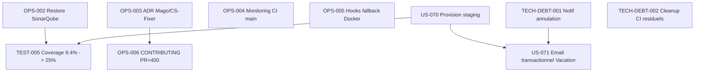

# Sprint 003 — Stabilisation Post-Vacation (CI/CD + Dette + Staging)

**Dates :** 2026-05-11 (lundi) → 2026-05-25 (lundi) (2 semaines fixes — jeudi 14/05 Ascension + pont vendredi 15/05 fériés)
**Capacité jours ouvrés :** 8 jours / dev (10 - 2 fériés)
**Origine :** retro sprint-002 (5 actions formelles) + dette technique identifiée + gap-analysis residuel.

## Objectif du Sprint (Sprint Goal)

> **Stabiliser le pipeline CI/CD post-OPS-001, fermer la dette technique notifications du chemin Vacation, et provisionner un environnement staging démontrable pour les Sprint Reviews.**

## Rationale

Sprint-002 a livré 34/34 pts mais a révélé :
- 4 CI checks sur PR #43 toujours rouges (Mago, PHPCS, PHPUnit pré-existants résiduels, SonarQube tokenless).
- Aucun environnement staging utilisable → la review sprint-002 s'est faite sur scénarios Gherkin texte.
- US-069 (manager cancel approved) ne notifie pas l'intervenant par email — silence côté UX.
- 5 actions retro priorisées attendent un sprint d'exécution.

Sprint-003 absorbe la dette structurelle pour permettre à sprint-004 d'attaquer un EPIC fonctionnel (e-signature, e-invoicing, ou export PDF des congés validés selon priorisation PO).

## Cérémonies

| Cérémonie | Durée | Date / Récurrence |
|---|---|---|
| Sprint Planning Part 1 (QUOI) | 2h | 2026-05-11 09:00 |
| Sprint Planning Part 2 (COMMENT) | 2h | 2026-05-11 14:00 |
| Daily Scrum | 15 min/jour | 09:30 |
| Affinage Backlog (sprint-004 prep) | 1h | 2026-05-19 14:00 |
| Sprint Review | 2h | 2026-05-25 14:00 |
| Rétrospective | 1h30 | 2026-05-25 16:30 |

## User Stories sélectionnées

> Total **30 pts** sur capacité ~32 pts (8 j × 4 dev × 1 pt/j × 80% focus factor = 25.6 pts hors fériés ; vélocité historique ~34 sprint-002 ; on garde une marge sécurité de 4 pts).

| ID | Titre | Pts | MoSCoW | Origine | Statut entrée |
|---|---|---:|---|---|---|
| OPS-002 | Restaurer pipeline SonarQube + Quality Gate strict | 3 | Must | Retro action 3 | 🔴 → 🟢 |
| OPS-003 | ADR + fix conflit formatage Mago vs PHP-CS-Fixer | 2 | Must | Retro action 2 | 🔴 → 🟢 |
| OPS-004 | Monitoring CI sur `main` (issue auto si rouge >24h) | 3 | Must | Retro action 1 | 🔴 → 🟢 |
| OPS-005 | Hooks pre-commit / pre-push fallback sans Docker | 2 | Should | Retro action 4 | 🔴 → 🟢 |
| OPS-006 | Politique PR <400 lignes diff dans `CONTRIBUTING.md` | 1 | Should | Retro action 5 | 🔴 → 🟢 |
| TECH-DEBT-001 | Notifier intervenant lors d'une annulation manager (US-069) | 3 | Must | Retro / sprint-002 backlog impact | 🔴 → 🟢 |
| TECH-DEBT-002 | Audit + cleanup CI checks résiduels (Mago/PHPCS/PHPUnit) sur PR existantes | 3 | Should | Retro thème A | 🔴 → 🟢 |
| US-070 | Provision env staging (Render/Docker) avec migrations + fixtures | 5 | Must | Retro / sprint-002 démo bloquée | 🔴 → 🟢 |
| TEST-005 | Élever coverage baseline 9.4% → 25% (focus Application + Domain Vacation + Notification) | 5 | Should | OPS-001 baseline + roadmap | 🔴 → 🟢 |
| US-071 | Email transactionnel de confirmation/refus/annulation Vacation (intervenant + manager) | 3 | Could | TECH-DEBT-001 amplifié | 🔴 → 🟢 |

**Total sélectionné : 30 points**

> US-071 est `Could` : descope possible si OPS-002/003/004 ou US-070 dérapent.

## Ordre d'exécution

1. **OPS-004** monitoring CI (3 pts) — fondation, à faire J1 pour détecter régressions futures
2. **OPS-002** SonarQube restauration (3 pts) — débloque le mesurage coverage TEST-005
3. **OPS-003** ADR + fix Mago/CS-Fixer (2 pts) — débloque les CI checks formatage
4. **OPS-005** Hooks fallback sans Docker (2 pts) — débloque les contributeurs sans daemon
5. **OPS-006** CONTRIBUTING PR <400 (1 pt) — règle écrite
6. **US-070** Provision staging (5 pts) — pré-requis démo sprint-003 review
7. **TECH-DEBT-001** Notif annulation (3 pts)
8. **TECH-DEBT-002** Audit cleanup CI (3 pts)
9. **TEST-005** Coverage push (5 pts) — dépend OPS-002 visible Sonar
10. **US-071** Email transactionnel (3 pts) — extension TECH-DEBT-001, descope si dérive

## Incrément livrable

À la fin du Sprint 003, le projet aura :

**Côté CI/CD**
- ✅ Pipeline CI vert sur `main` en continu (issue auto si rouge)
- ✅ SonarQube QualityGate strict, baseline coverage publiée et historisée
- ✅ Mago + PHP-CS-Fixer formatage aligné (1 ADR + 1 config gagnante)
- ✅ Hooks git fonctionnels sans daemon Docker

**Côté produit**
- ✅ Environnement staging déployé (URL stable, fixtures démo)
- ✅ Cycle Vacation : intervenant et manager notifiés par email à chaque transition (request, approve, reject avec motif, cancel manager)
- ✅ Coverage code domain Vacation/Notification ≥ 60% (vs 0% sprint-001 sur Vacation, ~30% sur Notification post sprint-002)

**Côté process**
- ✅ Politique PR <400 lignes formellement écrite et contrainte
- ✅ Dette CI résiduelle (Mago, PHPCS, PHPUnit) à 0 ou tracée explicitement

## Definition of Done (rappel sprint)

Pour CHAQUE story :
- [ ] Code review approuvée (1 reviewer humain externe minimum, self-approve interdit)
- [ ] Tests unitaires + intégration verts en CI
- [ ] PHPStan level 5 sans nouvelle erreur
- [ ] PHP-CS-Fixer + PHPCS clean
- [ ] Coverage delta ≥ 0 (pas de regression)
- [ ] PR <400 lignes diff (politique OPS-006 dès qu'elle est mergée)
- [ ] Documentation mise à jour si comportement utilisateur change
- [ ] Migration Doctrine fournie si schéma DB modifié

## Dépendances externes

| Dépendance | Bloque | Statut |
|---|---|---|
| Régénération SONAR_TOKEN par utilisateur (`gh secret set`) | OPS-002 | ⚠️ Action user requise avant J1 |
| Compte Render avec budget actif | US-070 | ❓ À confirmer |
| Domain `.atoll-tourisme.fr` ou `.hotones.app` pour staging | US-070 | ❓ À confirmer |
| SMTP/Mailer prod credentials (Sendgrid/Mailtrap?) pour US-071 | US-071 | ❓ À confirmer (peut basculer Mailtrap test) |

## Risques identifiés

| Risque | Probabilité | Impact | Mitigation |
|---|---|---|---|
| SONAR_TOKEN non régénéré J1 | Moyenne | OPS-002 bloqué | Déclencher l'action dès l'ouverture du sprint, fallback Codecov si échec |
| Render budget insuffisant | Faible | US-070 bloqué | Bascule sur Fly.io ou Hetzner Coolify |
| Conflit Mago vs CS-Fixer non résolvable | Faible | OPS-003 bloqué | Désactiver Mago `binary_operator_spaces` et tracker dette ADR-002 |
| Fériés FR 14/05 + 15/05 perte de focus | Élevée | Perte 2 j capacité | Capacité déjà ajustée à 8j |
| US-071 dérapage | Moyenne | Sprint Goal incomplet | US-071 est `Could`, descope assumé |

## Stack PR sprint-002 hérité

À merger sur main avant ou pendant J1 sprint-003 :
- **PR #43** US-068 + US-069 — review humaine en attente
- **PR #44** sprint-002 review + retro docs

Une fois mergées, sprint-002 est définitivement clôturé.
