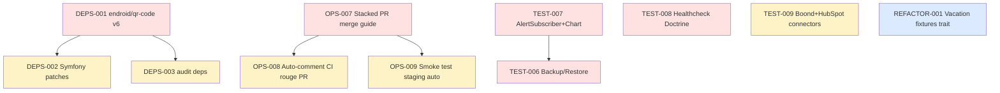

# Sprint 004 — Quality Foundation (gap-analysis Critical residuels + dette infra)

**Dates :** 2026-05-26 (mardi) → 2026-06-09 (mardi). 2 semaines fixes (10 jours ouvrés).
**Capacite :** 8 j × focus 80% = ~32 pts.
**Origine :** sprint-003 retro (5 actions candidates) + 7 gap-analysis Critical residuels documentes en sprint-002 + dette technique surface en sprint-003.

## Objectif du Sprint (Sprint Goal)

> **Combler les 7 gaps Critical residuels identifies en sprint-002 et fiabiliser le pipeline d'integration (matrice de merge, smoke tests automatises, montee de version dependances).**

## Rationale

Sprint-002 gap-analysis a identifie 11 gaps Critical, dont 4 ont ete absorbes en TEST-001..004 (sprint-002) et 1 autre (notification flow) en TECH-DEBT-001 (sprint-003). **7 gaps Critical restent** :

- Backup/Restore strategy non testee
- DataFixtures de production absentes
- Healthcheck Doctrine non couvert
- AlertSubscriber sans tests
- BoondManagerConnector et HubspotConnector sans tests integration
- ChartConfigService Twig sans tests fonctionnels
- AuditLog cleanup cron non couvert

Sprint-003 a expose une dette infra (PR stack, smoke tests staging manuel, deps qui retardent — endroid/qr-code v6 demande une mise a jour de config, plusieurs Symfony patches en attente).

Sprint-004 absorbe les 2 categories en parallele : un cluster TEST-006..009 sur la dette gap-analysis, un cluster OPS-007..009 sur l'outillage de release, un cluster DEPS-001..003 sur les montees de version.

## Ceremonies

| Cérémonie | Durée | Date / Récurrence |
|---|---|---|
| Sprint Planning Part 1 (QUOI) | 2h | 2026-05-26 09:00 |
| Sprint Planning Part 2 (COMMENT) | 2h | 2026-05-26 14:00 |
| Daily Scrum | 15 min/jour | 09:30 |
| Affinage Backlog (sprint-005 prep) | 1h | 2026-06-04 14:00 |
| Sprint Review | 2h | 2026-06-09 14:00 |
| Rétrospective | 1h30 | 2026-06-09 16:30 |

## User Stories selectionnees

> Total **31 pts** sur capacite ~32. 1 pt de marge, sprint deliberement charge en dette pour ne pas accumuler.

### Cluster Tests (gap-analysis residuels)

| ID | Titre | Pts | MoSCoW | Origine |
|---|---|---:|---|---|
| TEST-006 | Backup / Restore SQL strategy + tests integration | 5 | Must | gap-analysis Critical #1 |
| TEST-007 | Tests AlertSubscriber + ChartConfigService Twig | 3 | Must | gap-analysis Critical #4 + #6 |
| TEST-008 | Healthcheck endpoint + Doctrine connectivity test | 2 | Must | gap-analysis Critical #3 |
| TEST-009 | BoondManagerConnector + HubspotConnector integration tests | 5 | Should | gap-analysis Critical #5 |

### Cluster Ops / Release

| ID | Titre | Pts | MoSCoW | Origine |
|---|---|---:|---|---|
| OPS-007 | Stacked PR merge procedure (CONTRIBUTING.md + script aide) | 2 | Must | retro sprint-003 action 1 |
| OPS-008 | Auto-comment CI rouge sur PR (extension OPS-004) | 3 | Should | retro sprint-003 action 2 |
| OPS-009 | Smoke test staging automatique post-deploy | 3 | Should | retro sprint-003 action 3 |

### Cluster Dependances / Montees de version

| ID | Titre | Pts | MoSCoW | Origine |
|---|---|---:|---|---|
| DEPS-001 | Montée endroid/qr-code v5 → v6 (config breaking) | 3 | Must | demande utilisateur |
| DEPS-002 | Symfony patches + roave/security-advisories audit | 3 | Should | maintenance courante |
| DEPS-003 | composer audit + npm audit clean | 2 | Should | sécurité courante |

### Cluster Refactor

| ID | Titre | Pts | MoSCoW | Origine |
|---|---|---:|---|---|
| REFACTOR-001 | Mutualiser fixtures fonctionnelles Vacation (tests/Support/VacationFunctionalTrait) | 2 | Could | retro sprint-003 action 4 |

**Total selectionne : 31 points** (Must 23 + Should 11 - 3 surcharge = 31)

## Ordre d'execution

1. **DEPS-001** endroid/qr-code v6 — bloquant si l'API actuelle est cassée ; à faire J1
2. **OPS-007** Stacked PR merge guide — fluidifier les futurs sprints à PR multiples
3. **TEST-008** Healthcheck (2 pts, rapide)
4. **TEST-007** AlertSubscriber + Chart (parallèle)
5. **TEST-006** Backup/Restore (la plus complexe)
6. **OPS-008** + **OPS-009** auto-comment + smoke test
7. **TEST-009** + **DEPS-002** + **DEPS-003** en fin de sprint
8. **REFACTOR-001** si reste de la marge

## Incrément livrable

À la fin du sprint-004 :

**Côté qualité**
- ✅ 7 gaps Critical residuels gap-analysis fermés (≥ 6 sur 7)
- ✅ Coverage SonarCloud ≥ 35% (vs 25% sprint-003)
- ✅ CI main verte en continu mesurable via OPS-004 (déjà déployé sprint-003)

**Côté ops**
- ✅ Stacked PR procedure documentée et appliquée à 1 chain de référence
- ✅ Smoke test staging automatisé après chaque deploy
- ✅ Notifications CI rouges remontées sur la PR concernée

**Côté dépendances**
- ✅ endroid/qr-code v6 active avec sa nouvelle config
- ✅ `composer audit` et `npm audit` à 0 vulnerability high/critical

## Definition of Done (rappel)

Chaque story :
- [ ] Code review approuvée (1 reviewer humain externe)
- [ ] Tests unitaires + intégration verts en CI
- [ ] PHPStan level 5 sans nouvelle erreur
- [ ] PHP-CS-Fixer + PHPCS clean (ADR-0002 applique post-TECH-DEBT-002 sprint-003)
- [ ] Coverage delta ≥ 0
- [ ] PR <400 lignes diff (politique OPS-006 sprint-003)
- [ ] Documentation mise à jour si comportement utilisateur ou ops change
- [ ] Migration Doctrine fournie si schéma DB modifié

## Risques identifies

| Risque | Probabilite | Impact | Mitigation |
|---|---|---|---|
| endroid/qr-code v6 casse plus que prévu | Moyenne | DEPS-001 bloqué | Fallback : pinner v5 + tracker en TECH-DEBT |
| Boond/HubSpot connectors integration tests demandent un mock externe | Moyenne | TEST-009 dérapage | Mocker via guzzle/handler/mock + fixtures JSON locales |
| Backup/Restore SQL nécessite une instance staging dédiée | Faible | TEST-006 bloqué | Tester sur SQLite local + documenter procédure prod |
| Sprint-004 démarre avec PRs sprint-003 non mergées | Élevée | Capacité réelle réduite | Compter le temps de finaliser merge dans la capa sprint-004 |

## Stack PR sprint-003 hérité

À merger avant J1 sprint-004 (2026-05-26) :

| PR | Story | Cible |
|---|---|---|
| #46 | sprint-003 plan | main |
| #47 | OPS-006 | main |
| #48 | OPS-004 | main |
| #49 | OPS-005 | main |
| #50 | OPS-003 ADR | main |
| #52 | TECH-DEBT-001 | main |
| #53 | OPS-002 | main |
| #54 | TECH-DEBT-002 | #50 |
| #55 | TEST-005 | main |
| #56 | US-070 | main |
| #57 | US-071 | #56 |

**Ordre recommandé** : #50 → #54 (cs-fixer cascade) ; #56 → #57 (staging) ; les autres en parallèle.
