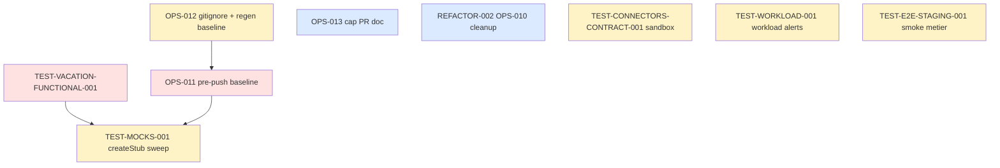

# Sprint 005 — Test Stabilization & Tech-Debt

**Dates :** 2026-05-04 (lundi) → 2026-05-15 (vendredi). 2 semaines fixes (10 jours ouvrés).
**Capacite :** 8 j × focus 80% = ~32 pts.
**Origine :** sprint-004 retro (4 actions SMART) + 5 candidates identifiées en review.

## Objectif du Sprint (Sprint Goal)

> **Stabiliser la suite de tests fonctionnels (Vacation + connectors), éliminer la dette mockObjects et fiabiliser le pre-push hook pour ne plus recourir à `--no-verify`.**

## Rationale

Sprint-004 a livré 30/30 pts mais a aussi exposé trois zones d'instabilité :

1. **11 tests fonctionnels Vacation cassés** depuis la migration DDD sprint-003 (route loader manquant + session/CSRF brittle). REFACTOR-001 a corrigé le loader, le reste est candidat.
2. **229 PHPUnit notices** silencées via `#[AllowMockObjectsWithoutExpectations]` plutôt que résolues (TEST-DEPRECATIONS-001 sweep). Dette à payer en convertissant `createMock` → `createStub` là où le mock n'asserte rien.
3. **74 failures pré-existantes** sur le pre-push hook qui forcent `--no-verify` à chaque push (utilisé 9 fois sprint-004).

Sprint-005 attaque ces trois fronts en parallèle, plus la fermeture des 5 candidates sprint-005 listées en review sprint-004.

## Cérémonies

| Cérémonie | Durée | Date / Récurrence |
|---|---|---|
| Sprint Planning Part 1 (QUOI) | 2h | 2026-05-04 09:00 |
| Sprint Planning Part 2 (COMMENT) | 2h | 2026-05-04 14:00 |
| Daily Scrum | 15 min/jour | 09:30 |
| Affinage Backlog (sprint-006 prep) | 1h | 2026-05-13 14:00 |
| Sprint Review | 2h | 2026-05-15 14:00 |
| Rétrospective | 1h30 | 2026-05-15 16:30 |

## User Stories selectionnees

> Total **26 pts** sur capacite ~32. 6 pts de marge — sprint volontairement plus relâché que sprint-004 pour absorber la file de review accumulée (10 PRs sprint-004 ouvertes au démarrage).

### Cluster Test fonctionnel (Must, 5 pts)

| ID | Titre | Pts | MoSCoW | Origine |
|---|---|---:|---|---|
| TEST-VACATION-FUNCTIONAL-001 | Fixer 11 tests fonctionnels Vacation (session + CSRF) + ajouter route count guard | 5 | Must | Retro sprint-004 action #2 |

### Cluster Pre-push hook (Must, 3 pts)

| ID | Titre | Pts | MoSCoW | Origine |
|---|---|---:|---|---|
| OPS-011 | Pre-push baseline : éliminer les 74 failures pré-existantes ou les `@group skip-pre-push` | 3 | Must | Retro sprint-004 action #3 |

### Cluster Test debt (Should, 11 pts)

| ID | Titre | Pts | MoSCoW | Origine |
|---|---|---:|---|---|
| TEST-MOCKS-001 | Convertir `createMock` → `createStub` + retirer `#[AllowMockObjectsWithoutExpectations]` (28 fichiers) | 3 | Should | Sprint-004 review candidate |
| TEST-CONNECTORS-CONTRACT-001 | Contract tests sandbox Boond + HubSpot (fixtures JSON réelles, smoke périodique) | 5 | Should | Sprint-004 review candidate |
| TEST-WORKLOAD-001 | Couvrir `AlertDetectionService::checkWorkloadAlerts` (Doctrine QueryBuilder) | 3 | Should | TEST-007 hors-scope sprint-004 |

### Cluster Ops / Doc (Should, 5 pts)

| ID | Titre | Pts | MoSCoW | Origine |
|---|---|---:|---|---|
| OPS-012 | `gitignore config/reference.php` + regen `phpstan-baseline.neon` from scratch | 2 | Should | Retro sprint-004 action #1 |
| TEST-E2E-STAGING-001 | Étendre smoke staging avec assertions métier (login JWT, lecture, écriture) | 3 | Should | Sprint-004 review candidate |

### Cluster Doc (Could, 1 pt)

| ID | Titre | Pts | MoSCoW | Origine |
|---|---|---:|---|---|
| OPS-013 | Section "PRs ouvertes simultanées" dans `CONTRIBUTING.md` (cap à 4) | 1 | Could | Retro sprint-004 action #4 |

### Cluster Refactor (Could, 1 pt)

| ID | Titre | Pts | MoSCoW | Origine |
|---|---|---:|---|---|
| REFACTOR-002 | Clarifier ou supprimer OPS-010 "review cascade" (scope ambigu) | 1 | Could | Retro sprint-004 |

**Total selectionne : 26 points** (Must 8 + Should 16 + Could 2).

## Ordre d'execution

1. **OPS-012** (J1, 2 pts) — démarrer par le nettoyage repo : `gitignore config/reference.php` + régénération phpstan-baseline. Débloque le suivi des autres PRs.
2. **TEST-VACATION-FUNCTIONAL-001** (J1-J3, 5 pts) — fix les 11 tests, ajout route count guard. Blocking pour OPS-011.
3. **OPS-011** (J3-J5, 3 pts) — une fois Vacation vert, traiter les 74 failures restantes (split par module + fixer ou skipper).
4. **TEST-MOCKS-001** (J5-J6, 3 pts) — sweep automatisable une fois OPS-012 + OPS-011 verts.
5. **TEST-WORKLOAD-001** (J6-J7, 3 pts) — branche AlertDetectionService restée hors-scope sprint-004.
6. **TEST-E2E-STAGING-001** (J7-J8, 3 pts) — étendre smoke avec login JWT + read/write.
7. **TEST-CONNECTORS-CONTRACT-001** (J8-J10, 5 pts) — story Should la plus risquée (sandbox externes), gardée en fin de sprint pour pouvoir down-scoper sans regret.
8. **OPS-013** + **REFACTOR-002** (Could) — si reste de la marge.

## Incrément livrable

À la fin du sprint-005 :

**Côté tests**
- ✅ 11 tests fonctionnels Vacation passent
- ✅ 0 PHPUnit deprecation, 0 notice (sans `AllowMockObjectsWithoutExpectations`)
- ✅ `AlertDetectionService::checkWorkloadAlerts` couvert
- ✅ Smoke staging assertions métier (login + lecture + écriture)

**Côté ops**
- ✅ Pre-push hook fiable (`git push` sans `--no-verify` réussit sur branche propre)
- ✅ `config/reference.php` git-ignored
- ✅ `phpstan-baseline.neon` régénéré, 0 pattern non-matché
- ✅ Politique "max 4 PRs ouvertes" documentée dans CONTRIBUTING

**Côté contracts**
- ✅ Tests contract Boond + HubSpot exécutables au moins en mode `@group sandbox`

## Definition of Done (rappel)

Chaque story :
- [ ] Code review approuvée (1 reviewer humain externe)
- [ ] Tests unitaires + intégration verts en CI
- [ ] PHPStan level 5 sans nouvelle erreur
- [ ] PHP-CS-Fixer + PHPCS clean
- [ ] PR <400 lignes diff (politique OPS-006 sprint-003)
- [ ] Documentation mise à jour si comportement utilisateur ou ops change
- [ ] Migration Doctrine fournie si schéma DB modifié

## Risques identifies

| Risque | Probabilite | Impact | Mitigation |
|---|---|---|---|
| 74 failures pre-push impossibles à résoudre en 3 pts | Élevée | OPS-011 dérapage | Fallback : marker `@group skip-pre-push` + story dédiée sprint-006 |
| Sandbox Boond/HubSpot indisponible | Moyenne | TEST-CONNECTORS-CONTRACT-001 bloqué | Down-scope vers `@group sandbox` désactivé par défaut |
| 11 tests Vacation imbriquent une refonte session security plus large | Moyenne | TEST-VACATION-FUNCTIONAL-001 dérapage | Down-scope : extraire CSRF du form HTML pour 6 tests, déférer 5 en sprint-006 |
| File de review sprint-004 (10 PRs) ralentit kickoff sprint-005 | Élevée | Capacité réelle réduite | Compter le temps de review dans la capa sprint-005 (déjà reflété dans 26 pts engagés vs capa 32) |

## File de PR sprint-004 héritée

À reviewer/merger en parallèle du sprint-005 :

| PR | Story | Cible |
|---|---|---|
| #71 | TEST-008 | main |
| #72 | TEST-007 | main |
| #73 | OPS-007 | main |
| #74 | TEST-DEPRECATIONS-001 | main |
| #75 | OPS-008 | main |
| #76 | OPS-009 | main |
| #77 | DEPS-004 | main |
| #78 | REFACTOR-001 | main |
| #79 | TEST-009 | main |
| #80 | sprint-004 review+retro | main |

**Ordre recommandé** :
1. OPS-007 (#73) + REFACTOR-001 (#78) en premier (pas de chevauchement code)
2. TEST-DEPRECATIONS-001 (#74) ensuite (touche 28 fichiers test, base pour les autres)
3. TEST-007/8/9 (#72/71/79) en parallèle (tests-only)
4. OPS-008/9 (#75/76) en parallèle (workflows isolés)
5. DEPS-004 (#77) en dernier (touche composer.lock)
6. #80 review/retro post-merge des autres
