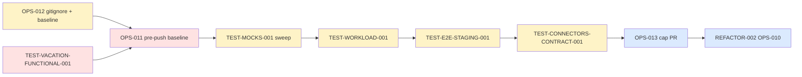

# Tâches — Sprint 005 (Test Stabilization & Tech-Debt)

## Vue d'ensemble

| US | Titre | Points | Tâches | Heures | Statut |
|---|---|---:|---:|---:|---|
| TEST-VACATION-FUNCTIONAL-001 | Fix 11 tests Vacation + route count guard | 5 | 7 | 12 | 🔲 |
| OPS-011 | Pre-push baseline (74 failures) | 3 | 4 | 7 | 🔲 |
| TEST-MOCKS-001 | createMock → createStub sweep | 3 | 4 | 7 | 🔲 |
| TEST-CONNECTORS-CONTRACT-001 | Sandbox Boond + HubSpot | 5 | 6 | 12 | 🔲 |
| TEST-WORKLOAD-001 | AlertDetectionService::checkWorkloadAlerts | 3 | 4 | 7 | 🔲 |
| OPS-012 | gitignore reference + regen baseline | 2 | 4 | 5 | 🔲 |
| TEST-E2E-STAGING-001 | Smoke staging assertions métier | 3 | 4 | 7 | 🔲 |
| OPS-013 | Cap PRs ouvertes doc | 1 | 1 | 2 | 🔲 |
| REFACTOR-002 | OPS-010 cleanup | 1 | 1 | 2 | 🔲 |
| **Total** | | **26** | **35** | **61h** | |

Capa estimée : ~32 pts ≈ 64h sur 10 jours ouvrés. **Marge ~3h** (sprint volontairement chargé en dette ; on absorbe les reviews sprint-004 dans la marge restante).

## Répartition par type

| Type | Tâches | Heures | % |
|---|---:|---:|---:|
| [TEST] | 18 | 33 | 54% |
| [OPS] | 7 | 12 | 20% |
| [BE] | 2 | 3 | 5% |
| [DOC] | 6 | 8 | 13% |
| [REV] | 4 | 4 | 7% |
| [DB] | 0 | 0 | 0% |
| [FE-WEB] | 0 | 0 | 0% |
| [FE-MOB] | 0 | 0 | 0% |
| **Total** | **37** | **60h** | **100%** |

> Sprint dominé par les tâches [TEST] et [OPS] — c'est attendu pour un sprint Test-Stabilization. Aucune story produit : pas de tâche DB / FE-WEB / FE-MOB.

## Fichiers

- [TEST-VACATION-FUNCTIONAL-001](./TEST-VACATION-FUNCTIONAL-001-tasks.md)
- [OPS-011](./OPS-011-tasks.md)
- [TEST-MOCKS-001](./TEST-MOCKS-001-tasks.md)
- [TEST-CONNECTORS-CONTRACT-001](./TEST-CONNECTORS-CONTRACT-001-tasks.md)
- [TEST-WORKLOAD-001](./TEST-WORKLOAD-001-tasks.md)
- [OPS-012](./OPS-012-tasks.md)
- [TEST-E2E-STAGING-001](./TEST-E2E-STAGING-001-tasks.md)
- [OPS-013](./OPS-013-tasks.md)
- [REFACTOR-002](./REFACTOR-002-tasks.md)

## Conventions

- **ID** : `T-<STORY>-<NN>` (ex: `T-TVF-01`, `T-OPS11-01`)
- **Taille** : 0.5h - 8h
- **Statuts** : 🔲 à faire | 🔄 en cours | 👀 review | ✅ done | 🚫 bloqué

## Ordre recommandé (dépendances explicites)

