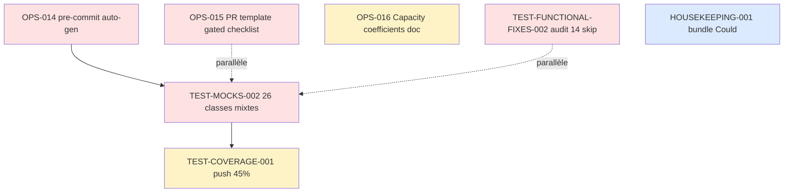

# Sprint 006 — Test debt cleanup & Workflow hygiene

**Dates :** 2026-05-04 (lundi) → 2026-05-15 (vendredi). 2 semaines fixes (10 jours ouvrés).
**Capacité brute :** 8 j × focus 80% = ~32 pts.
**Origine :** sprint-005 retro (4 actions SMART) + 3 candidates identifiées en review sprint-005 + 5 actions ops post-merge.

## Objectif du Sprint (Sprint Goal)

> **Éliminer la dette `AllowMockObjectsWithoutExpectations` (31 classes), auditer les 14 classes encore en `skip-pre-push`, et fiabiliser les guards workflow (pre-commit auto-générés, PR template gating).**

## Rationale

Sprint-005 a livré 26/26 pts (100%) en stabilisant le pipeline tests. Trois fronts restent ouverts :

1. **31 classes** encore décorées de `#[AllowMockObjectsWithoutExpectations]` — silence des deprecations PHPUnit 13 plutôt que conversion des `createMock` non-asserts en `createStub` (TEST-MOCKS-001 a fait 5 classes pures-stubs, reste les classes mixtes).
2. **14 classes** toujours en `skip-pre-push` (DDD migration, multi-tenant, session/CSRF). Ces tests existent côté CI et fail régulièrement — il faut soit les fix soit les documenter comme legacy permanente avec ADR.
3. **Workflows gated post-merge** (sprint-005 a mergé 3 PRs avec `vars.X_ENABLED` non provisionné — staging-backup, staging-smoke, contract-tests). Le PR template doit forcer la checklist avant merge.

En parallèle, les 4 actions retro sprint-005 sont injectées comme stories : capacity coefficients, pre-commit hook auto-gen, PR template checklist, bundle housekeeping.

## Capacité ajustée — coefficients par nature (action retro #1)

Première application des coefficients vélocité par catégorie (calibrés sur sprint-004 + sprint-005) :

| Nature | Coefficient | Note |
|---|---:|---|
| `doc-only` | ×1.5 | doc + tableau + xref + ADR. Sprint-005 a livré ~1pt en 30 min. |
| `refactor` | ×1.0 | conversion mécanique sur classes existantes. |
| `test` | ×0.8 | écrire un test demande analyse cas + fixture. |
| `infra` | ×0.7 | hook + workflow + secrets gating. |
| `feature-be` | ×0.5 | backend nouveau, Doctrine + tests. |
| `feature-fe` | ×0.4 | UI Symfony UX/Twig + tests fonctionnels. |

Capacité brute 32 pts × moyenne pondérée selon mix sprint-006 (~75% test/refactor/infra) → **capacité projetée ~28 pts**. Marge de 4 pts pour absorber imprévus. Confirmation/recalibrage en review sprint-006.

## Cérémonies

| Cérémonie | Durée | Date / Récurrence |
|---|---|---|
| Sprint Planning Part 1 (QUOI) | 2h | 2026-05-04 09:00 |
| Sprint Planning Part 2 (COMMENT) | 2h | 2026-05-04 14:00 |
| Daily Scrum | 15 min/jour | 09:30 |
| Affinage Backlog (sprint-007 prep) | 1h | 2026-05-13 14:00 |
| Sprint Review | 2h | 2026-05-15 14:00 |
| Rétrospective | 1h30 | 2026-05-15 16:30 |

## User Stories sélectionnées

### Cluster Test debt (31 + 14 classes)

| ID | Titre | Pts | MoSCoW | Nature | Origine |
|---|---|---:|---|---|---|
| TEST-MOCKS-002 | Convertir `createMock` → `createStub` sur les 26 classes mixtes restantes (audit cas par cas) | 8 | Must | refactor | sprint-005 review |
| TEST-FUNCTIONAL-FIXES-002 | Auditer les 14 classes `skip-pre-push` : fix ou ADR de tolérance permanente | 5 | Must | test | sprint-005 retro |
| TEST-COVERAGE-001 | Pousser coverage SonarCloud vers 45% (cible sprint-007 = 50%) via tests Service ciblés | 3 | Should | test | sprint-005 review candidate |

### Cluster Workflow hygiene (4 actions retro sprint-005)

| ID | Titre | Pts | MoSCoW | Nature | Origine |
|---|---|---:|---|---|---|
| OPS-014 | Hook pre-commit qui refuse `config/reference.php`, `var/cache/`, `.phpunit.cache`, `.deptrac.cache` staged | 2 | Must | infra | retro sprint-005 action #2 |
| OPS-015 | `.github/PULL_REQUEST_TEMPLATE.md` : checklist secrets/vars provisionnés pour workflows gated | 1 | Must | doc-only | retro sprint-005 action #3 |
| OPS-016 | Capacity planning par nature : tableau coefficients dans `project-management/README.md` | 1 | Should | doc-only | retro sprint-005 action #1 |

### Cluster Housekeeping (action retro #4 — bundle Could doc-only)

| ID | Titre | Pts | MoSCoW | Nature | Origine |
|---|---|---:|---|---|---|
| HOUSEKEEPING-001 | Bundle Could doc-only (CONTRIBUTING tweaks, README updates, CHANGELOG, broken links) | 2 | Could | doc-only | retro sprint-005 action #4 |

### Cluster Ops post-merge sprint-005 (action utilisateur, hors capa dev)

| Action | Statut | Note |
|---|---|---|
| Provisionner `STAGING_DATABASE_URL` + `STAGING_APP_SECRET` | ⏸️ user | TEST-006 backup workflow gated en attente |
| Activer `vars.STAGING_BACKUP_ENABLED=true` | ⏸️ user | idem |
| Provisionner `HUBSPOT_SANDBOX_TOKEN` (HubSpot Developer test, gratuit) | ⏸️ user | TEST-CONNECTORS-CONTRACT-001 gated |
| Activer `vars.CONTRACT_TESTS_ENABLED=true` | ⏸️ user | idem |
| Provisionner `BOOND_SANDBOX_*` (optionnel, payant) | ⏸️ user | down-scope HubSpot-only acceptable |

**Total sélectionné : 22 pts** (Must 16 + Should 4 + Could 2). Marge volontaire de 6 pts vs capacité projetée 28 — sprint-005 a montré que la vélocité réelle dépasse largement le plan, mieux vaut sous-engager et tirer du backlog au besoin.

## Ordre d'exécution

1. **OPS-014 + OPS-015** J1 — verrous workflow avant nouvelles PRs (action retro appliquée immédiatement).
2. **TEST-MOCKS-002** parallèle à TEST-FUNCTIONAL-FIXES-002 — gros chantiers indépendants.
3. **TEST-COVERAGE-001** après TEST-MOCKS-002 (les conversions stub révèlent souvent des manques d'assert).
4. **OPS-016** doc capacity coefficients — fin de sprint pour intégrer le retour d'expérience sprint-006.
5. **HOUSEKEEPING-001** marge.

## Incrément livrable

À la fin du sprint-006 :

**Côté qualité tests**
- ✅ 0 classe avec `#[AllowMockObjectsWithoutExpectations]` OU justification ADR pour les survivants.
- ✅ 14 classes `skip-pre-push` réduites à ≤ 5, les survivants tracés via ADR-0003 "tolérance test legacy".
- ✅ Coverage SonarCloud ≥ 45%.

**Côté workflow**
- ✅ Pre-commit hook bloque les fichiers auto-générés.
- ✅ PR template force checklist secrets/vars pour workflows gated.
- ✅ `project-management/README.md` documente les coefficients vélocité par nature.

**Côté ops**
- 🟡 Conditionnel (action utilisateur) : workflows staging-backup + contract-tests live et verts si secrets provisionnés.

## Definition of Done (rappel)

Chaque story :

- [ ] Code review approuvée (1 reviewer humain externe ou self-merge motivé).
- [ ] Tests unitaires + intégration verts en CI complète (groups inclus).
- [ ] PHPStan level 5 sans nouvelle erreur baseline.
- [ ] PHP-CS-Fixer + PHPCS clean.
- [ ] Coverage delta ≥ 0.
- [ ] PR ≤ 400 lignes diff (politique OPS-006), bundle housekeeping toléré jusqu'à 600 si sub-tasks isolées par commits.
- [ ] Quota PR respecté : ≤ 4 PRs open par dev (politique OPS-013).
- [ ] Si workflow gated ajouté : checklist secrets/vars cochée OU justification déficience documentée (politique OPS-015).
- [ ] Documentation mise à jour si comportement utilisateur ou ops change.

## Risques identifiés

| Risque | Probabilité | Impact | Mitigation |
|---|---|---|---|
| TEST-MOCKS-002 révèle des mocks réellement utilisés (assertions cachées) | Moyenne | dépassement scope | Procéder par lot de 5 classes, fail-fast sur les cas ambigus → migrer vers Mockery ou ADR |
| Les 14 classes `skip-pre-push` ne peuvent pas toutes être fixées en sprint | Élevée | TEST-FUNCTIONAL-FIXES-002 partiel | ADR-0003 : formaliser la tolérance permanente ; cible 5 classes restantes |
| Action utilisateur secrets non faite avant fin sprint | Élevée | workflows staging-backup + contract-tests gated en silence | OPS-015 (PR template) prévient le pattern à l'avenir mais ne couvre pas le carry-over sprint-005 |
| Nouveau hook pre-commit (OPS-014) friction excessive sur PRs en cours | Faible | rollback hook | Tester sur 2 PRs internes avant de pousser à tous |

## Stack PR sprint-005 hérité

À merger avant J1 sprint-006 (2026-05-04) :

| PR | Story | Statut |
|---|---|---|
| #88 | TEST-CONNECTORS-CONTRACT-001 | open |
| #89 | OPS-013 + REFACTOR-002 | open |
| #90 | sprint-005 review/retro | open |

**Ordre recommandé** : merger dans l'ordre, tous indépendants, base = main.

## Notes

- Cette planification applique **immédiatement** les 4 actions retro sprint-005 : OPS-016 (action #1), OPS-014 (action #2), OPS-015 (action #3), HOUSEKEEPING-001 (action #4 / bundle Could).
- Sprint-006 sera le premier à utiliser des coefficients capacité par nature plutôt qu'une moyenne unique.
- Si sprint-006 confirme la sous-engagement (livraison rapide), sprint-007 montera la capacité visée à 36 pts.
