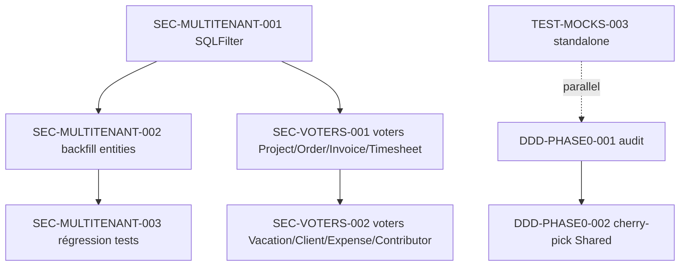

# Tasks — Sprint 007

> Décomposition des 8 stories sprint-007 en 35 tasks, avec estimation horaire et dépendances.

## Vue d'ensemble

| Story | Nature | Pts | Tasks |
|-------|--------|----:|------:|
| SEC-MULTITENANT-001 | feature-be | 8 | 7 |
| SEC-MULTITENANT-002 | refactor | 5 | 4 |
| SEC-MULTITENANT-003 | test | 5 | 5 |
| SEC-VOTERS-001 | feature-be | 5 | 5 |
| SEC-VOTERS-002 | feature-be | 3 | 4 |
| DDD-PHASE0-001 | doc-only | 2 | 4 |
| DDD-PHASE0-002 | feature-be | 3 | 4 |
| TEST-MOCKS-003 | test | 1 | 2 |
| **Total** | | **32** | **35** |

## Légende statut

🔲 À faire | 🔄 En cours | 👀 En review | ✅ Terminé | 🚫 Bloqué

## Tasks par story

Voir un fichier dédié par story :
- [SEC-MULTITENANT-001-tasks.md](SEC-MULTITENANT-001-tasks.md)
- [SEC-MULTITENANT-002-tasks.md](SEC-MULTITENANT-002-tasks.md)
- [SEC-MULTITENANT-003-tasks.md](SEC-MULTITENANT-003-tasks.md)
- [SEC-VOTERS-001-tasks.md](SEC-VOTERS-001-tasks.md)
- [SEC-VOTERS-002-tasks.md](SEC-VOTERS-002-tasks.md)
- [DDD-PHASE0-001-tasks.md](DDD-PHASE0-001-tasks.md)
- [DDD-PHASE0-002-tasks.md](DDD-PHASE0-002-tasks.md)
- [TEST-MOCKS-003-tasks.md](TEST-MOCKS-003-tasks.md)

## Graphe de dépendances



## Chemin critique

```
SEC-MULTITENANT-001 (8 pts, 12-15h) ──→ SEC-MULTITENANT-002 (5 pts, 6-8h) ──→ SEC-MULTITENANT-003 (5 pts, 8-10h)
                                                                              ↓
                                       SEC-VOTERS-001 (5 pts, 8-10h) ────────→  Sprint Review
                                       SEC-VOTERS-002 (3 pts, 5-7h)  ───────→
```

Total chemin critique : **39-50h** (vs capacité 64h). Marge ~15-25h pour DDD-PHASE0 + TEST-MOCKS-003.
