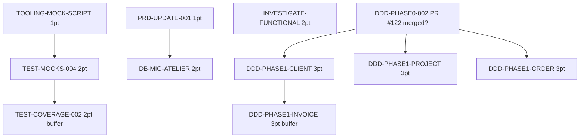

# Tâches Sprint 008 — Vue d'ensemble

## Sprint Goal (rappel)

> "Démarrer Phase 1 EPIC-001 (3 BCs DDD additifs Client/Project/Order) + résorber dette test résiduelle (TEST-MOCKS-004 + functional failures) + finaliser PRD post-atelier business avec migrations DB."

## Stories ferme (17 pts)

| # | Story | Pts | Tasks | Estimation | Status |
|---|---|---:|---:|---:|---|
| 1 | DDD-PHASE1-CLIENT | 3 | 6 | ~12h | 🔲 |
| 2 | DDD-PHASE1-PROJECT | 3 | 6 | ~12h | 🔲 |
| 3 | DDD-PHASE1-ORDER | 3 | 7 | ~14h | 🔲 |
| 4 | TEST-MOCKS-004 | 2 | 3 | ~6h | 🔲 |
| 5 | INVESTIGATE-FUNCTIONAL-FAILURES | 2 | 4 | ~8h | 🔲 |
| 6 | TOOLING-MOCK-SCRIPT | 1 | 2 | ~3h | 🔲 |
| 7 | PRD-UPDATE-001 | 1 | 2 | ~3h | 🔲 |
| 8 | DB-MIG-ATELIER | 2 | 4 | ~6h | 🔲 |
| **Total** | | **17** | **34** | **~64h** | |

## Stories buffer (5 pts, optional)

| # | Story | Pts | Tasks | Estimation | Status |
|---|---|---:|---:|---:|---|
| 9 | DDD-PHASE1-INVOICE | 3 | 7 | ~14h | ⏸️ Buffer |
| 10 | TEST-COVERAGE-002 | 2 | 4 | ~8h | ⏸️ Buffer |

## Répartition par type

| Type | Tâches ferme | Heures ferme |
|---|---:|---:|
| [DDD] DDD cherry-pick | 12 | ~24h |
| [TEST] Tests + investigation | 7 | ~14h |
| [DB] Migrations | 4 | ~6h |
| [DOC] Documentation | 4 | ~6h |
| [TOOL] Tooling | 2 | ~3h |
| [REV] Review | 5 | ~5h |
| **Total** | **34** | **~64h** |

## Conventions

- **ID**: `T-{STORY-CODE}-{NN}` (ex: `T-DDP1C-01` pour DDD-PHASE1-CLIENT task 01)
- **Taille**: 0.5h - 4h idéal
- **Statuts**: 🔲 À faire / 🔄 En cours / 👀 Review / ✅ Done / 🚫 Bloqué

## Files

- [DDD-PHASE1-CLIENT-tasks.md](./DDD-PHASE1-CLIENT-tasks.md)
- [DDD-PHASE1-PROJECT-tasks.md](./DDD-PHASE1-PROJECT-tasks.md)
- [DDD-PHASE1-ORDER-tasks.md](./DDD-PHASE1-ORDER-tasks.md)
- [TEST-MOCKS-004-tasks.md](./TEST-MOCKS-004-tasks.md)
- [INVESTIGATE-FUNCTIONAL-FAILURES-tasks.md](./INVESTIGATE-FUNCTIONAL-FAILURES-tasks.md)
- [TOOLING-MOCK-SCRIPT-tasks.md](./TOOLING-MOCK-SCRIPT-tasks.md)
- [PRD-UPDATE-001-tasks.md](./PRD-UPDATE-001-tasks.md)
- [DB-MIG-ATELIER-tasks.md](./DB-MIG-ATELIER-tasks.md)
- [BUFFER-tasks.md](./BUFFER-tasks.md) — DDD-PHASE1-INVOICE + TEST-COVERAGE-002

## Ordre d'exécution recommandé

Recommandation: démarrer en parallèle TOOLING-MOCK-SCRIPT + PRD-UPDATE-001 (1 pt chacun, low risk) pendant l'attente potentielle du merge de PR #122.
