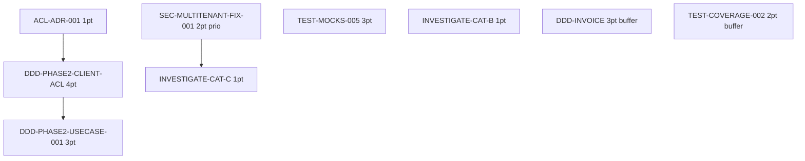

# Sprint 009 — Task Board

> **Sprint Goal**: DDD Phase 2 Strangler Fig + Critical Fixes.
> **Total engagé**: 15 pts (+ 5 pts buffer = 22 pts capacité).

---

## 🔲 Backlog (à démarrer)

### Sub-epic A — Critical Fix (2 pts)

- 🔲 **SEC-MULTITENANT-FIX-001** (2 pts) — Fix TenantFilter `find()` regression

### Sub-epic B — DDD Phase 2 Strangler Fig (8 pts)

- 🔲 **ACL-ADR-001** (1 pt) — ADR Anti-Corruption Layer pattern
- 🔲 **DDD-PHASE2-CLIENT-ACL** (4 pts) — Bridge Entity flat ↔ DDD Client
- 🔲 **DDD-PHASE2-USECASE-001** (3 pts) — Use case CRUD Client + controller migré

### Sub-epic C — Tech Debt (5 pts)

- 🔲 **TEST-MOCKS-005** (3 pts) — Refactor shared setUp mocks
- 🔲 **INVESTIGATE-CAT-B** (1 pt) — Fix OnboardingTemplate fixtures
- 🔲 **INVESTIGATE-CAT-C** (1 pt) — Fix VacationApproval pending API

### Sub-epic D — Buffer (5 pts, optional)

- ⏸️ **DDD-PHASE1-INVOICE** (3 pts)
- ⏸️ **TEST-COVERAGE-002** (2 pts)

---

## 🔄 In Progress / 👀 Review / ✅ Done / 🚫 Bloqué

(vide au démarrage)

---

## Métriques sprint

| Métrique | Valeur |
|---|---:|
| Pts engagés ferme | 15 |
| Pts buffer | 5 |
| Stories engagées | 7 |
| Stories buffer | 2 |
| Capacité moyenne historique | 22 |
| Confiance livraison | 🟢 Haute (engagement < capacité, marge 7 pts) |

---

## Ordre d'exécution recommandé

Recommandation: A1 (critical fix) en parallèle avec B1 (ADR doc-only). Puis C1+C2+C3 en parallèle. Puis B2 (gros morceau ACL). Puis B3.
