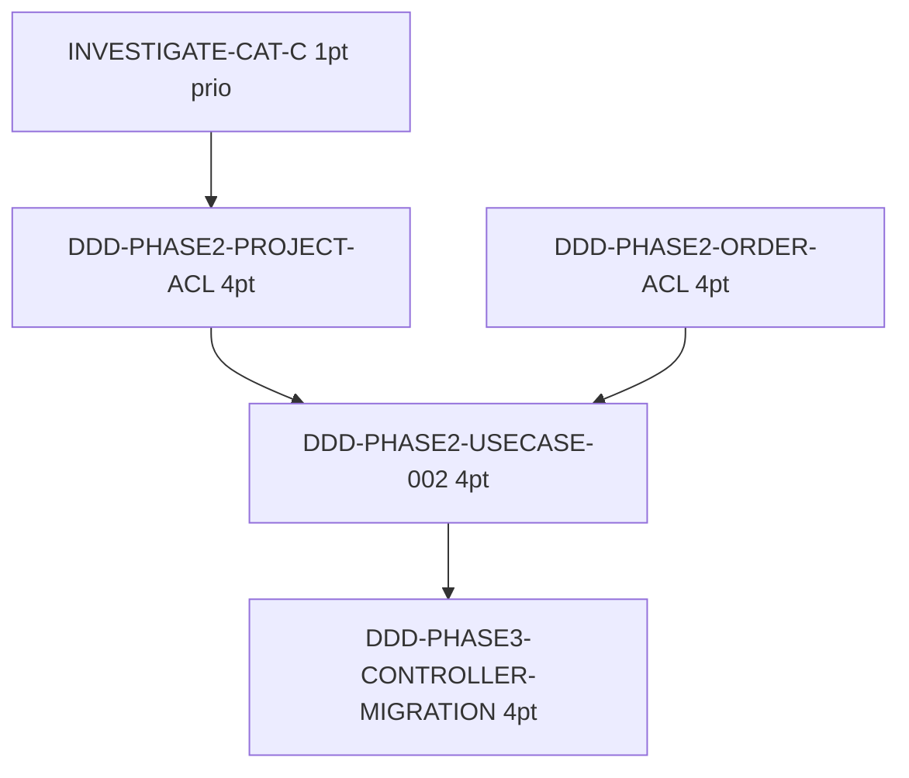

# Sprint 010 — Task Board

> **Sprint Goal**: DDD Phase 2 completion + Phase 3 start.
> **Total engagé**: 17 pts (+ 5 pts buffer = 22 pts capacité).

---

## 🔲 Backlog (à démarrer)

### Sub-epic A — DDD Phase 2 Completion (12 pts)

- 🔲 **DDD-PHASE2-PROJECT-ACL** (4 pts)
- 🔲 **DDD-PHASE2-ORDER-ACL** (4 pts)
- 🔲 **DDD-PHASE2-USECASE-002** (4 pts) — use cases Project + Order

### Sub-epic B — Phase 3 Start (4 pts)

- 🔲 **DDD-PHASE3-CONTROLLER-MIGRATION** (4 pts) — `ClientController::create()` migré

### Sub-epic C — Tech Debt (1 pt)

- 🔲 **INVESTIGATE-CAT-C** (1 pt) — VacationApproval pending API

### Sub-epic D — Buffer (optional)

- ⏸️ **DDD-PHASE1-INVOICE** (3 pts)
- ⏸️ **TEST-COVERAGE-002** (2 pts)

---

## Métriques sprint

| Métrique | Valeur |
|---|---:|
| Pts engagés ferme | 17 |
| Pts buffer | 5 |
| Stories engagées | 5 |
| Stories buffer | 2 |
| Capacité moyenne historique | 19 (médiane S-005..S-009) |
| Confiance livraison | 🟢 Haute |

---

## Ordre exécution recommandé

Recommandation: C1 quick win en premier. Puis A1 + A2 en parallèle (réplication pattern), A3 dépend des 2, B1 valide Phase 3 sur Client (pattern le plus mûr).
