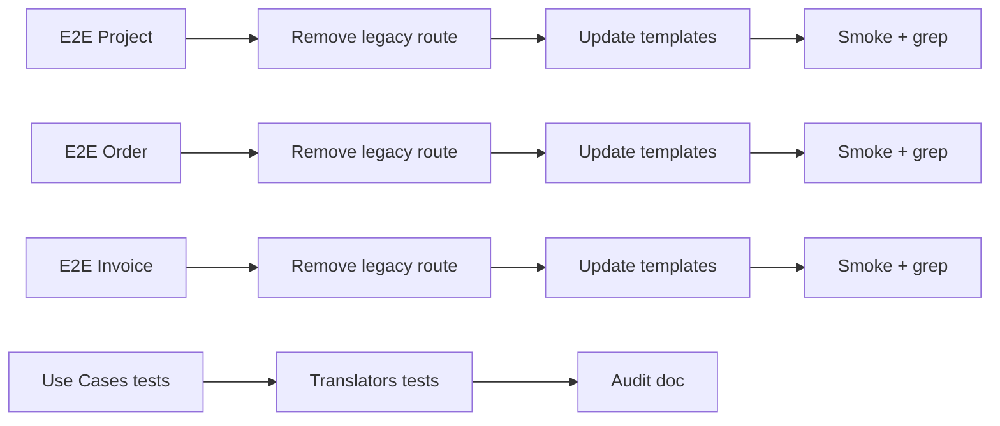

# Tasks — Sprint 013 — DDD Phase 4 Completion

## Vue d'ensemble

| Story | Titre | Pts | Tâches | Heures |
|---|---|---:|---:|---:|
| DDD-PHASE4-DECOMMISSION-PROJECT-NEW | Décommission Project/new | 3 | 4 | 4 h |
| DDD-PHASE4-DECOMMISSION-ORDER-NEW | Décommission Order/new | 3 | 4 | 4 h |
| DDD-PHASE4-DECOMMISSION-INVOICE-NEW | Décommission Invoice/new | 3 | 4 | 4 h |
| TEST-COVERAGE-003 | Escalator step 3 (30 → 35 %) | 2 | 3 | 3 h |
| **Total engagé** | | **11** | **15** | **15 h** |

## Buffer (non engagé)

| Story | Pts | Activation |
|---|---:|---|
| DDD-PHASE2-CONTRIBUTOR-ACL | 4 | Si Phase 4 livrée J5 |
| DDD-PHASE2-VACATION-ACL | 4 | Si Contributor ACL livré J7 |

## Détail par story

### DDD-PHASE4-DECOMMISSION-PROJECT-NEW (3 pts)

| ID | Type | Description | Heures |
|---|---|---|---:|
| T-DPP4-01 | [TEST] | Tests E2E ProjectControllerDddTest (feature parity) | 1 h |
| T-DPP4-02 | [FE-WEB] | Supprimer route legacy `/projects/new` (POST) | 0,5 h |
| T-DPP4-03 | [FE-WEB] | Mettre à jour templates : tous les liens vers `/projects/new-via-ddd` | 1 h |
| T-DPP4-04 | [TEST] | Smoke production fixtures (création + listing) + grep templates | 1,5 h |

### DDD-PHASE4-DECOMMISSION-ORDER-NEW (3 pts)

| ID | Type | Description | Heures |
|---|---|---|---:|
| T-DPO4-01 | [TEST] | Tests E2E OrderControllerDddTest (feature parity) | 1 h |
| T-DPO4-02 | [FE-WEB] | Supprimer route legacy `/orders/new` (POST) | 0,5 h |
| T-DPO4-03 | [FE-WEB] | Mettre à jour templates : tous les liens vers `/orders/new-via-ddd` | 1 h |
| T-DPO4-04 | [TEST] | Smoke production fixtures + grep templates | 1,5 h |

### DDD-PHASE4-DECOMMISSION-INVOICE-NEW (3 pts)

| ID | Type | Description | Heures |
|---|---|---|---:|
| T-DPI4-01 | [TEST] | Tests E2E InvoiceControllerDddTest (feature parity) | 1 h |
| T-DPI4-02 | [FE-WEB] | Supprimer route legacy `/invoices/new` (POST) | 0,5 h |
| T-DPI4-03 | [FE-WEB] | Mettre à jour templates : tous les liens vers `/invoices/new-via-ddd` | 1 h |
| T-DPI4-04 | [TEST] | Smoke production fixtures + grep templates | 1,5 h |

### TEST-COVERAGE-003 (2 pts)

| ID | Type | Description | Heures |
|---|---|---|---:|
| T-TC3-01 | [TEST] | Tests Unit Use Cases : CreateClient + CreateProject + CreateOrderQuote + CreateInvoiceDraft (mock EM + repository) | 2 h |
| T-TC3-02 | [TEST] | Tests Unit Translators : *FlatToDdd + *DddToFlat (4 BCs) | 0,5 h |
| T-TC3-03 | [DOC] | MAJ audit coverage step 3 dans `tools/coverage-step.md` | 0,5 h |

---

## Conventions

- **ID** : `T-DP{P|O|I}4-NN` (Decommission Project/Order/Invoice Phase 4)
- **Statuts** : 🔲 À faire | 🔄 En cours | 👀 Review | ✅ Done | 🚫 Bloqué
- **Estimation** : heures (0,5 h granularité)

---

## Dépendances inter-tâches

Les 3 décommissions sont indépendantes entre elles → parallélisables si
ressources disponibles.
