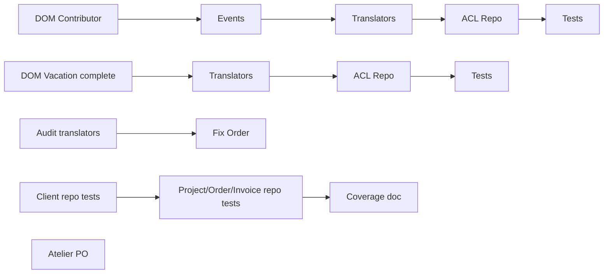

# Tasks — Sprint 014 — OPS Stabilization (reshuffled 2026-05-07)

## Vue d'ensemble (révisée)

| Story | Titre | Pts | Tâches | Heures | Statut |
|---|---|---:|---:|---:|---|
| ORDER-TRANSLATOR-FLAT-TO-DDD-FIX | Bug protected createdAt | 1 | 2 | 2 h | ✅ #168 |
| TEST-COVERAGE-004 | Escalator step 4 | 2 | 3 | 4 h | ✅ #169 |
| US-087 CI green | Faire passer GitHub Actions | 5 | 6 | 8,5 h | 🔲 |
| US-088 Snyk security | Upgrades deps (no custom dev) | 3 | 5 | 5 h | 🔲 |
| US-089 Deps update routine | Dependabot + cadence | 2 | 3 | 2,5 h | 🔲 |
| US-090 Render deploy fix | Build + healthcheck | 3 | 5 | 5,5 h | 🔲 |
| **Total révisé** | | **16** | **24** | **27,5 h** | |

## Reportés sprint-015

| Story | Pts | Raison |
|---|---:|---|
| DDD-PHASE2-CONTRIBUTOR-ACL | 4 | Capacité absorbée par OPS US-087..090 |
| DDD-PHASE2-VACATION-ACL | 4 | Idem |
| EPIC-002-KICKOFF-WORKSHOP | 1 | Reporté sprint-015 J1 si capacité OPS verte |

## Détails tâches OPS US-087..US-090

Voir `project-management/backlog/user-stories/OPS.md` sections US-087..US-090 :
- T-087-01..06 : audit + fix CI jobs (8,5 h)
- T-088-01..05 : Snyk triage + bump (5 h)
- T-089-01..03 : Dependabot + cadence (2,5 h)
- T-090-01..05 : Render logs + fix + runbook (5,5 h)

## Détail par story

### DDD-PHASE2-CONTRIBUTOR-ACL (4 pts)

| ID | Type | Description | Heures |
|---|---|---|---:|
| T-DPC2-01 | [DOM] | Phase 1 BC Contributor : Aggregate + VOs (ContributorId, ContractStatus) | 2 h |
| T-DPC2-02 | [DOM] | Domain events (ContributorCreated, ContractStarted, etc.) | 1 h |
| T-DPC2-03 | [INFRA] | ContributorFlatToDddTranslator + ContributorDddToFlatTranslator | 1,5 h |
| T-DPC2-04 | [INFRA] | DoctrineDddContributorRepository (ACL adapter) | 1,5 h |
| T-DPC2-05 | [TEST] | Tests Unit Domain + Translators | 2 h |

### DDD-PHASE2-VACATION-ACL (4 pts)

| ID | Type | Description | Heures |
|---|---|---|---:|
| T-DPV2-01 | [DOM] | Compléter Phase 1 Vacation BC (DTO existant, manque Repository interface) | 2 h |
| T-DPV2-02 | [INFRA] | VacationFlatToDddTranslator + VacationDddToFlatTranslator | 1,5 h |
| T-DPV2-03 | [INFRA] | DoctrineDddVacationRepository (ACL adapter) | 1,5 h |
| T-DPV2-04 | [TEST] | Tests Unit Domain + Translators | 2 h |

### ORDER-TRANSLATOR-FLAT-TO-DDD-FIX (1 pt)

| ID | Type | Description | Heures |
|---|---|---|---:|
| T-OTF-01 | [INFRA] | Audit 7 autres translators pour pattern access protected | 1 h |
| T-OTF-02 | [INFRA] | Fix OrderFlatToDddTranslator : utiliser `getCreatedAt()` getter au lieu de `$flat->createdAt` | 1 h |

### TEST-COVERAGE-004 (2 pts)

| ID | Type | Description | Heures |
|---|---|---|---:|
| T-TC4-01 | [TEST] | Tests Unit DoctrineDddClientRepository (mock EM, query DQL) | 1,5 h |
| T-TC4-02 | [TEST] | Tests Unit DoctrineDddProjectRepository + Order + Invoice | 2 h |
| T-TC4-03 | [DOC] | MAJ audit coverage step 4 dans `tools/coverage-step.md` | 0,5 h |

### EPIC-002-KICKOFF-WORKSHOP (1 pt process)

| ID | Type | Description | Heures |
|---|---|---|---:|
| T-E2K-01 | [PROCESS] | Atelier 1 h avec PO + Tech Lead → MMF + 5 US candidates | 1 h |

---

## Conventions

- **ID** : T-DPC2 (Contributor) / T-DPV2 (Vacation) / T-OTF (Order Translator Fix) / T-TC4 (Coverage 4) / T-E2K (EPIC-002 Kickoff)
- **Statuts** : 🔲 À faire | 🔄 En cours | 👀 Review | ✅ Done | 🚫 Bloqué
- **Estimation** : heures (0,5 h granularité)

---

## Dépendances inter-tâches

Les 4 stories Sub-epic A + B sont indépendantes → parallélisables.

EPIC-002 atelier hors-pattern : process step déclencheur de tâches sprint-015.
