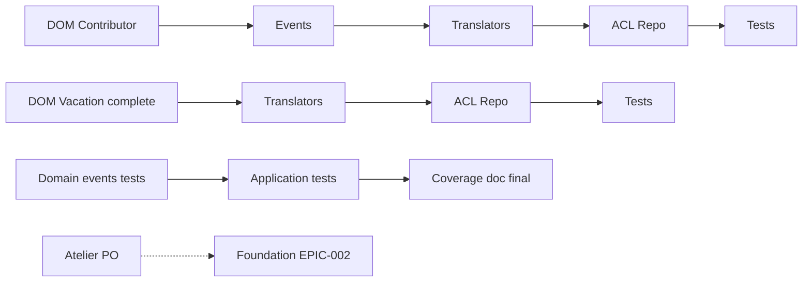

# Tasks — Sprint 015 — Buffer ACL Promotion + EPIC-002 Kickoff

## Vue d'ensemble

| Story | Titre | Pts | Tâches | Heures | Statut |
|---|---|---:|---:|---:|---|
| DDD-PHASE2-CONTRIBUTOR-ACL | Bridge Contributor BC | 4 | 5 | 8 h | 🔲 |
| DDD-PHASE2-VACATION-ACL | Bridge Vacation BC complet | 4 | 4 | 7 h | 🔲 |
| TEST-COVERAGE-005 | Escalator step 5 final (40 → 45 %) | 2 | 3 | 4 h | 🔲 |
| EPIC-002-KICKOFF-WORKSHOP | Atelier scope PO | 1 | 1 | 1 h | 🔲 |
| **Total ferme** | | **11** | **13** | **20 h** | |

## Capacité libre (6 pts) — EPIC-002 Foundation

À définir post-atelier J1-J2. Cible : 1-3 stories EPIC-002 alignées sur
MMF retenu.

## Détail par story

### DDD-PHASE2-CONTRIBUTOR-ACL (4 pts)

| ID | Type | Description | Heures |
|---|---|---|---:|
| T-DPC2-01 | [DOM] | Phase 1 BC Contributor : Aggregate + VOs (ContributorId, ContractStatus) | 2 h |
| T-DPC2-02 | [DOM] | Domain events (ContributorCreated, ContractStarted) | 1 h |
| T-DPC2-03 | [INFRA] | ContributorFlatToDddTranslator + ContributorDddToFlatTranslator | 1,5 h |
| T-DPC2-04 | [INFRA] | DoctrineDddContributorRepository (ACL adapter) | 1,5 h |
| T-DPC2-05 | [TEST] | Tests Unit Domain + Translators (audit autres translators pattern protected, cf US-090) | 2 h |

### DDD-PHASE2-VACATION-ACL (4 pts)

| ID | Type | Description | Heures |
|---|---|---|---:|
| T-DPV2-01 | [DOM] | Compléter Phase 1 Vacation BC (DTO + Query handlers existent, manque Repository interface complet) | 2 h |
| T-DPV2-02 | [INFRA] | VacationFlatToDddTranslator + VacationDddToFlatTranslator | 1,5 h |
| T-DPV2-03 | [INFRA] | DoctrineDddVacationRepository (ACL adapter) | 1,5 h |
| T-DPV2-04 | [TEST] | Tests Unit Domain + Translators | 2 h |

### TEST-COVERAGE-005 (2 pts)

| ID | Type | Description | Heures |
|---|---|---|---:|
| T-TC5-01 | [TEST] | Tests Unit Domain Events + Exceptions (4 BCs : Client + Project + Order + Invoice) | 2 h |
| T-TC5-02 | [TEST] | Tests Unit Application : UpdateProject + (Contributor/Vacation post-PR) | 1,5 h |
| T-TC5-03 | [DOC] | MAJ audit coverage step 5 dans `tools/coverage-step.md` (escalator FINAL) | 0,5 h |

### EPIC-002-KICKOFF-WORKSHOP (1 pt process)

| ID | Type | Description | Heures |
|---|---|---|---:|
| T-E2K-01 | [PROCESS] | Atelier 1 h avec PO + Tech Lead → MMF + 5 US candidates + EPIC-002 brief écrit | 1 h |

---

## Conventions

- **ID** : T-DPC2 (Contributor) / T-DPV2 (Vacation) / T-TC5 (Coverage 5) / T-E2K (EPIC-002 Kickoff)
- **Statuts** : 🔲 À faire | 🔄 En cours | 👀 Review | ✅ Done | 🚫 Bloqué
- **Estimation** : heures (0,5 h granularité)

---

## Dépendances inter-tâches

Les 4 stories Sub-epic A + B sont indépendantes → parallélisables.
