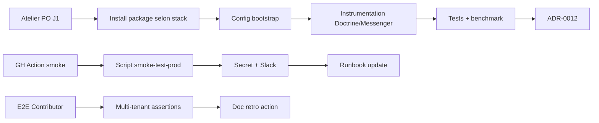

# Tasks — Sprint 016 — EPIC-002 Kickoff Observabilité

## Vue d'ensemble

| Story | Titre | Pts | Tâches | Heures | Statut |
|---|---|---:|---:|---:|---|
| EPIC-002-KICKOFF-WORKSHOP | Atelier PO 5 questions | 1 | 1 | 1 h | 🔲 |
| US-091 | OpenTelemetry tracing | 5 | 5 | 9 h | 🔲 |
| US-092 | Smoke test post-deploy GH Action | 3 | 4 | 5 h | 🔲 |
| TEST-CONTRIBUTOR-E2E | Tests E2E Contributor BC | 2 | 3 | 4 h | 🔲 |
| **Total ferme** | | **11** | **13** | **19 h** | |

## Détail

### EPIC-002-KICKOFF-WORKSHOP (1 pt process)

| ID | Type | Description | Heures |
|---|---|---|---:|
| T-E2K-01 | [PROCESS] | Atelier 1h PO + Tech Lead OU async 48h écrit. 5 questions arbitrées + sprint-016 net + ADR-0012 stack si pertinent. | 1 h |

### US-091 OpenTelemetry tracing (5 pts)

⚠️ Tâches finalisées **post-atelier J2** (stack dépend décision PO).
Squelette indicatif :

| ID | Type | Description | Heures |
|---|---|---|---:|
| T-091-01 | [OPS] | Install package + bundle Symfony selon stack retenue (sentry/sentry-symfony OU otel/symfony-bundle) | 2 h |
| T-091-02 | [OPS] | Config bootstrap : DSN env + sampling 10 % + middleware HTTP | 2 h |
| T-091-03 | [BE] | Instrumentation Doctrine queries + Messenger + custom Application UseCase spans | 3 h |
| T-091-04 | [TEST] | Tests Integration : trace propagation + benchmark p95 overhead < 50ms | 1,5 h |
| T-091-05 | [DOC] | ADR-0012 : décision stack + ADR-0013 sampling strategy | 0,5 h |

### US-092 Smoke test post-deploy (3 pts)

| ID | Type | Description | Heures |
|---|---|---|---:|
| T-092-01 | [OPS] | GH Action workflow `.github/workflows/post-deploy-smoke.yml` (trigger : push main + workflow_dispatch) | 1,5 h |
| T-092-02 | [OPS] | Script `docker/scripts/smoke-test-prod.sh` (curl /health JSON + homepage 200 + grep error) | 1,5 h |
| T-092-03 | [OPS] | Secret `RENDER_PROD_URL` configuré + alerting Slack si fail | 1 h |
| T-092-04 | [DOC] | Update `render-runbook.md` : section smoke test post-deploy | 1 h |

### TEST-CONTRIBUTOR-E2E (2 pts)

| ID | Type | Description | Heures |
|---|---|---|---:|
| T-TCE-01 | [TEST] | ContributorControllerDddTest : create + edit + delete via DDD route (skip-pre-push group) | 2 h |
| T-TCE-02 | [TEST] | Multi-tenant assertions : user company isolation | 1,5 h |
| T-TCE-03 | [DOC] | Update sprint-015 retro action L-2 : dette E2E rattrapée | 0,5 h |

---

## Conventions

- **ID** : T-E2K (EPIC-002 Kickoff) / T-091 / T-092 / T-TCE (Contributor E2E)
- **Statuts** : 🔲 À faire | 🔄 En cours | 👀 Review | ✅ Done | 🚫 Bloqué

---

## Dépendances inter-tâches

US-091 séquentiel post-atelier. US-092 + TEST-CONTRIBUTOR-E2E indépendantes
peuvent démarrer J1.
