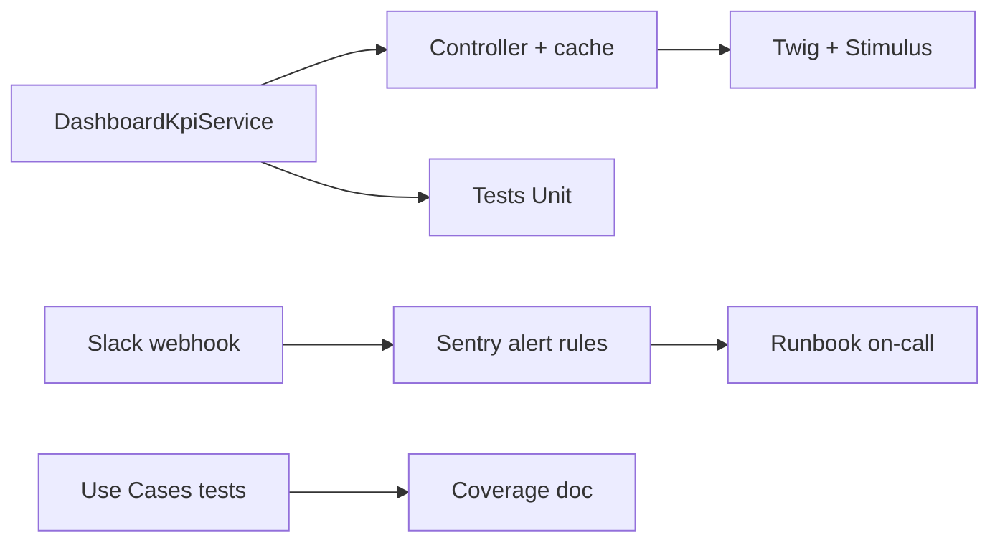

# Tasks — Sprint 017 — EPIC-002 Dashboard + Alerting

## Vue d'ensemble

| Story | Titre | Pts | Tâches | Heures | Statut |
|---|---|---:|---:|---:|---|
| US-093 | Dashboard 7 KPIs business | 5 | 4 | 8,5 h | 🔲 |
| US-094 | Alerting Sentry → Slack | 3 | 3 | 4 h | 🔲 |
| TEST-COVERAGE-006 | Coverage step 6 (45 → 50 %) | 2 | 2 | 3 h | 🔲 |
| **Total ferme** | | **10** | **9** | **15,5 h** | |

## Détail

### US-093 Dashboard 7 KPIs business (5 pts)

| ID | Type | Description | Heures |
|---|---|---|---:|
| T-093-01 | [BE] | `DashboardKpiService` avec 7 méthodes : DAU/MAU + projets/jour + devis signés/mois + factures (count + €) + conversion + revenu 30j + marge moy | 4 h |
| T-093-02 | [BE] | Controller `/admin/business-dashboard` ROLE_ADMIN + cache Redis 5 min | 1,5 h |
| T-093-03 | [FE-WEB] | Twig template `admin/business_dashboard.html.twig` + Stimulus auto-refresh 5 min | 2 h |
| T-093-04 | [TEST] | Tests Unit `DashboardKpiServiceTest` (7 méthodes, mocks repos) | 1 h |

### US-094 Alerting Sentry → Slack (3 pts)

| ID | Type | Description | Heures |
|---|---|---|---:|
| T-094-01 | [OPS] | Slack workspace incoming webhook créé + URL stockée Sentry projet integration | 1 h |
| T-094-02 | [OPS] | Sentry alert rules : errors > 10/h + quota transactions > 80 % + slow tx > 2s | 2 h |
| T-094-03 | [DOC] | Runbook on-call (ack alerte + escalation tech lead) + ADR-0013 si pertinent | 1 h |

### TEST-COVERAGE-006 (2 pts)

| ID | Type | Description | Heures |
|---|---|---|---:|
| T-TC6-01 | [TEST] | Tests Unit Application Use Cases manquants (UpdateClient + UpdateProject + edge cases) | 2 h |
| T-TC6-02 | [DOC] | Audit coverage step 6 dans `tools/coverage-step.md` (escalator final) | 1 h |

---

## Conventions

- **ID** : T-093 (Dashboard) / T-094 (Alerting) / T-TC6 (Coverage 6)
- **Statuts** : 🔲 À faire | 🔄 En cours | 👀 Review | ✅ Done | 🚫 Bloqué

---

## Dépendances inter-tâches

US-093 séquentiel (KPI calcul → controller → UI). US-094 + TEST-COVERAGE-006
indépendantes — parallélisables avec US-093.
