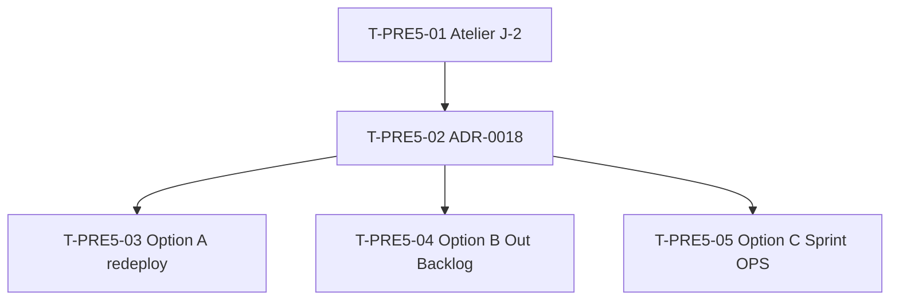

# Tâches — OPS-PRE5-DECISION : ADR Render redeploy ou Out Backlog

## Informations US

- **Epic** : EPIC-002 (résiduel)
- **Persona** : PO + user
- **Story Points** : 2
- **Sprint** : sprint-024
- **MoSCoW** : Must
- **Source** : sprint-023 retro S-4 + L-2 (6ᵉ sprint trigger réversibilité)

## Card

**En tant que** PO + user
**Je veux** trancher le statut du holdover PRE-5 via ADR formalisée
**Afin de** sortir du backlog implicite (6 sprints consécutifs = signal d'arrêt runbook §3 + pattern ADR-0017)

## Vue d'ensemble tâches

| ID | Type | Tâche | Estimation | Dépend de | Statut |
|----|------|-------|-----------:|-----------|--------|
| T-PRE5-01 | [DOC] | Atelier OPS-PREP-J0 J-2 sprint-024 — matrix §3 décision PO | 0.5h | — | 🔲 |
| T-PRE5-02 | [DOC] | Rédaction ADR-0018 selon option choisie | 1h | T-PRE5-01 | 🔲 |
| T-PRE5-03 | [OPS] | Si option A : redeploy Render + smoke vérification | 0.25h | T-PRE5-02 | ⏳ conditional |
| T-PRE5-04 | [OPS] | Si option B : fermeture holdover PRE-5 + update runbook §3 | 0.5h | T-PRE5-02 | ⏳ conditional |
| T-PRE5-05 | [OPS] | Si option C : création story OPS officielle US-XXX + dépendances credentials | 1h | T-PRE5-02 | ⏳ conditional |

**Total estimé** : 3.5h (selon option choisie : A=1.75h, B=2h, C=2.5h)

## Détail tâches

### T-PRE5-01 — Atelier OPS-PREP-J0 J-2 sprint-024

- **Type** : [DOC]
- **Estimation** : 0.5h (30 min atelier)
- **Date** : 2026-05-26

**Description** :
Application matrix §3 runbook OPS-PREP-J0. Décision PO entre 3 options.

**Participants** :
- PO
- Tech Lead
- User (Render dashboard access)

**Output attendu** :
- Option A / B / C tranchée
- Décision documentée (1 ligne) avant rédaction ADR
- Triggers replan listés si Option B

**Critères validation atelier** :
- [ ] 6ᵉ sprint holdover constaté (factuel)
- [ ] Coûts/bénéfices 3 options pesés
- [ ] Décision PO actée
- [ ] Owner ADR-0018 nommé

---

### T-PRE5-02 — Rédaction ADR-0018

- **Type** : [DOC]
- **Estimation** : 1h
- **Dépend de** : T-PRE5-01

**Fichiers** :
- `docs/02-architecture/adr/0018-render-redeploy-decision.md`

**Template ADR (pattern ADR-0017)** :
```
# ADR-0018 — Render Redeploy Decision

| Champ | Valeur |
|---|---|
| Statut | Accepté |
| Date | 2026-05-26 |
| Sprint | sprint-024 |
| Auteur | PO + Tech Lead |

## Contexte
6 sprints consécutifs holdover PRE-5 (image stale 2026-01-12).
Trigger réversibilité runbook §3 atteint.

## Décision
[Option A : redeploy executed]
OU
[Option B : Out Backlog avec triggers replan]
OU
[Option C : sprint OPS dédié sprint-025+]

## Triggers replan (si Option B)
1. Render plan starter activé
2. Alternative déploiement Fly.io/Railway évaluée
3. Abandon route /health remplacée

## Conséquences
- Smoke test red accepté comme bruit / corrigé
- Holdover PRE-5 fermé définitivement
```

**Critères** :
- [ ] ADR rédigé selon template pattern ADR-0017
- [ ] Contexte historique documenté (6 sprints)
- [ ] Triggers replan **factuels et mesurables** si Option B
- [ ] Commit ADR + référence depuis sprint-024 retro

---

### T-PRE5-03 — Option A : redeploy Render + smoke (CONDITIONAL)

- **Type** : [OPS]
- **Estimation** : 0.25h (15 min user-execute)
- **Dépend de** : T-PRE5-02 (si option A choisie)

**Description** :
User execute via Render dashboard :
1. Manual deploy depuis dernière commit main
2. Clear build cache
3. Attendre déploiement (≈ 5 min)
4. Vérifier `/health` retourne JSON valide

**Critères** :
- [ ] Render dashboard manual deploy executed
- [ ] Build cache cleared
- [ ] `curl https://hotones.onrender.com/health` retourne `{"status":"ok"}` JSON
- [ ] Smoke test GH Action vert sur prochaine run scheduled
- [ ] ADR-0018 statut "accepted" avec date redeploy + commit smoke vert

---

### T-PRE5-04 — Option B : fermeture holdover (CONDITIONAL)

- **Type** : [OPS]
- **Estimation** : 0.5h
- **Dépend de** : T-PRE5-02 (si option B choisie)

**Fichiers à modifier** :
- `docs/runbooks/sprint-ops-prep-j0.md` (update §3 — pattern Out Backlog appliqué)
- `.bmad/sprint-status.yaml` (PRE-5 closed définitivement)
- `project-management/sprints/sprint-024-*/sprint-goal.md` (retirer PRE-4 trigger atteint)

**Critères** :
- [ ] Holdover PRE-5 marqué "closed_out_backlog" dans yaml
- [ ] Runbook §3 update avec exemple ADR-0018 (Out Backlog 2ᵉ application après ADR-0017)
- [ ] Smoke test red accepté informellement (commentaire CI workflow)

---

### T-PRE5-05 — Option C : création story OPS (CONDITIONAL)

- **Type** : [OPS]
- **Estimation** : 1h
- **Dépend de** : T-PRE5-02 (si option C choisie)

**Fichiers à créer** :
- `project-management/backlog/user-stories/US-XXX-render-redeploy-ops-dedicated.md`

**Critères** :
- [ ] Story OPS officielle créée (Format INVEST + 3C + Gherkin)
- [ ] Prérequis listés : owner OPS aligné + 4 credentials (Render + GH + Sentry + Slack) + 30 min atelier
- [ ] Sprint cible identifié (sprint-025 ou sprint-026 selon planning)
- [ ] Dépendances explicites (notamment 4 credentials simultanés)
- [ ] Pattern ADR-0017 référencé (réversibilité documentée)

## Dépendances



## Recommandation Tech Lead

**Option A** si user disponible 15 min — sortie rapide du holdover, smoke vert restauré, minimal risk.

**Option B** si user **pas dispo** sprint-024 — formalise pattern (2ᵉ application ADR-0017) avec triggers replan.

**Option C** seulement si OPS Sub-epic B revient à l'ordre du jour (très peu probable sprint-025+ vu ADR-0017 actée).

## Risques

| Risque | Probabilité | Mitigation |
|---|---|---|
| Atelier J-2 reporté → décision retardée sprint-025 | Faible | Pré-allocation T-PRE5-01 obligatoire dans runbook |
| Option A redeploy casse prod | Très faible | Render rollback dispo en 1 clic |
| Option B sans triggers replan factuels | Moyenne | Review Tech Lead avant validation ADR |
