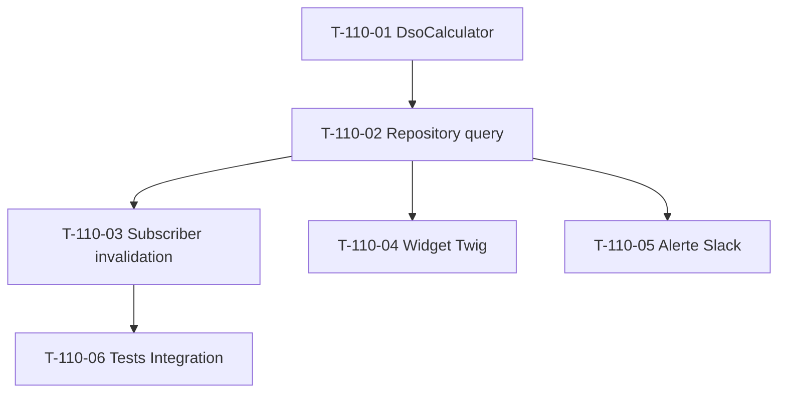

# Tâches — US-110 : KPI DSO (Days Sales Outstanding)

## Informations US

- **Epic** : EPIC-003 Phase 4
- **Persona** : PO
- **Story Points** : 3
- **Sprint** : sprint-024-epic-003-phase-4-kickoff
- **MoSCoW** : Must
- **ADR** : ADR-0013 KPI #1

## Card

**En tant que** PO
**Je veux** mesurer le DSO en jours sur 30/90/365 jours rolling
**Afin de** piloter la trésorerie et identifier les clients lents à payer

## Vue d'ensemble tâches

| ID | Type | Tâche | Estimation | Dépend de | Statut |
|----|------|-------|-----------:|-----------|--------|
| T-110-01 | [BE]   | Domain Service `DsoCalculator` + tests Unit | 3h | — | 🔲 |
| T-110-02 | [BE]   | Repository query optimisée 30/90/365 jours rolling | 2h | T-110-01 | 🔲 |
| T-110-03 | [BE]   | Subscriber `InvoicePaidEvent` invalidation cache Redis | 1h | T-110-02 | 🔲 |
| T-110-04 | [FE-WEB] | Widget Twig dashboard + Stimulus indicateur tendance | 2h | T-110-02 | 🔲 |
| T-110-05 | [BE]   | Alerte Slack seuil rouge (réutilise `SlackAlertingService`) | 1h | T-110-02 | 🔲 |
| T-110-06 | [TEST] | Tests Integration query + cache invalidation | 2h | T-110-03 | 🔲 |

**Total estimé** : 11h

## Détail tâches

### T-110-01 — Domain Service `DsoCalculator` + tests Unit

- **Type** : [BE]
- **Estimation** : 3h

**Description** :
Implémentation Domain pure (testable Unit sans DB) du calcul DSO :
`DSO = Σ(date_paiement − date_émission) × montant_payé / Σ(montant_payé)`

**Fichiers à créer** :
- `src/Domain/Project/Service/DsoCalculator.php` (Domain Service pure)
- `tests/Unit/Domain/Project/Service/DsoCalculatorTest.php`

**Critères de validation** :
- [ ] Méthode `calculateRolling(InvoiceCollection $invoices, int $days): DsoDays`
- [ ] Value Object `DsoDays` (immutable, validation > 0)
- [ ] Factures impayées exclues du calcul
- [ ] Pondération par montant (moyenne pondérée)
- [ ] Tests Unit > 5 cas (vide, 1 facture, plusieurs factures, mixte payées/impayées, edge cases)
- [ ] Coverage > 90 % sur DsoCalculator

---

### T-110-02 — Repository query optimisée 30/90/365 jours

- **Type** : [BE]
- **Estimation** : 2h
- **Dépend de** : T-110-01

**Description** :
Single SQL query aggregating sur 3 fenêtres rolling.

**Fichiers** :
- `src/Domain/Project/Repository/DsoQueryInterface.php`
- `src/Infrastructure/Project/Persistence/Doctrine/DoctrineDsoQuery.php`

**Critères** :
- [ ] Query unique avec `CASE WHEN paidAt BETWEEN now-30d AND now`
- [ ] Index Doctrine sur `invoice.paid_at` (vérifier existence, créer si manquant)
- [ ] Cache Redis 1h TTL
- [ ] Multitenant scope (filter `company_id`)

---

### T-110-03 — Subscriber `InvoicePaidEvent` invalidation cache

- **Type** : [BE]
- **Estimation** : 1h
- **Dépend de** : T-110-02

**Description** :
Event-driven invalidation cache DSO quand facture payée.

**Fichiers** :
- `src/Application/Project/EventSubscriber/InvoicePaidDsoInvalidator.php`

**Critères** :
- [ ] `#[AsEventListener]` sur `InvoicePaidEvent`
- [ ] Cache key `dso_30d_{companyId}` + `dso_90d_{companyId}` + `dso_365d_{companyId}` invalidés
- [ ] Tests Unit avec mock cache

---

### T-110-04 — Widget Twig dashboard + Stimulus

- **Type** : [FE-WEB]
- **Estimation** : 2h
- **Dépend de** : T-110-02

**Fichiers** :
- `templates/admin/dashboard/_kpi_dso.html.twig`
- `assets/controllers/dso_widget_controller.js`

**Critères** :
- [ ] 3 valeurs DSO (30j/90j/365j) avec unité « jours »
- [ ] Indicateur tendance ↗️ ↘️ → vs période précédente
- [ ] Warning orange si > seuil configuré (45j défaut)
- [ ] Stimulus auto-refresh 5 min
- [ ] Responsive + WCAG 2.1 AA

---

### T-110-05 — Alerte Slack seuil rouge

- **Type** : [BE]
- **Estimation** : 1h
- **Dépend de** : T-110-02

**Fichiers** :
- `src/Application/Project/EventSubscriber/DsoThresholdExceededAlerter.php`

**Critères** :
- [ ] Réutilise `SlackAlertingService` (EPIC-002 US-094)
- [ ] Pattern hiérarchique configurabilité seuils (US-108)
- [ ] Cooldown 24h par tenant (éviter spam alertes)

---

### T-110-06 — Tests Integration query + cache invalidation

- **Type** : [TEST]
- **Estimation** : 2h
- **Dépend de** : T-110-03

**Fichiers** :
- `tests/Integration/Project/Persistence/DoctrineDsoQueryTest.php`
- `tests/Integration/Project/EventSubscriber/InvoicePaidDsoInvalidatorTest.php`

**Critères** :
- [ ] Fixtures `InvoiceFactory` + `ProjectFactory` réutilisées
- [ ] Test 3 fenêtres rolling avec dataset connu
- [ ] Test invalidation cache après `InvoicePaidEvent` dispatch
- [ ] Reset BDD + Reset cache entre tests

## Dépendances

## Risques

| Risque | Probabilité | Mitigation |
|---|---|---|
| Index Doctrine `paid_at` manquant → query slow | Moyenne | Verify + create migration si besoin (1 sous-task de T-110-02) |
| Volume factures > 100k → query timeout | Faible | Cache 1h + materialized view si scaling besoin sprint-026+ |
