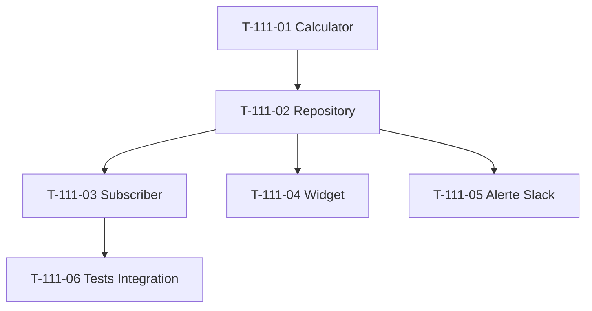

# Tâches — US-111 : KPI temps de facturation

## Informations US

- **Epic** : EPIC-003 Phase 4
- **Persona** : PO
- **Story Points** : 3
- **Sprint** : sprint-024
- **MoSCoW** : Must
- **ADR** : ADR-0013 KPI #2

## Card

**En tant que** PO
**Je veux** mesurer le temps de facturation (lead time devis signé → facture émise) en jours
**Afin de** identifier les goulots d'étranglement administratifs entre commercial et compta

## Vue d'ensemble tâches

| ID | Type | Tâche | Estimation | Dépend de | Statut |
|----|------|-------|-----------:|-----------|--------|
| T-111-01 | [BE]   | Domain Service `BillingLeadTimeCalculator` + tests Unit | 3h | — | 🔲 |
| T-111-02 | [BE]   | Repository query percentiles p50/p75/p95 + top 3 clients | 2h | T-111-01 | 🔲 |
| T-111-03 | [BE]   | Subscriber `InvoiceEmittedEvent` invalidation cache | 1h | T-111-02 | 🔲 |
| T-111-04 | [FE-WEB] | Widget Twig dashboard + top 3 clients | 2h | T-111-02 | 🔲 |
| T-111-05 | [BE]   | Alerte Slack seuil rouge médiane 30j (réutilise SlackAlertingService) | 1h | T-111-02 | 🔲 |
| T-111-06 | [TEST] | Tests Integration query percentiles + invalidation | 2h | T-111-03 | 🔲 |

**Total estimé** : 11h

## Détail tâches

### T-111-01 — Domain Service `BillingLeadTimeCalculator`

- **Type** : [BE]
- **Estimation** : 3h

**Description** :
Calcul lead time `Invoice.emittedAt − Quote.signedAt` pour devis convertis en facture.

**Fichiers** :
- `src/Domain/Project/Service/BillingLeadTimeCalculator.php`
- `tests/Unit/Domain/Project/Service/BillingLeadTimeCalculatorTest.php`

**Critères** :
- [ ] Méthode `calculate(QuoteInvoicePairCollection $pairs): LeadTimeStats`
- [ ] Value Object `LeadTimeStats` (median, p75, p95, count, mean)
- [ ] Devis sans facture exclus (compté séparément `unbilledQuotesCount`)
- [ ] Algorithme percentile avec interpolation linéaire
- [ ] Tests Unit > 6 cas (vide, 1 paire, p50 exact, p95 interpolated, mixte unbilled)

---

### T-111-02 — Repository query percentiles + top 3 clients

- **Type** : [BE]
- **Estimation** : 2h
- **Dépend de** : T-111-01

**Fichiers** :
- `src/Domain/Project/Repository/BillingLeadTimeQueryInterface.php`
- `src/Infrastructure/Project/Persistence/Doctrine/DoctrineBillingLeadTimeQuery.php`

**Critères** :
- [ ] Query SQL avec `PERCENTILE_CONT(0.5/0.75/0.95) WITHIN GROUP (ORDER BY lead_time)`
- [ ] Sous-query top 3 clients `GROUP BY client_id ORDER BY AVG(lead_time) DESC LIMIT 3`
- [ ] Multitenant filter `company_id`
- [ ] Cache Redis 1h TTL

---

### T-111-03 — Subscriber `InvoiceEmittedEvent` invalidation

- **Type** : [BE]
- **Estimation** : 1h
- **Dépend de** : T-111-02

**Fichiers** :
- `src/Application/Project/EventSubscriber/InvoiceEmittedLeadTimeInvalidator.php`

**Critères** :
- [ ] `#[AsEventListener]` sur `InvoiceEmittedEvent`
- [ ] Cache keys `billing_lead_time_{30d|90d|365d}_{companyId}` invalidés
- [ ] Tests Unit avec mock cache

---

### T-111-04 — Widget Twig + top 3 clients

- **Type** : [FE-WEB]
- **Estimation** : 2h
- **Dépend de** : T-111-02

**Fichiers** :
- `templates/admin/dashboard/_kpi_billing_lead_time.html.twig`
- `assets/controllers/billing_lead_time_widget_controller.js`

**Critères** :
- [ ] Affichage médiane + p75 + p95 + count
- [ ] Tableau top 3 clients avec colonne « lead time moyen »
- [ ] Warning si médiane > 14j (orange), red si > 30j
- [ ] Auto-refresh 5 min

---

### T-111-05 — Alerte Slack seuil rouge médiane 30j

- **Type** : [BE]
- **Estimation** : 1h
- **Dépend de** : T-111-02

**Fichiers** :
- `src/Application/Project/EventSubscriber/BillingLeadTimeThresholdAlerter.php`

**Critères** :
- [ ] Réutilise `SlackAlertingService`
- [ ] Cooldown 24h par tenant
- [ ] Seuils configurables hiérarchique (pattern US-108) : global only ici

---

### T-111-06 — Tests Integration query percentiles + invalidation

- **Type** : [TEST]
- **Estimation** : 2h
- **Dépend de** : T-111-03

**Fichiers** :
- `tests/Integration/Project/Persistence/DoctrineBillingLeadTimeQueryTest.php`
- `tests/Integration/Project/EventSubscriber/InvoiceEmittedLeadTimeInvalidatorTest.php`

**Critères** :
- [ ] Dataset fixtures avec 20+ paires devis-facture
- [ ] Vérif percentiles vs valeurs attendues
- [ ] Vérif top 3 clients ordering
- [ ] Test cache invalidation

## Dépendances

## Risques

| Risque | Probabilité | Mitigation |
|---|---|---|
| `PERCENTILE_CONT` MariaDB syntaxe différente PostgreSQL | Moyenne | Vérifier MariaDB 11.4 support — fallback ORDER BY + LIMIT calc côté PHP |
| Quote sans signedAt = NULL nombreux | Faible | Filter `WHERE signedAt IS NOT NULL` strict |
