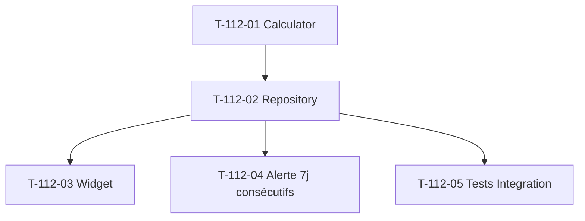

# Tâches — US-112 : KPI % adoption marge temps réel

## Informations US

- **Epic** : EPIC-003 Phase 4
- **Persona** : PO
- **Story Points** : 2
- **Sprint** : sprint-024
- **MoSCoW** : Should
- **ADR** : ADR-0013 KPI #3 (indicateur trigger abandon cas 2)

## Card

**En tant que** PO
**Je veux** mesurer le % de projets adoption marge temps réel (`margin_calculated_at` < 7j)
**Afin de** quantifier l'adoption MVP EPIC-003 + identifier les projets en dette d'usage

## Vue d'ensemble tâches

| ID | Type | Tâche | Estimation | Dépend de | Statut |
|----|------|-------|-----------:|-----------|--------|
| T-112-01 | [BE]   | Domain Service `MarginAdoptionCalculator` + tests Unit | 2h | — | 🔲 |
| T-112-02 | [BE]   | Repository query CASE WHEN classification fresh/warning/critical | 1h | T-112-01 | 🔲 |
| T-112-03 | [FE-WEB] | Widget Twig dashboard 3 catégories + bar chart | 1.5h | T-112-02 | 🔲 |
| T-112-04 | [BE]   | Alerte Slack persistante 7j consécutifs si adoption < seuil rouge | 1.5h | T-112-02 | 🔲 |
| T-112-05 | [TEST] | Tests Unit + Integration query CASE WHEN | 1h | T-112-02 | 🔲 |

**Total estimé** : 7h

## Détail tâches

### T-112-01 — Domain Service `MarginAdoptionCalculator`

- **Type** : [BE]
- **Estimation** : 2h

**Description** :
Domain Service simple. Classification projets actifs en 3 catégories :
- `fresh` : `margin_calculated_at` < 7 jours
- `stale_warning` : 7-30 jours
- `stale_critical` : NULL OU > 30 jours

**Fichiers** :
- `src/Domain/Project/Service/MarginAdoptionCalculator.php`
- `tests/Unit/Domain/Project/Service/MarginAdoptionCalculatorTest.php`

**Critères** :
- [ ] Méthode `classify(ProjectCollection $activeProjects, DateTimeImmutable $now): AdoptionBreakdown`
- [ ] Value Object `AdoptionBreakdown` (counts + percents pour 3 catégories)
- [ ] Projet "archived" exclus (filtré upstream Repository)
- [ ] Tests Unit > 5 cas (vide, tous fresh, tous critical, mixte, edge dates)

---

### T-112-02 — Repository query CASE WHEN

- **Type** : [BE]
- **Estimation** : 1h
- **Dépend de** : T-112-01

**Fichiers** :
- `src/Domain/Project/Repository/MarginAdoptionQueryInterface.php`
- `src/Infrastructure/Project/Persistence/Doctrine/DoctrineMarginAdoptionQuery.php`

**Critères** :
- [ ] Query SQL single : `SELECT COUNT(*), CASE WHEN ... END category GROUP BY category`
- [ ] Multitenant filter `company_id`
- [ ] Filter `status != 'archived'`
- [ ] Pas de cache (recalcul rapide, données changent à chaque WorkItem ajouté)

---

### T-112-03 — Widget Twig + bar chart

- **Type** : [FE-WEB]
- **Estimation** : 1.5h
- **Dépend de** : T-112-02

**Fichiers** :
- `templates/admin/dashboard/_kpi_margin_adoption.html.twig`
- `assets/controllers/margin_adoption_widget_controller.js` (Chart.js intégration)

**Critères** :
- [ ] Bar chart horizontal 3 segments couleurs (vert/orange/rouge)
- [ ] Count absolu + % par catégorie
- [ ] Lien actionnable "voir projets stale_critical" (filtre liste projets)
- [ ] Responsive

---

### T-112-04 — Alerte Slack persistante 7j

- **Type** : [BE]
- **Estimation** : 1.5h
- **Dépend de** : T-112-02

**Description** :
Alerte Slack uniquement si adoption < seuil rouge 7 jours consécutifs (évite faux positifs).

**Fichiers** :
- `src/Application/Project/Scheduled/CheckMarginAdoptionThreshold.php` (Symfony scheduler ou cron quotidien)

**Critères** :
- [ ] Lecture quotidienne adoption rate
- [ ] Stockage historique 7 derniers jours (Redis ou table dédiée)
- [ ] Alerte Slack 1 fois quand 7 jours consécutifs < seuil
- [ ] Reset cooldown quand rate remonte au-dessus seuil

---

### T-112-05 — Tests Unit + Integration

- **Type** : [TEST]
- **Estimation** : 1h
- **Dépend de** : T-112-02

**Fichiers** :
- `tests/Integration/Project/Persistence/DoctrineMarginAdoptionQueryTest.php`

**Critères** :
- [ ] Fixtures avec projets 3 catégories (fresh + warning + critical)
- [ ] Vérif counts + percents
- [ ] Test exclusion projets `archived`

## Dépendances

## Risques

| Risque | Probabilité | Mitigation |
|---|---|---|
| Alerte 7j consécutifs storage compliqué | Faible | Redis simple list 7 entrées + LPUSH/LTRIM |
| Date `margin_calculated_at` NULL massif post-migration legacy | Moyenne | Coordonner avec US-113 (recalcul automatique) |
