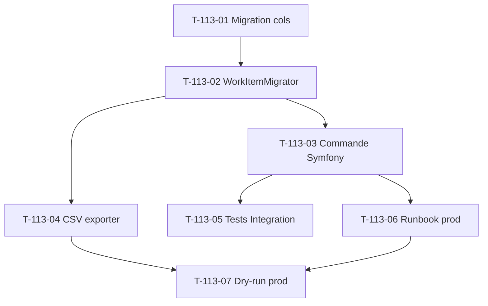

# Tâches — US-113 : Migration historique `WorkItem.cost` legacy → DDD

## Informations US

- **Epic** : EPIC-003 Phase 4
- **Persona** : Tech Lead + PO
- **Story Points** : 3
- **Sprint** : sprint-024
- **MoSCoW** : Should
- **Source** : AUDIT-WORKITEM-DATA Phase 1 (sprint-019)
- **Trigger** : ADR-0013 cas 3 (drift > 5 % bloque scaling)

## Card

**En tant que** Tech Lead
**Je veux** migrer `WorkItem.cost` legacy flat vers DDD aggregate avec recalcul cohérent `HourlyRate × WorkedHours`
**Afin de** garantir data integrity > 95 % (trigger ADR-0013 cas 3 non déclenché) + calcul marge fiable sur historique

## Vue d'ensemble tâches

| ID | Type | Tâche | Estimation | Dépend de | Statut |
|----|------|-------|-----------:|-----------|--------|
| T-113-01 | [DB]   | Doctrine migration cols `migrated_at` + `legacy_cost_drift` + `legacy_cost_cents` | 1h | — | 🔲 |
| T-113-02 | [BE]   | Domain Service `WorkItemMigrator` (recalcul + drift detection) + tests Unit | 4h | T-113-01 | 🔲 |
| T-113-03 | [BE]   | Commande Symfony `app:workitem:migrate-legacy-cost` avec `--dry-run` | 2h | T-113-02 | 🔲 |
| T-113-04 | [BE]   | Export CSV drift report `var/migration/workitem-cost-drift-{date}.csv` | 1h | T-113-02 | 🔲 |
| T-113-05 | [TEST] | Tests Integration migration up/down idempotente | 3h | T-113-03 | 🔲 |
| T-113-06 | [DOC]  | Runbook prod migration (backup + fenêtre + rollback) | 1h | T-113-03 | 🔲 |
| T-113-07 | [OPS]  | Exécution dry-run prod + analyse rapport drift (hors sprint, post-merge) | 0.5h | T-113-04, T-113-06 | ⏳ |

**Total estimé sprint** : 12h (T-07 hors sprint user-tracked)

## Détail tâches

### T-113-01 — Migration Doctrine cols supplémentaires

- **Type** : [DB]
- **Estimation** : 1h

**Description** :
Ajouter 3 colonnes table `work_item` pour traçabilité migration.

**Fichiers** :
- `migrations/Version20260512_XXXXXX_WorkItemMigrationCols.php`

**SQL** :
```sql
ALTER TABLE work_item
  ADD COLUMN migrated_at DATETIME NULL,
  ADD COLUMN legacy_cost_drift BOOLEAN NOT NULL DEFAULT FALSE,
  ADD COLUMN legacy_cost_cents INT NULL;

CREATE INDEX idx_workitem_migrated_at ON work_item(migrated_at);
CREATE INDEX idx_workitem_drift ON work_item(legacy_cost_drift);
```

**Critères** :
- [ ] Migration up + down testées
- [ ] Index présents
- [ ] Pas de lock long sur table prod (à vérifier `ALGORITHM=INPLACE`)

---

### T-113-02 — Domain Service `WorkItemMigrator`

- **Type** : [BE]
- **Estimation** : 4h
- **Dépend de** : T-113-01

**Description** :
Domain Service pure (testable Unit) recalcul + drift detection.

**Fichiers** :
- `src/Domain/WorkItem/Service/WorkItemMigrator.php`
- `tests/Unit/Domain/WorkItem/Service/WorkItemMigratorTest.php`

**Logique** :
```
Pour chaque WorkItem legacy :
  1. Lookup Contributor.hourlyRate (snapshot date du WorkItem)
  2. Recalcule cost = HourlyRate × WorkedHours
  3. Si |new_cost - legacy_cost| > 1 cent → flag drift
  4. Backup legacy_cost dans legacy_cost_cents
  5. Set migrated_at = now()
```

**Critères** :
- [ ] Méthode `migrate(WorkItem $legacyItem): MigrationResult`
- [ ] Value Object `MigrationResult` (newCost, drift bool, hadRateMissing bool)
- [ ] HourlyRate manquant → fallback `HourlyRate::fromCents(0)` + flag `legacy_no_rate`
- [ ] Tests Unit > 8 cas (no drift, drift positive, drift negative, no rate, edge < 1 cent)
- [ ] Coverage > 90 %

---

### T-113-03 — Commande Symfony `app:workitem:migrate-legacy-cost`

- **Type** : [BE]
- **Estimation** : 2h
- **Dépend de** : T-113-02

**Fichiers** :
- `src/Infrastructure/WorkItem/Command/MigrateLegacyCostCommand.php`

**Options** :
- `--dry-run` : pas d'écriture BDD, output report only
- `--batch-size=100` : nb items par transaction
- `--company-id=X` : limiter à un tenant (debug)

**Critères** :
- [ ] Idempotent (skip déjà migrés via `WHERE migrated_at IS NULL`)
- [ ] Batch processing 100 items/transaction (memory safe)
- [ ] Progress bar (Symfony Console Progress)
- [ ] Output final : total migrés + drifts + no_rate fallbacks
- [ ] Exit code 0 si OK, 1 si drift > 5 % global (gating ADR-0013 cas 3)

---

### T-113-04 — Export CSV drift report

- **Type** : [BE]
- **Estimation** : 1h
- **Dépend de** : T-113-02

**Fichiers** :
- `src/Infrastructure/WorkItem/Reporter/DriftCsvExporter.php`

**Format CSV** :
```
work_item_id,project_id,company_id,legacy_cost_cents,new_cost_cents,delta_cents,delta_percent
```

**Critères** :
- [ ] Export dans `var/migration/workitem-cost-drift-{YYYY-MM-DD-HHMMSS}.csv`
- [ ] Header sur première ligne
- [ ] UTF-8 BOM (Excel compatible)
- [ ] Filename unique (timestamp)

---

### T-113-05 — Tests Integration migration up/down idempotente

- **Type** : [TEST]
- **Estimation** : 3h
- **Dépend de** : T-113-03

**Fichiers** :
- `tests/Integration/Infrastructure/WorkItem/Command/MigrateLegacyCostCommandTest.php`

**Scénarios** :
- [ ] Fixtures 50+ WorkItem legacy + Contributor avec HourlyRate
- [ ] Test dry-run : aucun changement BDD
- [ ] Test execution : tous migrés + cols populées
- [ ] Test idempotence : second run = 0 changements
- [ ] Test rollback migration Doctrine down : restore état pré-migration
- [ ] Test fallback HourlyRate manquant
- [ ] Test drift > 5 % → exit code 1

---

### T-113-06 — Runbook prod migration

- **Type** : [DOC]
- **Estimation** : 1h
- **Dépend de** : T-113-03

**Fichiers** :
- `docs/runbooks/workitem-cost-migration.md`

**Contenu** :
- [ ] Pré-requis : backup BDD complet (timing + commande)
- [ ] Estimation volume legacy (count WorkItem non migrés)
- [ ] Étape 1 : dry-run sur prod (lecture seule)
- [ ] Étape 2 : analyse rapport drift (seuil 5 %)
- [ ] Étape 3 : décision PO Go/No-Go selon drift
- [ ] Étape 4 : exécution prod (fenêtre maintenance recommandée)
- [ ] Étape 5 : vérification post-migration
- [ ] Rollback : migration Doctrine down + restore backup

---

### T-113-07 — Exécution dry-run prod (hors sprint)

- **Type** : [OPS]
- **Estimation** : 0.5h (post-merge user-tracked)
- **Statut** : ⏳ hors sprint

**Critères** :
- [ ] User execute commande `app:workitem:migrate-legacy-cost --dry-run` sur prod (SSH ou Render shell)
- [ ] Récupère rapport CSV
- [ ] Analyse drift globale
- [ ] Décision Go/No-Go exécution réelle (sprint-025 si OK, ADR-0019 si drift > 5 %)

## Dépendances



## Risques

| Risque | Probabilité | Impact | Mitigation |
|---|---|---|---|
| Drift > 5 % global → blocage scaling | Moyenne | Haut | Dry-run obligatoire avant exécution |
| Volume legacy > 10000 items → timeout | Faible | Moyen | Batch 100 + checkpoint resumable |
| Rollback nécessaire mi-migration | Faible | Haut | Backup `legacy_cost_cents` + migration down testée |
| HourlyRate historique manquant | Moyenne | Moyen | Fallback `HourlyRate::fromCents(0)` + flag |

## Gating ADR-0013 cas 3

Si drift global > 5 % détecté sur prod :
1. **Bloquer migration prod**
2. **Décision PO + Tech Lead** : continuer ou rollback
3. **ADR-0019** rédigé : décision + plan correction data (data correction manuelle, exclusion projets, etc.)
4. **Possible pivot EPIC-004** si data quality structurellement compromise
