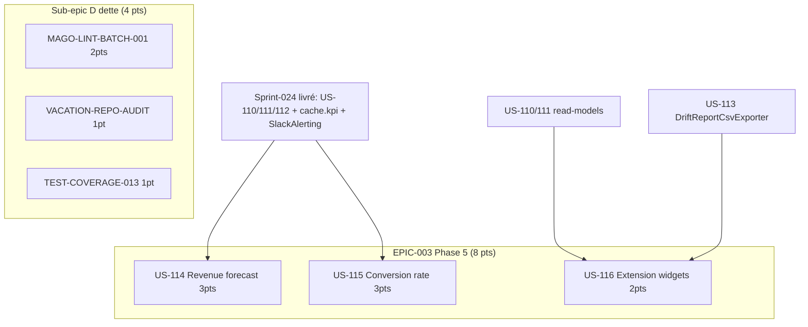

# Tâches — Sprint 025

## Vue d'ensemble

| Item | Titre | Points | Tâches | Heures | Statut |
|------|-------|-------:|-------:|-------:|--------|
| US-114 | KPI Revenue forecast | 3 | 6 | 12h | 🔲 |
| US-115 | KPI Conversion devis → commande | 3 | 6 | 12h | 🔲 |
| US-116 | Extension widgets DSO/lead time (drill-down + CSV) | 2 | 4 | 7h | 🔲 |
| MAGO-LINT-BATCH-001 | Mago lint cleanup batch | 2 | 3 | 5h | 🔲 |
| VACATION-REPO-AUDIT | Audit Deptrac VacationRepository | 1 | 2 | 3h | 🔲 |
| TEST-COVERAGE-013 | Coverage 70 → 72 % | 1 | 2 | 4h | 🔲 |
| **TOTAL** | | **12** | **23** | **43h** | |

## Engagement

- **12 pts ferme** (EPIC-003 Phase 5 : 8 pts + Sub-epic D dette : 4 pts)
- **Cap libre 1-2 pts** : TBD — à assigner Sprint Planning P1 (PRE-5/A-2)
- **Reporté Phase 5** : US-117 KPI Marge moyenne portefeuille (3 pts → sprint-026+)

## Répartition par type

| Type | Tâches | Heures | % |
|------|-------:|-------:|--:|
| [BE] | 11 | 23h | 53 % |
| [FE-WEB] | 3 | 6h | 14 % |
| [TEST] | 5 | 9h | 21 % |
| [OPS] | 3 | 3h | 7 % |
| [DOC] | — | inclus | — |
| **TOTAL** | **23** | **43h** | |

> Note : pas de tâches [FE-MOB] — stack projet = Symfony web only (pas de Flutter dans ce repo).
> Tâches [DOC] (A-3, A-6) groupées dans T-MAGO-03 et US-114 T-114-03.

## Fichiers

- [US-114 — KPI Revenue forecast](./US-114-tasks.md)
- [US-115 — KPI Conversion devis → commande](./US-115-tasks.md)
- [US-116 — Extension widgets DSO/lead time](./US-116-tasks.md)
- [Tâches techniques transverses (Sub-epic D + actions retro)](./technical-tasks.md)

## Pattern de référence

Les 2 nouveaux KPI (US-114, US-115) suivent le **pattern KpiCalculator** établi 4× consécutivement sprint-024 (US-110/111/112/113) :

```
6 tâches / KPI (~11-12h pour 3 pts) :
  1. [BE]    Domain Service Calculator (pure PHP) + VO + tests Unit
  2. [BE]    Repository read-model port + Doctrine adapter
  3. [BE]    Cache decorator (cache.kpi) + subscriber(s) invalidation
  4. [FE-WEB] Widget Twig dashboard + handler CQRS
  5. [BE]    Alerte Slack seuil rouge
  6. [TEST]  Tests Integration E2E (query + cache + flow event)
```

US-116 = extension UI (pas de nouveau calculateur) → 4 tâches.

## Conventions

- **ID** : `T-{US}-{NN}` (ex: `T-114-01`) ou `T-{ITEM}-{NN}` pour Sub-epic D (ex: `T-MAGO-02`)
- **Taille** : 0.5h – 8h max
- **Statuts** : 🔲 À faire · 🔄 En cours · 👀 Review · ✅ Done · 🚫 Bloqué
- **Vertical slicing** : Domain → Application → Infrastructure → Presentation → Tests
- **DoD** : PHPStan max 0 erreur · CS-Fixer/Rector/Deptrac 0 violation · coverage ≥ 80 % · 0 commit `--no-verify`

## Dépendances inter-stories



US-114, US-115, US-116 sont **indépendants entre eux** — parallélisables. Sub-epic D indépendant des KPI.
