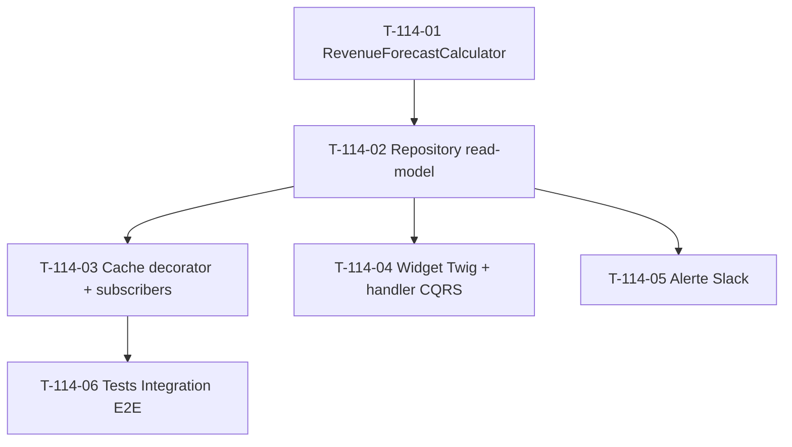

# Tâches — US-114 : KPI Revenue forecast (prévision CA glissante)

## Informations US

- **Epic** : EPIC-003 Phase 5
- **Persona** : PO
- **Story Points** : 3
- **Sprint** : sprint-025
- **MoSCoW** : Must
- **Source** : EPIC-003 Phase 5 extension KPIs business

## Card

**En tant que** PO
**Je veux** une prévision de CA glissante (devis pondérés + commandes confirmées non facturées)
**Afin d'**anticiper la trésorerie entrante 30/90 jours et piloter l'effort commercial

## Vue d'ensemble tâches

| ID | Type | Tâche | Estimation | Dépend de | Statut |
|----|------|-------|-----------:|-----------|--------|
| T-114-01 | [BE]   | Domain Service `RevenueForecastCalculator` + VO + tests Unit | 3h | — | 🔲 |
| T-114-02 | [BE]   | Repository read-model port + Doctrine adapter (pipeline Orders) | 2h | T-114-01 | 🔲 |
| T-114-03 | [BE]   | Cache decorator + subscribers invalidation (`OrderValidatedEvent` + `InvoiceCreatedEvent`) | 2h | T-114-02 | 🔲 |
| T-114-04 | [FE-WEB] | Widget Twig dashboard + handler CQRS | 2h | T-114-02 | 🔲 |
| T-114-05 | [BE]   | Alerte Slack seuil rouge forecast | 1h | T-114-02 | 🔲 |
| T-114-06 | [TEST] | Tests Integration E2E (query + cache + flow event) | 2h | T-114-03 | 🔲 |

**Total estimé** : 12h (≈ 3 pts)

## Détail tâches

### T-114-01 — Domain Service `RevenueForecastCalculator` + tests Unit

- **Type** : [BE]
- **Estimation** : 3h

**Description** :
Domain pure (testable Unit sans DB) du forecast pondéré :
`forecast = Σ(montant commandes signe/gagne non facturées) + Σ(montant devis a_signer × coefProba)`

**Fichiers à créer** :
- `src/Domain/Project/Service/RevenueForecastCalculator.php` (Domain Service pure)
- `src/Domain/Project/ValueObject/RevenueForecast.php` (VO immutable)
- `tests/Unit/Domain/Project/Service/RevenueForecastCalculatorTest.php`

**Critères de validation** :
- [ ] Méthode `calculate(iterable $pipelineRecords, float $probabilityCoefficient, DateTimeImmutable $now): RevenueForecast`
- [ ] VO `RevenueForecast` (forecast30, forecast90, breakdown confirmé/pondéré)
- [ ] Commandes `signe`/`gagne` non facturées → 100 %
- [ ] Devis `a_signer` → pondérés par coefficient (défaut 0.3)
- [ ] `perdu`/`abandonne`/`standby` exclus
- [ ] Horizon = `validUntil` dans la fenêtre
- [ ] Tests Unit > 6 cas (vide, devis seul, commandes seules, mixte, exclusions, edge horizon)
- [ ] Coverage > 90 %

---

### T-114-02 — Repository read-model port + Doctrine adapter

- **Type** : [BE]
- **Estimation** : 2h
- **Dépend de** : T-114-01

**Description** :
Port domaine + adapter Doctrine récupérant le pipeline Orders + exclusion déjà facturé.

**Fichiers** :
- `src/Domain/Project/Repository/RevenueForecastReadModelRepositoryInterface.php`
- `src/Infrastructure/Project/Persistence/Doctrine/DoctrineRevenueForecastReadModelRepository.php`

**Critères** :
- [ ] Query Orders statut ∈ (`a_signer`,`signe`,`gagne`) avec `validUntil` dans fenêtre
- [ ] JOIN/exclusion Orders déjà couverts par `Invoice` (pas de double comptage)
- [ ] Multitenant scope (`CompanyContext`)
- [ ] Index vérifié sur `order.valid_until` + `order.status` (migration si manquant)

---

### T-114-03 — Cache decorator + subscribers invalidation

- **Type** : [BE]
- **Estimation** : 2h
- **Dépend de** : T-114-02

**Description** :
Décorateur cache `cache.kpi` + invalidation event-driven.

**Fichiers** :
- `src/Infrastructure/Project/Persistence/Doctrine/CachingRevenueForecastReadModelRepository.php`
- `src/Application/Project/EventListener/InvalidateRevenueForecastCacheOnOrderValidated.php`
- `src/Application/Project/EventListener/InvalidateRevenueForecastCacheOnInvoiceCreated.php`
- alias + wiring `config/services.yaml`

**Critères** :
- [ ] Decorator `CacheInterface::get()` clé `revenue_forecast.pipeline.company_%d.day_%s`
- [ ] `#[AsEventListener]` sur `OrderValidatedEvent` + `InvoiceCreatedEvent`
- [ ] `config/services.yaml` : alias interface → decorator (pattern US-110/111)
- [ ] Tests Unit invalidation avec mock cache

---

### T-114-04 — Widget Twig dashboard + handler CQRS

- **Type** : [FE-WEB]
- **Estimation** : 2h
- **Dépend de** : T-114-02

**Fichiers** :
- `src/Application/Project/Query/RevenueForecastKpi/ComputeRevenueForecastKpiQuery.php`
- `src/Application/Project/Query/RevenueForecastKpi/ComputeRevenueForecastKpiHandler.php`
- `templates/admin/dashboard/_kpi_revenue_forecast.html.twig`

**Critères** :
- [ ] Handler CQRS read-only retourne DTO (forecast 30/90 + breakdown)
- [ ] Widget : forecast 30j/90j + décomposition confirmé/pondéré
- [ ] Warning orange si forecast 30j < seuil
- [ ] Intégré `/admin/business-dashboard` (ordre après widgets sp-024)
- [ ] Responsive + WCAG 2.1 AA

---

### T-114-05 — Alerte Slack seuil rouge forecast

- **Type** : [BE]
- **Estimation** : 1h
- **Dépend de** : T-114-02

**Fichiers** :
- `src/Application/Project/EventListener/SendRevenueForecastRedAlertOnOrderValidated.php`

**Critères** :
- [ ] Réutilise `SlackAlertingService` (US-094)
- [ ] Seuils hiérarchiques configurables (pattern US-108)
- [ ] Cooldown 24h par tenant (anti-spam)

---

### T-114-06 — Tests Integration E2E

- **Type** : [TEST]
- **Estimation** : 2h
- **Dépend de** : T-114-03

**Fichiers** :
- `tests/Integration/Application/Project/RevenueForecastFlowTest.php`

**Critères** :
- [ ] Fixtures `OrderFactory` + `InvoiceFactory` (pipeline mixte)
- [ ] Test forecast 30/90 avec dataset connu
- [ ] Test cache populé après lecture + invalidé après `OrderValidatedEvent`/`InvoiceCreatedEvent`
- [ ] Test Slack alert déclenchée si seuil rouge franchi
- [ ] `MultiTenantTestTrait` + `ResetDatabase` + `cache.kpi` array adapter

## Dépendances

## Risques

| Risque | Probabilité | Mitigation |
|---|---|---|
| Coefficient probabilité devis arbitraire (0.3) | Moyenne | Configurable hiérarchique US-108, ajustable post-feedback PO |
| Double comptage devis/facture | Moyenne | T-114-02 exclusion explicite + test dédié T-114-06 |
| Index `order.valid_until` manquant | Faible | Vérif + migration sous-tâche T-114-02 |
