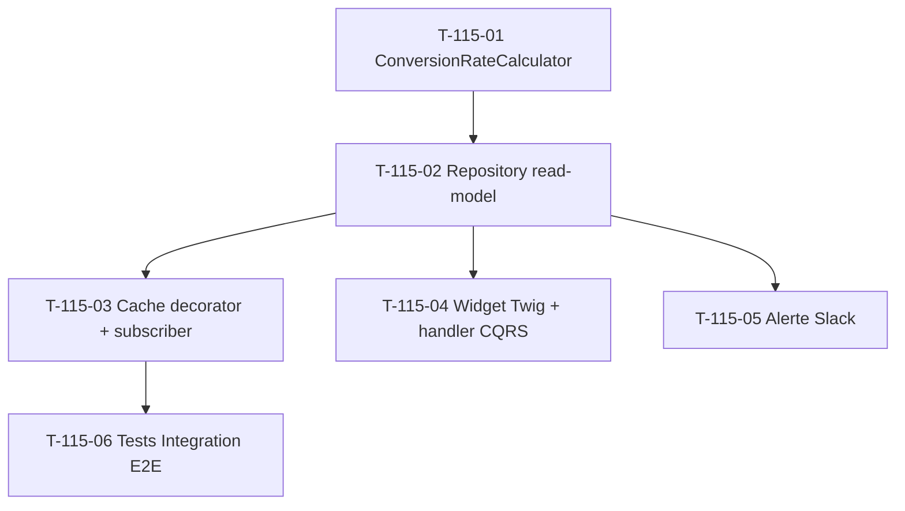

# Tâches — US-115 : KPI Taux de conversion devis → commande

## Informations US

- **Epic** : EPIC-003 Phase 5
- **Persona** : PO
- **Story Points** : 3
- **Sprint** : sprint-025
- **MoSCoW** : Must
- **Source** : EPIC-003 Phase 5 extension KPIs business

## Card

**En tant que** PO
**Je veux** mesurer le taux de conversion devis → commande sur fenêtres glissantes
**Afin de** piloter la performance commerciale et détecter les baisses de transformation

## Vue d'ensemble tâches

| ID | Type | Tâche | Estimation | Dépend de | Statut |
|----|------|-------|-----------:|-----------|--------|
| T-115-01 | [BE]   | Domain Service `ConversionRateCalculator` + tendance + tests Unit | 3h | — | 🔲 |
| T-115-02 | [BE]   | Repository read-model port + Doctrine adapter | 2h | T-115-01 | 🔲 |
| T-115-03 | [BE]   | Cache decorator + subscriber `OrderValidatedEvent` invalidation | 2h | T-115-02 | 🔲 |
| T-115-04 | [FE-WEB] | Widget Twig dashboard + handler CQRS + indicateur tendance | 2h | T-115-02 | 🔲 |
| T-115-05 | [BE]   | Alerte Slack seuil rouge conversion | 1h | T-115-02 | 🔲 |
| T-115-06 | [TEST] | Tests Integration E2E (query + cache + flow event) | 2h | T-115-03 | 🔲 |

**Total estimé** : 12h (≈ 3 pts)

## Détail tâches

### T-115-01 — Domain Service `ConversionRateCalculator` + tests Unit

- **Type** : [BE]
- **Estimation** : 3h

**Description** :
Domain pure du taux de conversion + tendance vs fenêtre précédente :
`taux = count(Orders signe+gagne) / count(Orders émis hors standby)` sur la fenêtre

**Fichiers à créer** :
- `src/Domain/Project/Service/ConversionRateCalculator.php` (Domain Service pure)
- `src/Domain/Project/ValueObject/ConversionRate.php` (VO immutable, 0-100 %)
- `tests/Unit/Domain/Project/Service/ConversionRateCalculatorTest.php`

**Critères de validation** :
- [ ] Méthode `calculateRolling(iterable $orderRecords, int $days, DateTimeImmutable $now): ConversionRate`
- [ ] VO `ConversionRate` (taux, count émis, count convertis, trend)
- [ ] `signe`/`gagne` = converti ; `perdu`/`abandonne` = échec (dénominateur) ; `standby` exclu
- [ ] Date émission = `createdAt`
- [ ] Tendance : delta vs fenêtre précédente (`StableDelta < 1` pattern US-110)
- [ ] Tests Unit > 6 cas (vide, 100 %, 0 %, mixte, exclusion standby, tendance)
- [ ] Coverage > 90 %

---

### T-115-02 — Repository read-model port + Doctrine adapter

- **Type** : [BE]
- **Estimation** : 2h
- **Dépend de** : T-115-01

**Fichiers** :
- `src/Domain/Project/Repository/ConversionRateReadModelRepositoryInterface.php`
- `src/Infrastructure/Project/Persistence/Doctrine/DoctrineConversionRateReadModelRepository.php`

**Critères** :
- [ ] Query Orders émis (`createdAt` dans fenêtre) avec statut
- [ ] 3 fenêtres rolling 30/90/365 j + fenêtre précédente (tendance)
- [ ] Multitenant scope (`CompanyContext`)
- [ ] Index vérifié `order.created_at` + `order.status` (migration si manquant)

---

### T-115-03 — Cache decorator + subscriber invalidation

- **Type** : [BE]
- **Estimation** : 2h
- **Dépend de** : T-115-02

**Fichiers** :
- `src/Infrastructure/Project/Persistence/Doctrine/CachingConversionRateReadModelRepository.php`
- `src/Application/Project/EventListener/InvalidateConversionRateCacheOnOrderValidated.php`
- alias + wiring `config/services.yaml`

**Critères** :
- [ ] Decorator clé `conversion_rate.orders.company_%d.window_%d.day_%s`
- [ ] `#[AsEventListener]` sur `OrderValidatedEvent`
- [ ] `config/services.yaml` alias interface → decorator (pattern US-110/111)
- [ ] Tests Unit invalidation avec mock cache

---

### T-115-04 — Widget Twig dashboard + handler CQRS + tendance

- **Type** : [FE-WEB]
- **Estimation** : 2h
- **Dépend de** : T-115-02

**Fichiers** :
- `src/Application/Project/Query/ConversionRateKpi/ComputeConversionRateKpiQuery.php`
- `src/Application/Project/Query/ConversionRateKpi/ComputeConversionRateKpiHandler.php`
- `templates/admin/dashboard/_kpi_conversion_rate.html.twig`

**Critères** :
- [ ] Handler CQRS read-only retourne DTO (taux 30/90/365 + décomposition + trend)
- [ ] Widget : 3 taux rolling + indicateur tendance ↗️ ↘️ →
- [ ] Décomposition devis émis / signés
- [ ] Warning orange si taux 30j < seuil (défaut 40 %)
- [ ] Intégré `/admin/business-dashboard`
- [ ] Responsive + WCAG 2.1 AA

---

### T-115-05 — Alerte Slack seuil rouge conversion

- **Type** : [BE]
- **Estimation** : 1h
- **Dépend de** : T-115-02

**Fichiers** :
- `src/Application/Project/EventListener/SendConversionRateRedAlertOnOrderValidated.php`

**Critères** :
- [ ] Réutilise `SlackAlertingService` (US-094)
- [ ] Seuil rouge configurable hiérarchique (défaut 25 %)
- [ ] Cooldown 24h par tenant

---

### T-115-06 — Tests Integration E2E

- **Type** : [TEST]
- **Estimation** : 2h
- **Dépend de** : T-115-03

**Fichiers** :
- `tests/Integration/Application/Project/ConversionRateFlowTest.php`

**Critères** :
- [ ] Fixtures `OrderFactory` (statuts mixtes + dates émission)
- [ ] Test taux 30/90/365 + tendance avec dataset connu
- [ ] Test exclusion `standby` du dénominateur
- [ ] Test cache populé + invalidé après `OrderValidatedEvent`
- [ ] Test Slack alert si seuil rouge
- [ ] `MultiTenantTestTrait` + `ResetDatabase` + `cache.kpi` array adapter

## Dépendances

## Risques

| Risque | Probabilité | Mitigation |
|---|---|---|
| Traitement `standby` ambigu (échec ou en attente ?) | Moyenne | Exclu du dénominateur, documenté Gherkin + test T-115-06 |
| Index `order.created_at` manquant | Faible | Vérif + migration sous-tâche T-115-02 |
