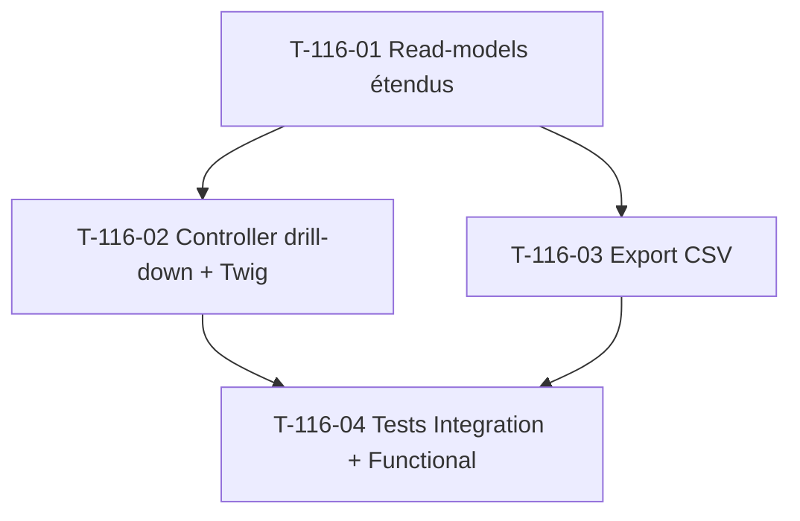

# Tâches — US-116 : Extension widgets DSO / lead time (drill-down + export CSV)

## Informations US

- **Epic** : EPIC-003 Phase 5
- **Persona** : PO
- **Story Points** : 2
- **Sprint** : sprint-025
- **MoSCoW** : Should
- **Source** : EPIC-003 Phase 5 extension KPIs business

## Card

**En tant que** PO
**Je veux** un drill-down par client + export CSV sur les widgets DSO (US-110) et lead time (US-111)
**Afin d'**exploiter les KPIs au-delà de l'agrégat — analyse client par client + reporting hors dashboard

## Vue d'ensemble tâches

| ID | Type | Tâche | Estimation | Dépend de | Statut |
|----|------|-------|-----------:|-----------|--------|
| T-116-01 | [BE]   | Étendre read-models DSO + lead time : `findAllClientsAggregated` | 2h | — | 🔲 |
| T-116-02 | [FE-WEB] | Controller drill-down + route + voter + vue Twig | 2h | T-116-01 | 🔲 |
| T-116-03 | [BE]   | Export CSV (réutilise pattern `DriftReportCsvExporter`) | 1.5h | T-116-01 | 🔲 |
| T-116-04 | [TEST] | Tests Integration drill-down + Functional export CSV | 1.5h | T-116-02, T-116-03 | 🔲 |

**Total estimé** : 7h (≈ 2 pts)

## Détail tâches

### T-116-01 — Étendre read-models DSO + lead time

- **Type** : [BE]
- **Estimation** : 2h

**Description** :
Étendre les read-models existants (sprint-024) pour exposer la liste **complète** par client,
pas seulement le top 3.

**Fichiers à modifier** :
- `src/Domain/Project/Repository/DsoReadModelRepositoryInterface.php` (+ méthode)
- `src/Domain/Project/Repository/BillingLeadTimeReadModelRepositoryInterface.php` (+ méthode)
- `src/Infrastructure/Project/Persistence/Doctrine/DoctrineDsoReadModelRepository.php`
- `src/Infrastructure/Project/Persistence/Doctrine/DoctrineBillingLeadTimeReadModelRepository.php`
- decorators caching correspondants

**Critères de validation** :
- [ ] Méthode `findAllClientsAggregated(int $windowDays, DateTimeImmutable $now): array`
- [ ] DSO : `GROUP BY client_id` → DSO moyen + sample_count par client
- [ ] Lead time : `GROUP BY client_id` → lead time moyen + count devis convertis
- [ ] Tri valeur décroissante (clients lents en tête)
- [ ] Multitenant scope ; réutilise `cache.kpi` (clé dédiée drill-down)
- [ ] Pas de régression sur `topSlowClients` existant

---

### T-116-02 — Controller drill-down + route + voter + vue Twig

- **Type** : [FE-WEB]
- **Estimation** : 2h
- **Dépend de** : T-116-01

**Fichiers** :
- `src/Presentation/Project/Controller/BusinessDashboardDrillDownController.php`
- `templates/admin/dashboard/drill_down.html.twig`
- liens depuis `_kpi_dso.html.twig` + `_kpi_billing_lead_time.html.twig`

**Critères** :
- [ ] Route `/admin/business-dashboard/drill-down/{kpi}` (kpi ∈ `dso`|`lead-time`)
- [ ] `#[IsGranted('ROLE_ADMIN')]`
- [ ] Param fenêtre `?window=30|90|365` (défaut 30)
- [ ] Vue liste triée + état vide explicite si aucune donnée
- [ ] Bouton « Export CSV » pointant T-116-03
- [ ] Responsive + WCAG 2.1 AA

---

### T-116-03 — Export CSV

- **Type** : [BE]
- **Estimation** : 1.5h
- **Dépend de** : T-116-01

**Description** :
Export CSV du drill-down — réutilise le pattern `DriftReportCsvExporter` (US-113 T-113-04).

**Fichiers** :
- `src/Application/Project/Export/KpiDrillDownCsvExporter.php`
- route `/admin/business-dashboard/drill-down/{kpi}/export` dans le controller T-116-02

**Critères** :
- [ ] Colonnes : `client_name, valeur_kpi, sample_count, window`
- [ ] `fputcsv` + header `Content-Disposition: attachment`
- [ ] Respecte la fenêtre rolling sélectionnée
- [ ] Multitenant (société courante uniquement)
- [ ] Pas de CSV vide silencieux (état vide géré côté controller)

---

### T-116-04 — Tests Integration drill-down + Functional export CSV

- **Type** : [TEST]
- **Estimation** : 1.5h
- **Dépend de** : T-116-02, T-116-03

**Fichiers** :
- `tests/Integration/Project/Persistence/DrillDownReadModelTest.php`
- `tests/Functional/Controller/Admin/BusinessDashboardDrillDownControllerTest.php`

**Critères** :
- [ ] Test `findAllClientsAggregated` DSO + lead time avec dataset connu
- [ ] Test controller drill-down 200 + tri + état vide
- [ ] Test export CSV : colonnes, contenu, `Content-Disposition`
- [ ] `MultiTenantTestTrait` + `ResetDatabase` + `cache.kpi` array adapter

## Dépendances

## Risques

| Risque | Probabilité | Mitigation |
|---|---|---|
| Régression `topSlowClients` widgets sp-024 | Moyenne | T-116-01 ajoute méthode, ne modifie pas l'existant ; test non-régression |
| Volume clients important → liste lourde | Faible | Pagination ou limite 100 lignes si besoin (sprint-026+) |
