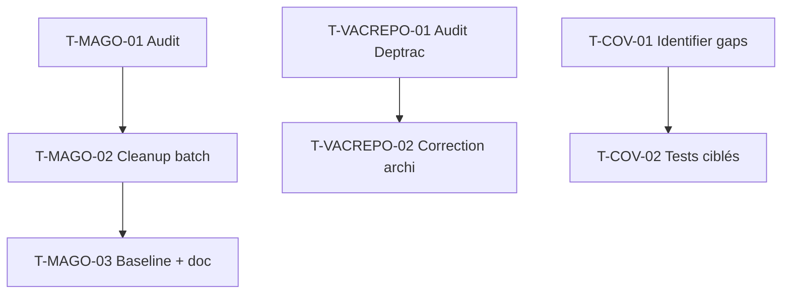

# Tâches Techniques Transverses — Sprint 025

## Sub-epic D — Dette technique (carry-over sp-022/023/024)

Items hérités, sans US dédiée (tech-debt). **Total : 4 pts**.

### Vue d'ensemble

| ID | Type | Tâche | Estimation | Dépend de | Statut |
|----|------|-------|-----------:|-----------|--------|
| T-MAGO-01 | [OPS]  | Audit + catégorisation des 626 erreurs Mago lint | 1h | — | 🔲 |
| T-MAGO-02 | [BE]   | Cleanup batch initial (100-150 erreurs auto-fixables) | 3h | T-MAGO-01 | 🔲 |
| T-MAGO-03 | [OPS]  | Baseline Mago résiduel + doc CONTRIBUTING.md | 1h | T-MAGO-02 | 🔲 |
| T-VACREPO-01 | [BE] | Audit violation Deptrac `VacationRepository` | 1h | — | 🔲 |
| T-VACREPO-02 | [BE] | Correction architecture (`CompanyContext` hors Repository layer) | 2h | T-VACREPO-01 | 🔲 |
| T-COV-01 | [TEST] | Identifier zones non couvertes (gap 70 → 72 %) | 1h | — | 🔲 |
| T-COV-02 | [TEST] | Tests ciblés push coverage 70 → 72 % | 3h | T-COV-01 | 🔲 |

**Total estimé** : 12h (≈ 4 pts)

---

## MAGO-LINT-BATCH-001 — Mago lint cleanup batch (2 pts)

> Source : sprint-022 retro top-5 #3, sprint-023 retro A-6, hérité sprint-024.
> Mago lint stable à 626 erreurs (cf sprint-024 review « risques résiduels »).

### T-MAGO-01 — Audit + catégorisation

- **Type** : [OPS]
- **Estimation** : 1h

**Description** :
Run `make mago` (ou équivalent Docker), catégoriser les 626 erreurs par règle/sévérité.

**Critères** :
- [ ] Rapport catégorisé : auto-fixables vs manuel, par règle
- [ ] Identifier le batch initial 100-150 erreurs auto-fixables sûres
- [ ] Lister les règles à baseliner (faux positifs / non prioritaires)

---

### T-MAGO-02 — Cleanup batch initial

- **Type** : [BE]
- **Estimation** : 3h
- **Dépend de** : T-MAGO-01

**Critères** :
- [ ] 100-150 erreurs corrigées (auto-fix Mago + revue)
- [ ] PHPStan / CS-Fixer / Deptrac toujours verts après cleanup
- [ ] Tests toujours verts (pas de régression)
- [ ] Commit groupé par catégorie de règle

---

### T-MAGO-03 — Baseline résiduel + doc

- **Type** : [OPS]
- **Estimation** : 1h
- **Dépend de** : T-MAGO-02

**Critères** :
- [ ] Baseline Mago des erreurs résiduelles non prioritaires
- [ ] `CONTRIBUTING.md` : section Mago lint (run, baseline, cleanup progressif)
- [ ] Compteur résiduel documenté (objectif : décroissance sprints futurs)

---

## VACATION-REPO-AUDIT — Audit Deptrac VacationRepository (1 pt)

> Source : sprint-023 retro L-4, hérité sprint-024.
> Violation connue : `App\Repository\VacationRepository` → `App\Security\CompanyContext`
> (Repository layer ne doit pas dépendre de Security — cf violation `ContributorRepository`
> similaire détectée sprint-024 PR #270).

### T-VACREPO-01 — Audit violation

- **Type** : [BE]
- **Estimation** : 1h

**Critères** :
- [ ] `make deptrac` → confirmer la/les violation(s) `VacationRepository`
- [ ] Identifier le pattern : injection `CompanyContext` dans le Repository
- [ ] Vérifier si `ContributorRepository` a le même souci (audit conjoint)
- [ ] Proposer correction : déplacer le filtrage multitenant (Doctrine filter, ou query param explicite)

---

### T-VACREPO-02 — Correction architecture

- **Type** : [BE]
- **Estimation** : 2h
- **Dépend de** : T-VACREPO-01

**Critères** :
- [ ] `CompanyContext` retiré du Repository layer (ou pattern conforme validé)
- [ ] `make deptrac` → violation(s) `VacationRepository` résolue(s)
- [ ] Tests Repository toujours verts
- [ ] Pas de régression multitenant (test isolation tenant)

---

## TEST-COVERAGE-013 — Coverage 70 → 72 % (1 pt)

> Source : PRE-2 héritage sprint-024. Cible CI globale 72 %.

### T-COV-01 — Identifier zones non couvertes

- **Type** : [TEST]
- **Estimation** : 1h

**Critères** :
- [ ] Rapport coverage actuel (`make test-coverage`)
- [ ] Top zones non couvertes à fort ROI (classes Domain/Application simples)
- [ ] Cible : +2 points = ~zones identifiées

---

### T-COV-02 — Tests ciblés push 70 → 72 %

- **Type** : [TEST]
- **Estimation** : 3h
- **Dépend de** : T-COV-01

**Critères** :
- [ ] Tests ajoutés sur les zones identifiées T-COV-01
- [ ] Coverage CI ≥ 72 %
- [ ] Tests verts, pas de flaky

---

## Actions héritées rétro sp-024 (hors points — intégrées au sprint)

| ID | Action | Owner | Type | Quand |
|----|--------|-------|------|-------|
| A-1 | Activer `enablePullRequestAutoMerge` repo settings | Tech Lead | [OPS] | J-2 |
| A-3 | Doc procédure rebase stack PR adjacent — CONTRIBUTING.md | Tech Lead | [DOC] | doc-only (groupé avec T-MAGO-03) |
| A-4 | Helper `DateTime::mutableFromImmutable()` — Tests Support | Tech Lead | [TEST] | refactor 30 min |
| A-5 | T-113-07 dry-run prod migration WorkItem.cost — user-tracked | user + Tech Lead | [OPS] | J0 fenêtre maintenance |
| A-6 | Doc `cache.kpi` pool partagé (commentaire `cache.yaml` ou ADR) | Tech Lead | [DOC] | doc-only (groupé avec US-114 T-114-03) |
| A-7 | Décision Slack channel `#kpi-alerts-prod` | PO + Tech Lead | — | atelier OPS-PREP J-2 |

## Dépendances

