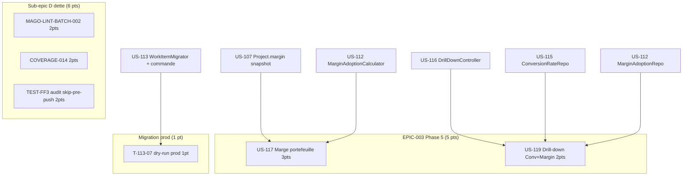

# Tâches — Sprint 026

## Vue d'ensemble

| Item | Titre | Points | Tâches | Heures | Statut |
|------|-------|-------:|-------:|-------:|--------|
| US-117 | KPI Marge moyenne portefeuille | 3 | 6 | 12h | 🔲 |
| US-119 | Extension drill-down Conversion + Margin | 2 | 4 | 6h | 🔲 |
| MAGO-LINT-BATCH-002 | Cleanup Mago résiduel (200-300 erreurs) | 2 | 3 | 5h | 🔲 |
| COVERAGE-014 | Push coverage 72 → 74 % | 2 | 2 | 4h | 🔲 |
| TEST-FUNCTIONAL-FIXES-003 | Audit skip-pre-push markers | 2 | 2 | 5h | 🔲 |
| T-113-07 | Dry-run prod migration WorkItem.cost | 1 | 2 | 3h | 🔲 |
| **TOTAL** | | **12** | **19** | **35h** | |

## Engagement

- **12 pts ferme** (Phase 5 continuation : 5 pts + Dette résiduelle : 6 pts + Migration prod : 1 pt)
- **Cap libre 1-2 pts** : intégré au ferme via T-113-07 (A-1 sp-025 retro HIGH satisfait)

## Répartition par type

| Type | Tâches | Heures | % |
|------|-------:|-------:|--:|
| [BE] | 8 | 16h | 46 % |
| [FE-WEB] | 2 | 3h | 9 % |
| [TEST] | 5 | 11h | 31 % |
| [OPS] | 4 | 5h | 14 % |
| **TOTAL** | **19** | **35h** | |

## Pattern KpiCalculator (7ᵉ application US-117)

US-117 réutilise partiellement `MarginAdoptionCalculator` (US-112) — pas un nouveau Calculator from-scratch mais un agrégat pondéré du snapshot `Project.margin` (US-107). 6 tâches standard.

## Fichiers

- [US-117 — KPI Marge moyenne portefeuille](./US-117-tasks.md)
- [US-119 — Extension drill-down Conversion + Margin](./US-119-tasks.md)
- [Tâches techniques transverses (Sub-epic D dette + T-113-07)](./technical-tasks.md)

## Conventions

- **ID** : `T-{US}-{NN}` (ex: `T-117-01`) ou `T-{ITEM}-{NN}` (ex: `T-MAGO2-01`)
- **Taille** : 0.5h – 8h max
- **Statuts** : 🔲 🔄 👀 ✅ 🚫
- **DoD** : PHPStan max 0 erreur · CS-Fixer/Rector/Deptrac 0 violation · Mago 0 nouvelle issue · coverage ≥ 80 % · 0 `--no-verify`

## Dépendances inter-stories

Stories largement indépendantes — parallélisables.
