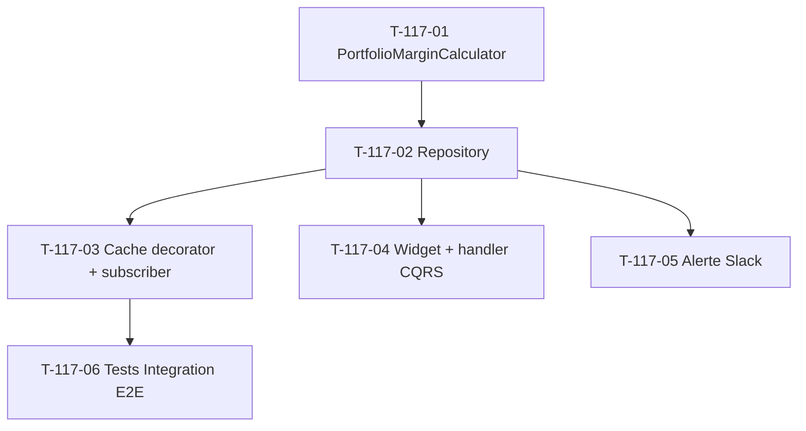

# Tâches — US-117 : KPI Marge moyenne portefeuille

## Informations US

- **Epic** : EPIC-003 Phase 5
- **Persona** : PO
- **Story Points** : 3
- **Sprint** : sprint-026
- **MoSCoW** : Must
- **Source** : EPIC-003 Phase 5 — reporté sp-025 (overflow capacité)

## Card

**En tant que** PO
**Je veux** la marge moyenne pondérée du portefeuille de projets actifs + sa tendance
**Afin de** piloter la rentabilité globale au-delà du suivi projet par projet (US-103/104)

## Vue d'ensemble tâches

| ID | Type | Tâche | Estimation | Dépend de | Statut |
|----|------|-------|-----------:|-----------|--------|
| T-117-01 | [BE]   | Domain Service `PortfolioMarginCalculator` + VO + tests Unit | 3h | — | ✅ |
| T-117-02 | [BE]   | Repository read-model port + Doctrine adapter | 2h | T-117-01 | ✅ |
| T-117-03 | [BE]   | Cache decorator + subscriber `ProjectMarginRecalculatedEvent` | 2h | T-117-02 | 🔲 |
| T-117-04 | [FE-WEB] | Widget Twig dashboard + handler CQRS | 2h | T-117-02 | 🔲 |
| T-117-05 | [BE]   | Alerte Slack seuil rouge marge portefeuille | 1h | T-117-02 | 🔲 |
| T-117-06 | [TEST] | Tests Integration E2E flow | 2h | T-117-03 | 🔲 |

**Total estimé** : 12h (≈ 3 pts)

## Détail tâches

### T-117-01 — Domain Service `PortfolioMarginCalculator` + tests Unit

- **Type** : [BE]
- **Estimation** : 3h

**Description** :
Domain pure : marge moyenne pondérée par montant projet.
`marge_portefeuille = Σ(marge_projet × montant_projet) / Σ(montant_projet)`

**Fichiers à créer** :
- `src/Domain/Project/Service/PortfolioMarginCalculator.php`
- `src/Domain/Project/Service/ProjectMarginRecord.php` (record DTO)
- `src/Domain/Project/ValueObject/PortfolioMargin.php` (VO immutable)
- `tests/Unit/Domain/Project/Service/PortfolioMarginCalculatorTest.php`

**Critères de validation** :
- [ ] Méthode `calculate(iterable $records, DateTimeImmutable $now): PortfolioMargin`
- [ ] VO `PortfolioMargin` (marge moyenne + count + tendance + breakdown sous/au-dessus seuil cible)
- [ ] Projets sans snapshot `margeCalculatedAt` exclus
- [ ] Projets statut `completed` / `cancelled` exclus
- [ ] Tests Unit > 6 cas (vide, simple, pondéré, exclusion completed, exclusion sans snapshot, tendance)
- [ ] Coverage > 90 %

---

### T-117-02 — Repository read-model port + Doctrine adapter

- **Type** : [BE]
- **Estimation** : 2h
- **Dépend de** : T-117-01

**Fichiers** :
- `src/Domain/Project/Repository/PortfolioMarginReadModelRepositoryInterface.php`
- `src/Infrastructure/Project/Persistence/Doctrine/DoctrinePortfolioMarginReadModelRepository.php`

**Critères** :
- [ ] Query Projects actifs avec `margeCalculatedAt IS NOT NULL` et `margin IS NOT NULL`
- [ ] Statut `active` (exclu : completed/cancelled)
- [ ] Sélection : `id, name, margin, totalAmount, margeCalculatedAt`
- [ ] Multitenant scope (`CompanyContext`)

---

### T-117-03 — Cache decorator + subscriber

- **Type** : [BE]
- **Estimation** : 2h
- **Dépend de** : T-117-02

**Fichiers** :
- `src/Infrastructure/Project/Persistence/Doctrine/CachingPortfolioMarginReadModelRepository.php`
- `src/Application/Project/EventListener/InvalidatePortfolioMarginCacheOnProjectMarginRecalculated.php`
- alias + wiring `config/services.yaml`

**Critères** :
- [ ] Decorator clé `portfolio_margin.snapshot.company_%d.day_%s`
- [ ] `#[AsMessageHandler]` sur `ProjectMarginRecalculatedEvent` (US-107)
- [ ] Tests Unit invalidation avec mock cache

---

### T-117-04 — Widget Twig + handler CQRS

- **Type** : [FE-WEB]
- **Estimation** : 2h
- **Dépend de** : T-117-02

**Fichiers** :
- `src/Application/Project/Query/PortfolioMarginKpi/ComputePortfolioMarginKpiHandler.php`
- `src/Application/Project/Query/PortfolioMarginKpi/PortfolioMarginKpiDto.php`
- `templates/admin/_portfolio_margin_widget.html.twig`

**Critères** :
- [ ] Handler CQRS retourne DTO (marge moyenne + count + breakdown + warning)
- [ ] Widget : marge moyenne % + tendance + répartition projets > seuil / sous seuil
- [ ] Warning orange si marge < seuil configuré
- [ ] Intégré `/admin/business-dashboard` (9ᵉ widget)

---

### T-117-05 — Alerte Slack seuil rouge

- **Type** : [BE]
- **Estimation** : 1h
- **Dépend de** : T-117-02

**Fichiers** :
- `src/Application/Project/EventListener/SendPortfolioMarginRedAlertOnRecalculated.php`

**Critères** :
- [ ] Réutilise `SlackAlertingService` (US-094)
- [ ] Seuil rouge configurable hiérarchique (pattern US-108)
- [ ] Trigger sur `ProjectMarginRecalculatedEvent` (event.occurredOn ancrage testabilité)

---

### T-117-06 — Tests Integration E2E

- **Type** : [TEST]
- **Estimation** : 2h
- **Dépend de** : T-117-03

**Fichiers** :
- `tests/Integration/Application/Project/ProjectMarginRecalculatedPortfolioFlowTest.php`

**Critères** :
- [ ] Fixtures `ProjectFactory` (statuts variés + margeCalculatedAt + margin)
- [ ] Test marge pondérée par dataset connu
- [ ] Test cache populé + invalidé après event
- [ ] Test Slack alert si seuil rouge
- [ ] `MultiTenantTestTrait` + `ResetDatabase` + `cache.kpi` array adapter

## Dépendances

## Risques

| Risque | Probabilité | Mitigation |
|---|---|---|
| Seuil rouge marge arbitraire | Moyenne | Configurable hiérarchique US-108, ajustable post-PO |
| Volume Projects actifs grand → query lente | Faible | Cache 1h + index `margeCalculatedAt` |
