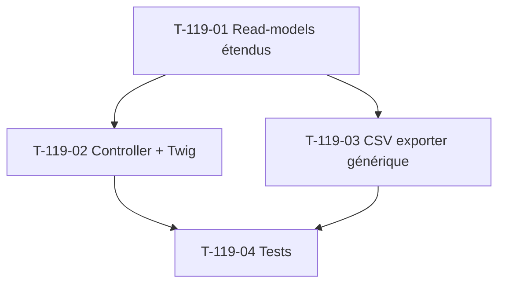

# Tâches — US-119 : Extension drill-down Conversion + Margin

## Informations US

- **Epic** : EPIC-003 Phase 5
- **Persona** : PO
- **Story Points** : 2
- **Sprint** : sprint-026
- **MoSCoW** : Should
- **Source** : extension US-116 (sp-025) sur 2 widgets restants

## Card

**En tant que** PO
**Je veux** drill-down par client + export CSV sur widgets Conversion (US-115) + Margin adoption (US-112)
**Afin de** compléter l'analyse client-par-client déjà dispo sur DSO/lead time (US-116)

## Vue d'ensemble tâches

| ID | Type | Tâche | Estimation | Dépend de | Statut |
|----|------|-------|-----------:|-----------|--------|
| T-119-01 | [BE]   | Étendre read-models Conversion + Margin : `findAllClientsAggregated` | 1.5h | — | 🔲 |
| T-119-02 | [FE-WEB] | Étendre controller drill-down + route regex + Twig adapt 4 KPIs | 2h | T-119-01 | 🔲 |
| T-119-03 | [BE]   | Export CSV générique (extension `KpiDrillDownCsvExporter`) | 1h | T-119-01 | 🔲 |
| T-119-04 | [TEST] | Tests Integration drill-down + Functional CSV | 1.5h | T-119-02, T-119-03 | 🔲 |

**Total estimé** : 6h (≈ 2 pts)

## Détail tâches

### T-119-01 — Étendre read-models Conversion + Margin

- **Type** : [BE]
- **Estimation** : 1.5h

**Description** :
Ajouter `findAllClientsAggregated(int $windowDays, DateTimeImmutable $now): array` à
`ConversionRateReadModelRepositoryInterface` + `MarginAdoptionReadModelRepositoryInterface`.

**Fichiers à modifier** :
- `src/Domain/Project/Repository/ConversionRateReadModelRepositoryInterface.php` (+ méthode)
- `src/Domain/Project/Repository/MarginAdoptionReadModelRepositoryInterface.php` (+ méthode)
- Adapters Doctrine correspondants + decorators caching
- DTOs `ClientConversionAggregate` + `ClientMarginAdoptionAggregate`
- Stubs anon classes implementing interfaces dans tests existants (pattern US-116 fix)

**Critères** :
- [ ] DTOs Domain pure
- [ ] SQL `GROUP BY client_id` ou agrégation côté PHP (DATEDIFF non portable)
- [ ] Tri valeur décroissante
- [ ] Cache clé séparée `<kpi>.clients_aggregated.*`
- [ ] Multitenant scope

---

### T-119-02 — Étendre controller drill-down + route + Twig

- **Type** : [FE-WEB]
- **Estimation** : 2h
- **Dépend de** : T-119-01

**Fichiers** :
- `src/Controller/Admin/BusinessDashboardDrillDownController.php` (modif route regex + branchement repo selon kpi)
- `templates/admin/dashboard/drill_down.html.twig` (label/unit selon kpi)
- Liens depuis `_conversion_rate_widget.html.twig` + `_margin_adoption_widget.html.twig`

**Critères** :
- [ ] Route requirement `kpi=dso|lead-time|conversion|margin`
- [ ] Twig affiche unité correcte par kpi (jours / % / projets)
- [ ] `ROLE_ADMIN` voter respecté
- [ ] Pas de régression DSO/lead-time existants (US-116)

---

### T-119-03 — Export CSV générique

- **Type** : [BE]
- **Estimation** : 1h
- **Dépend de** : T-119-01

**Fichiers** :
- `src/Application/Project/Export/KpiDrillDownCsvExporter.php` (extension type DTO supporté)

**Critères** :
- [ ] Method signature accepts les 4 types d'aggregate (union ou polymorphic)
- [ ] Colonne `valeur_kpi` adapté unité par kpi
- [ ] Filename `kpi-drill-down-{kpi}-window-{N}j-{timestamp}.csv`

---

### T-119-04 — Tests Integration + Functional

- **Type** : [TEST]
- **Estimation** : 1.5h
- **Dépend de** : T-119-02, T-119-03

**Fichiers** :
- Extension `BusinessDashboardDrillDownControllerTest` : 4 tests (conversion + margin × {liste + CSV})
- `tests/Integration/Project/Persistence/DrillDownReadModelTest.php` extension Conversion + Margin

**Critères** :
- [ ] 4 tests Functional ajoutés (liste + export pour conversion + margin)
- [ ] Test exclusion standby (conversion) + projets sans snapshot (margin) au drill-down
- [ ] Pas de régression sur tests US-116 existants

## Dépendances

## Risques

| Risque | Probabilité | Mitigation |
|---|---|---|
| Régression tests US-116 dashboard | Moyenne | Tests no-régression dédiés T-119-04 |
| Stubs anon classes dans tests existants (interface évolue) | Élevée | Pattern fix sp-025 US-116 — appliquer en T-119-01 |
