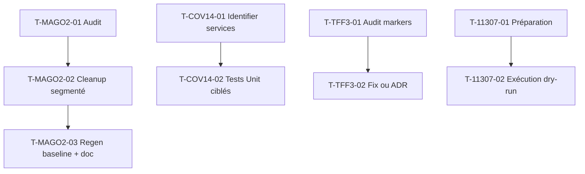

# Tâches Techniques Transverses — Sprint 026

## Vue d'ensemble

| ID | Type | Tâche | Estimation | Statut |
|----|------|-------|-----------:|--------|
| T-MAGO2-01 | [OPS] | Audit issues résiduelles ciblables | 1h | 🔲 |
| T-MAGO2-02 | [BE] | Cleanup 200-300 erreurs (segmenté par règle) | 3h | 🔲 |
| T-MAGO2-03 | [OPS] | Regen baseline + update CONTRIBUTING.md | 1h | 🔲 |
| T-COV14-01 | [TEST] | Identifier services legacy ROI ciblables (5 candidats) | 1h | 🔲 |
| T-COV14-02 | [TEST] | Tests Unit ciblés (push 72→74 %) | 3h | 🔲 |
| T-TFF3-01 | [TEST] | Audit `skip-pre-push` markers restants (6 classes) | 2h | 🔲 |
| T-TFF3-02 | [TEST] | Fix 2-3 markers ou ADR-0003 extension | 3h | 🔲 |
| T-11307-01 | [OPS] | Préparation fenêtre maintenance + backup BDD | 1h | 🔲 |
| T-11307-02 | [OPS] | Exécution dry-run prod + CSV drift report + décision | 2h | 🔲 |

**Total estimé** : 17h

---

## MAGO-LINT-BATCH-002 (2 pts) — Cleanup Mago résiduel

> Sub-epic D dette — héritage sp-025. Baseline activé à 1307 issues post-sp-025.
> Objectif : nibbler 200-300 erreurs ciblées (segmenté par règle).

### T-MAGO2-01 — Audit issues résiduelles ciblables

- **Type** : [OPS]
- **Estimation** : 1h

**Description** :
Analyser le baseline `mago-baseline.json` (1307 issues filtrées) — identifier
règles à haute concentration et faible risque pour cleanup ciblé.

**Critères** :
- [ ] Top 5 règles par count
- [ ] Liste auto-fixables vs manuel
- [ ] Sélection batch initial 200-300 issues low-risk

---

### T-MAGO2-02 — Cleanup segmenté par règle

- **Type** : [BE]
- **Estimation** : 3h
- **Dépend de** : T-MAGO2-01

**Critères** :
- [ ] Auto-fix segmenté `--rule <X>` + run suite intermédiaire (procédure sp-025 retro S-1/STOP-2)
- [ ] PHPStan / CS-Fixer / Deptrac toujours verts après chaque batch
- [ ] PHPUnit 1700+ tests verts à chaque étape
- [ ] Commits groupés par règle

---

### T-MAGO2-03 — Regen baseline + doc

- **Type** : [OPS]
- **Estimation** : 1h
- **Dépend de** : T-MAGO2-02

**Critères** :
- [ ] `mago-baseline.json` régénéré (issues résiduelles réduites)
- [ ] `CONTRIBUTING.md` : section procédure segmentée par règle ajoutée (action A-6 héritée)
- [ ] Compteur résiduel documenté (avant/après cleanup)

---

## COVERAGE-014 (2 pts) — Push 72 → 74 %

> Sub-epic D dette — héritage sp-025 backlog. Cible CI globale 74 %.

### T-COV14-01 — Identifier services legacy ROI ciblables

- **Type** : [TEST]
- **Estimation** : 1h

**Critères** :
- [ ] Rapport coverage actuel (cible : services identifiés sp-025 audit)
- [ ] Top 5 services legacy faible coverage : `WorkloadPredictionService` (8 %),
  `CronExtension` (25 %), `ProjectRiskAnalyzer` (29 %), `OnboardingService` (47 %),
  `SecureFileUploadService` (40 %)
- [ ] Choix 1-2 services le meilleur ROI (Domain logic testable sans mock complexe)

---

### T-COV14-02 — Tests Unit ciblés

- **Type** : [TEST]
- **Estimation** : 3h
- **Dépend de** : T-COV14-01

**Critères** :
- [ ] Tests Unit ajoutés sur services choisis
- [ ] Coverage CI ≥ 74 %
- [ ] Tests verts, pas de flaky

---

## TEST-FUNCTIONAL-FIXES-003 (2 pts) — Audit `skip-pre-push` markers

> Sub-epic D dette — héritage sp-006 audit en cours.
> Status sp-006 : 3 markers ADR-0003 conservés, 6 à auditer (cf CONTRIBUTING.md).

### T-TFF3-01 — Audit 6 markers restants

- **Type** : [TEST]
- **Estimation** : 2h

**Critères** :
- [ ] Liste 6 classes `skip-pre-push` restantes hors ADR-0003
- [ ] Pour chaque : cause racine + faisabilité fix
- [ ] Décision : fix immédiat / ADR-0003 extension / reporté

---

### T-TFF3-02 — Fix 2-3 markers ou ADR extension

- **Type** : [TEST]
- **Estimation** : 3h
- **Dépend de** : T-TFF3-01

**Critères** :
- [ ] 2-3 markers retirés (fix cause racine)
- [ ] ADR-0003 mis à jour si nouveaux markers tolérés
- [ ] Pas de régression sur markers ADR-0003 existants

---

## T-113-07 (1 pt) — Dry-run prod migration WorkItem.cost

> Héritage sp-024 retro A-5 (HIGH priority, 2 sprints reportés).
> Runbook : `docs/runbooks/workitem-cost-migration.md` (sp-024).

### T-11307-01 — Préparation

- **Type** : [OPS]
- **Estimation** : 1h

**Critères** :
- [ ] Fenêtre maintenance planifiée avec PO + ops
- [ ] Backup BDD prod réalisé (runbook §2)
- [ ] Render env vars vérifiés (`ENCRYPTION_KEY`, `DATABASE_URL`)
- [ ] User-tracked log dédié (`var/log/migration-workitem-prod.log`)

---

### T-11307-02 — Exécution + décision

- **Type** : [OPS]
- **Estimation** : 2h
- **Dépend de** : T-11307-01

**Critères** :
- [ ] `bin/console app:workitem:migrate-legacy-cost --dry-run --csv-report=auto` exécuté
- [ ] CSV drift report téléchargé localement
- [ ] Décision PO : exec migration réelle / rollback / abandon ADR-0013 cas 3 si drift > 5 %
- [ ] Sprint-status migration_log entry

## Dépendances

## Actions héritées rétro sp-025 (hors points — intégrées au sprint)

| ID | Action | Type | Quand |
|----|--------|------|-------|
| A-3 | Helper `KpiTestSupport` trait | [TEST] refactor 1h | T-119-04 groupé |
| A-4 | Hook pre-commit Mago step | [OPS] | T-MAGO2-03 groupé |
| A-5 | ADR pattern timestamping listeners | [DOC] | T-117-03 doc-only |
| A-6 | Procédure Mago segmentée doc | [DOC] | T-MAGO2-03 groupé |
| A-7 | Décision Slack channel `#kpi-alerts-prod` | [OPS] | T-11307-01 atelier OPS-PREP |
| A-8 | Pagination drill-down volume seuil | [PO décision] | T-119-02 groupé si seuil décidé |
